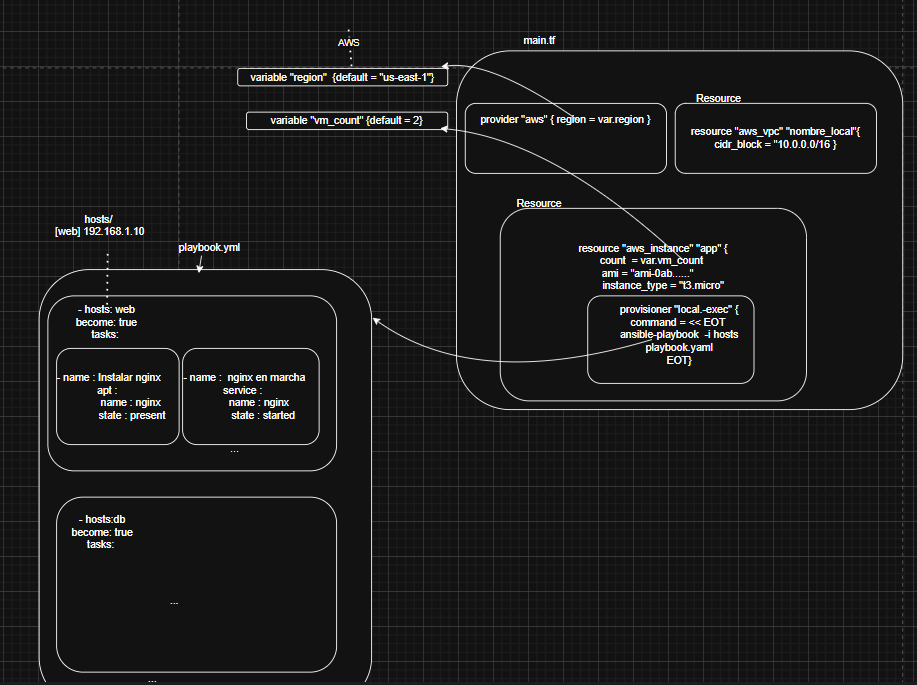
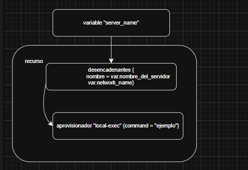
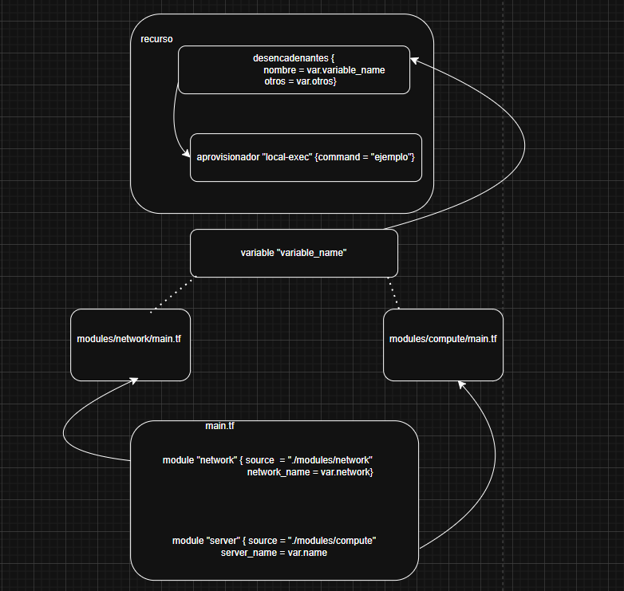
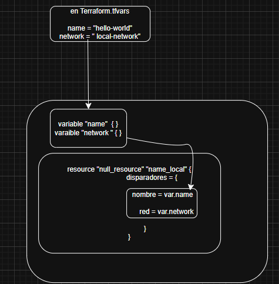
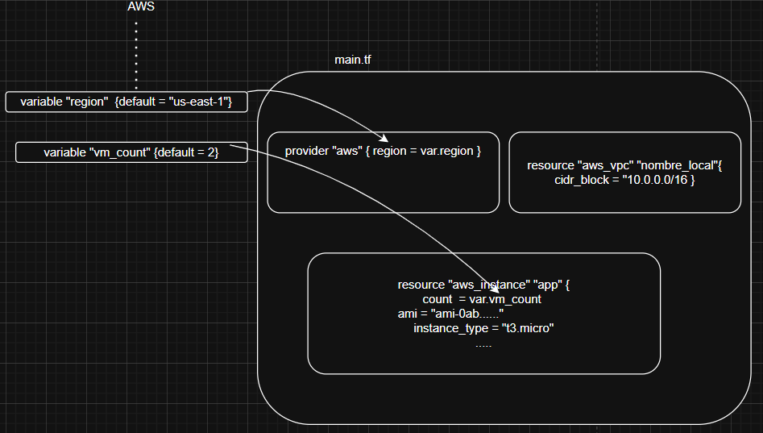
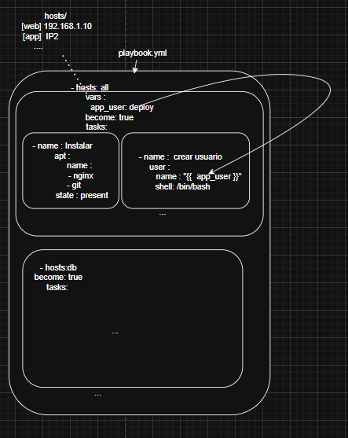
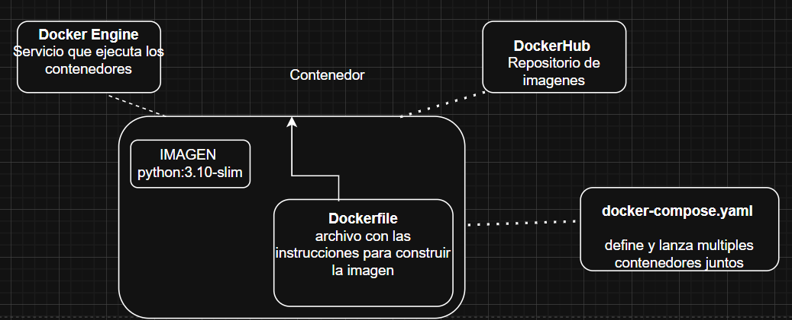
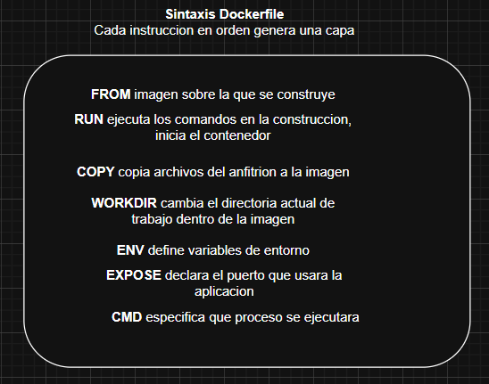

# Resumen de la Lectura15
La infraestructura engloba todo lo necesario para ejecutar un app<br>
```bash
            almacenamiento
                    ↓
      computo  → INFRAESTRUCTURA ← red
                    ↑
            seguridad(politicas IAM)
```
Antes se configuraba todo esto desde CLI
## ¿Qué es IaC?
Infraestructura como codigo (infraestructura en archivos) , en este archivo declaramos la infraestructura que queremos<br>
```bash
    pasos ad-hoc            | definicion en archivos
    ssh server                  HCL o JSON(terraform),YAML (ansible)
    yum install nginx           qué recursos queremos
    ...
    crea la red                 "quiero una maquina con ngnix en la 
    luego la maquina                red X "
    despues instala nginx
```
```bash
recurso "aws_instance" "web"   {
    ami = "123"
    instance_type = "t2.micro"
} 
quiero(que debe existir) una instancia EC2 con estas caracteristicas
```

## ¿Qué no es IaC?
Ejecutar *configuracion.sh* sin los principios de IaC
 
## Principios de IaC 
```bash
        Reproducibilidad        Composibilidad
        (entornos identicos)     (no cambio innecesario de estado )
        Idempotencia            Envolvibilidad
```
## Indempotencia
Luego del primer apply el estado local (.terraform.tfestate) guarda el estado del recurso, si volvemos a ejecutar terraform apply ,terraform detecta que no hay cambios entre el JSON, luego no se volvera a ejecutar local-exec<br>
Bueno, entonces para esto presentamos a YAML (YAML ain't markup language)<br>
Describe info estructurada(listas , objetos, valores)
```bash
persona:
  nombre: "P1"
  edad: 25
  habilidades: 
    - Terraform
    - Ansible
```
Ahora es ANSIBLE es la herramienta de automatizacion que usará YAML, de modo que se describa que tareas ejecutar en que servidores<br>

Mientras hosts, become, tasks son palabras reservadas de YAML; apt , service, copy.. son modulos de ansible, como se ve cada modulo tiene sus parametros y hace una tarea especifica<br>
Mientras Reproducibilidad e Idempotencias nos nos de alguna manera ya conocidas; veamos las dos propiedades nuevas<br>
Para ello revisemos la sintaxis de HCL(Hashicorp..) que es precisamente el lenguaje declarativo de configuracion que usaremos<br>
```bash
tipo_de_bloque "id1" "id2" {
    atributo = valor
    sub_bloques....
}
esto varia un poco dependiendo de que tipo de bloque es especifico se trate
resource tipo_definido_por_un_proveedor nombre_local {
    clave = valor
}
variable nombre_escogido {
    clave = valor  
}
recurso "aws_instance" "web"   {
    ami = "ami-0abcd1234"
    instance_type = "t2.micro"
} 
y module llama a las anteriores como lo haria una funcion
```
Okay, tenemos la sintaxis ,ahora veamos como referenciar los bloques entre si.
<br>
como se observa ,la variable server_name el disparador para crear un nuevo recurso , si este cambia se rehace el recurso ejecutando el provisionador , quien ejecuta un comando de interés.<br>

## Composibilidad
Se tiene la sintaxis de los bloques y como las variables llamadas en dentro del ambito de los resource, veamos como se pasan los valores ingresados en main.tf hacia los modulos network y compute, lo cual nos muestra la propiedad de  composabilidad 
Ahora bien la COMPOSABILIDAD  se veria del siguiente modo 

## Evolvibilidad

En cuanto a la EVOLVIBILIDAD ,se diria que es similar a export una variable en bash para que los procesos hijos lo usen , o parecido a la iyeccion de dependencias .
Entonces esto facilita la extension y adaptacion de la configuracion 

```bash
name = "hello-world"
network = "local-network"
ó
name = "staging-server"
network = "staging-network"
y 
terraform apply -var-file=staging.tfvars
```
### versionado de cambios
### Aplicacion de los principios

- Separacion de responsabilidades:<br>
    *Variables (network.tf.json)*<br>
    cómputo (main.tf.json)<br> 
    lógica de generación (main.py)
- Parametrizacion : <br>
    ```bash 
      hello_server_local(name="app1", network="net1")
      hello_server_local(name="app2", network="net2")
    ```
- Portabilidad con Docker: el Dockerfile y docker-compose.yml, garantiza que cualquieer maquina reproduzca e el flujo<br>
    *docker-compose up --build*

## Por qué usar IaC
Porque da control, velocidad ,  colaboracion y seguridad
- ### Gestion de cambios <br>
 **Rastro de auditoria**
 si se cambia el instance_type 
```bash
  t2.micro  a  t3.small en main.tf.json 
```
git diff  <commit1> <commit2>
```bash
diff --git a/app.py b/app.py
index 83db48d..7c5a7b3 100644
--- a/app.py
+++ b/app.py
@@ -10,7 +10,7 @@ def main():
     print("Hello world!")
-    print("Version 1")
+    print("Version 2")
     return True
```
**Revision por pares**
En el pr se incluye un terraform plan
```bash
terraform init    #inicializa el entorno
terraform plan    #genera un plan de ejecucion
Plan: 1 to add, 0 to change, 0 to destroy.
se aprueba (en main)
terraform apply -var-file=staging.tfvars -auto-approve

```
**Rollback instantaneo**
Si un despliegue automatico introduce un error , basta con revertir el commit 
```bash
git revert <SHA del commit> 
terraform vuelve a la version anterior y esto toma algunos minutos en comparacion con horas de reconstruccion manual
```
- ### Retorno de inversion (ROI)
**Despliegue expres** un entorno completo , una red local simulada con null_resource , servidor de prueba se crea en segundos
```bash
terraform apply -auto-approve
``` 
hacerlo manualmente implicaria decenas de clicks en consolas web ssh y validaciones de estado
**Pipelines automatizados**
Integrar Iac en GitHub Actions , GitLab CI o Jenkins  permite que , al hacer merge a main se ejecute automaticamente 

terraform fmt && tflint 
terraform plan 
terraform apply -auto-approve

Con esto se dedica menos tiempo en tareas repetitivas

**escalado horizontal**
si se necesita 5 instancias nuevas para un pico de trafico solo modificamos count=5 y reaplicamos. Terraform crea exactamente las instancias adicionales
sin intervencion manual

- ### Compartir conocimiento
**documentacion viva**
 las variables con nombre claros var.network_name , var.server_name, comentarios en modulos y ejemplos en README.md actuan como guias para miembros nuevos

 **onboarding acelerado** al clonar y ejecutar docker-compose up --build un desarrollador novato levanta un entorno de pruebas indentico al de produccion local 

 **Bibliotecas de modulos reutilizables** almacenados en modulos genericos ej security_group el equipo crea catalogo interno de bloques IaC , fomentando la consistencia entre proyectos
- ### Seguridad
**gestion centralizada de secretos** nunca harcodeamos credenciales, en cambio se integra Vault , AWS SSM o Azure Key Vault, ej el pipeline podria inyectar un token con :
```bash
- name: Login to Vault
  run: vault login -method=github token=${{ secrets.VAULT_TOKEN }}
```
**Revision de politicas** Al difinir roles y permisos de IAM como codigo ,se puede usar herramientas como terraform terraform-compliance para escanear malas configuraciones ej 0.0.0.0/0 no deberia estar en reglas de ssh

**Principio de menor privilegio** al versionar los aws_iam_policy o sus equivalentes, se documenta que permisos necesita cada componente, si una funcion lambda reclama permisos excesivos, el diff muestra que se añadio, evitando por ejemplo que un servicio tenga mas privilegios de los necesarios
## Herramientas

- **Aprovisionamiento** , nos provisionamos de infraestructura una nube privada virtual, red, balanceador , base de datos.

luego 
```bash
terraform init
terraform plan
terraform apply
```
- **Gestion de configuracion** 
Dejarla en el estado deseado: intalar  paquetes, copiar archivos de configuracion , gestionar servicios<br>
Estado deseado : cada playbook decribe el estado final<br>
Agentes vs agentless: Ansible suele funcionar por SSH<br>
Indempotencia: Aplicada en la maquina recien creada como en aquellas recreadas tras un provisionioning<br>
```bash
# playbook.yml
- hosts: all
  become: true
  vars:
    app_user: deploy
  tasks:
    - name: Crear usuario de la aplicación
      user:
        name: "{{ app_user }}"
        shell: /bin/bash

    - name: Instalar dependencias
      apt:
        name:
          - nginx
          - git
        state: present

    - name: Desplegar código
      git:
        repo: "https://github.com/mi-org/mi-app.git"
        dest: "/home/{{ app_user }}/app"
        version: "main"

    - name: Configurar servicio systemd
      template:
        src: service.j2
        dest: /etc/systemd/system/mi-app.service

    - name: Habilitar y arrancar servicio
      systemd:
        name: mi-app
        enabled: yes
        state: started
```
Como se ve tenemos un play que se aplica a todos los hosts **all** , y con become : true ejecutamos como **root** mediante sudo<br>
Mientras que la palabra reservada **vars** define variables locales al play , app_user será accesible desde las tareas <br>
mediante {{ app_user }}, las tareas cumplen codigo como documentacion, asi que son suficientemente explicitas<br>

Aun asi veamos algunos detalles, la tarea desplegar codigo 
```bash
- name: Desplegar código
  git:
    repo: "https://github.com/mi-org/mi-app.git"
    dest: "/home/{{ app_user }}/app"
    version: "main"

```
el modulo git clona un repo de Git, dest es la carpeta de destino <br>
La tarea template (plantilla de servicio) copia un archivo de plantilla Jinja2 (.j2) al servidor, procesando variables dentro.
```bash
  [Service]
  User={{ app_user }}
  ExecStart=/home/{{ app_user }}/app/start.sh
```
La siguiente tarea es conocida, el modulo systemd gestiona servicios del sistema (start,stop,restart)<br>
```bash
- name: Habilitar y arrancar servicio
  systemd:
    name: mi-app
    enabled: yes
    state: started

```
y todo se ejecutaria con 
```bash
ansible-playbook -i inventory playbook.yml
```
- **Construccion de imagenes**<br>
Se busca crear artefactos inmutables, contenedores Docker o imagenes VM, con todo preinstalado.<br>
De modo que minimizamos pasos en tiempo de arranque y garantizamos entornos identicos<br>
    - Arranque rapido, el contenedor ya incluye dependencias
    - Reproducibilidad, la imagen es un snapshot de su stack
    - Inmutabilidad, si falla un nodo lanzas otra imagen

Okay ahora hablemos de Docker<br>

**Docker** 
Es una plataforma para emmpaquetar aplicaciones y sus dependencias<br>
En tanto que un contenedor es una "pequeña maquina (vm)" aislada que comparte el kernel de sistema operativo del anfitrion, pero tiene sus propios procesos, sistemas de archivos y red 


Por su parte la sintaxis de Dockerfile


Ejemplo
```bash
FROM python:3.10-slim

# 1. Instala dependencias del sistema
RUN apt-get update && apt-get install -y git

# 2. Crea usuario y directorio de trabajo
RUN useradd -ms /bin/bash deploy
WORKDIR /home/deploy

# 3. Copia código y dependencias de Python
COPY requirements.txt .
RUN pip install --no-cache-dir -r requirements.txt
COPY . .

# 4. Define comando por defecto
CMD ["gunicorn", "app:app", "--bind", "0.0.0.0:8000"]
```
obtenemos la imagen , iniciamos el contenedor en el sentido de que ejecutamos comandos en tiempo de construccion (una capa por ejecucion), cambiamos al directorio deploy, copiamos requirements a la imagen, y finalmente ejecutamos el comando luego de construido el contenedor
CMD ejecuta el equivalente a
```bash
CMD gunicorn app:app --bind 0.0.0.0:8000
/bin/sh -c "gunicorn app:app --bind 0.0.0.0:8000"

#un ejemplo mas simple

CMD ["python", "app.py"]
python app.py
```
visualmente
```bash
CMD ["gunicorn", "app:app", "--bind", "0.0.0.0:8000"]
│      │             │           └── red y puerto
│      │             └── App (módulo:objeto)
│      └── Ejecutable principal (servidor WSGI)
└── Instrucción CMD de Docker
#app.py
from flask import Flask
app = Flask(__name__)
@route('/')
def saludo():
  return "saludos!"
```
docker build -t mi-app:latest .<br>
docker run -d -p 8000:8000 mi-app:latest<br>

el CMD ejecuta dentro del contenedor
```bash
guicorn app:app --bind 0.0.0.0/8000
```
levantamos el servior web flask en http://localhost:8000

**Packer**
Construye imagenes de maquinas virtuales completas<br>
   - Amazon AMI (EC2)
una imagene de todo el sistema operativo(Ubuntu)
```bash
{
  "builders": [
    {
      "type": "amazon-ebs",
      "region": "us-east-1",
      "source_ami": "ami-0abcdef1234567890",
      "instance_type": "t3.micro",
      "ssh_username": "ubuntu",
      "ami_name": "app-{{timestamp}}"
    }
  ],
  "provisioners": [
    {
      "type": "shell",
      "inline": [
        "sudo apt-get update",
        "sudo apt-get install -y nginx git python3-pip",
        "git clone https://github.com/mi-org/mi-app.git /opt/mi-app",
        "pip3 install -r /opt/mi-app/requirements.txt"
      ]
    }
  ]
}
```
packer build packer.json<br>
Arranca una instancia temporal de EC2,ejecuta los comandos de instacion (apt-get, git, pip3..) , se crea una AMI ya configurada y luego terraform puede instanciar la imagen
```bash
provider "aws" {
  region = "us-east-1"
}

resource "aws_instance" "web" {
  ami           = "ami-0a1b2c3d4e5f6g7h8"  # ←← la AMI creada por Packer
  instance_type = "t3.micro"

  tags = {
    Name = "ServidorConPacker"
  }
}

```
### como encajan estas capas en un pipeline 
- Desarrollo  y pruebas locales
- Control de calidad
- Despliegue
- Monitoreo y feedback 

## Escribiendo IaC 
### Expresando cambios en infraestructura
- Edicion declarativa de archivos
- Flujo clasico  init → plan → apply
- Plan como contrato 
### Comprendiendo la inmutabilidad
- Nunca parchear en caliente evitar ssh 
- Construccion de imagenes como paso previo
- Despliegue de blue /green o rolling 
- Remeditacion de drifts
- Migracion desde entornos legados
### Escribiendo codigo limpio de IaC
- Control de versiones como fuente de verdad
- Linting y formateo automatico
- Convenciones de nombrados
- Variables bien estructurados
- Parametrizar dependencias con codigo 
- Manejo seguro de secretos
## Anexos
A. Consistencia entre modulos 
```bash
# modules/network/variables.tf
variable "network_name" {
  description = "Nombre de la red principal"
  type        = string
}

# modules/network/main.tf
# ... recursos de red ...

# modules/network/outputs.tf
output "network_name" {
  description = "Nombre de la red creada o referenciada"
  value       = var.network_name
}
```
B. Variables con HCL y terraform.tfvars 
```bash
# variables.tf
variable "project_id" {
  type        = string
  description = "ID del proyecto"
}

variable "region" {
  type        = string
  description = "Región por defecto"
  default     = "us-central1"
}
....
# terraform.tfvars (ejemplo dev)
project_id  = "demo-devsecops"
region      = "us-central1"
tags        = ["owner:devsecops", "env:dev"]
db_password = "cámbiame"
```
C. Backend remoto y bloqueo de estado<br>
Usar backend remoto y locking <br>
S3 y DynamoDB
```bash
terraform {
  backend "s3" {
    bucket         = "tfstate-demo-devsecops"
    key            = "infra/terraform.tfstate"
    region         = "us-east-1"
    dynamodb_table = "tfstate-locks"
    encrypt        = true
  }
}
```
D. Usar Makefile ,estandariza flujo y facilita CI
```bash
SHELL := /usr/bin/env bash

TF ?= terraform
TF_DIR ?= ./

.PHONY: tools fmt lint init plan apply destroy clean

tools:
	command -v terraform >/dev/null || { echo "Instala Terraform"; exit 1; }
	command -v tflint >/dev/null || { echo "Instala tflint"; exit 1; }
	command -v checkov >/dev/null || { echo "Instala checkov"; exit 1; }

fmt:
	$(TF) -chdir=$(TF_DIR) fmt -recursive

lint: fmt
	tflint --recursive
	checkov -d $(TF_DIR)
...
```
E. Hook pre-commit (formato , lint y seguridad)
```bash
#!/usr/bin/env bash
set -euo pipefail
terraform fmt -recursive
tflint --recursive
checkov -d .
```