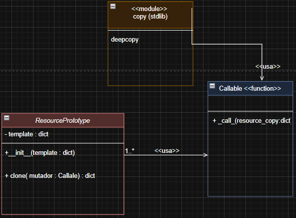

## Resumen (a lo sumo) de la lectura 16
En IaC organizar los componentes en achivos HCL , JSON o clases generadoras python => escalabilidad, mantenibilidad y coherencia.

Para recursos "null_resources" <= patrones de diseño clásicos del desarrollo de software .
El proyecto crece → muchas configuraciones → desorden , entonces se precisan metodologias de diseño.

En el caso particular del labo 6:
- Terraform json como proveedor null, se simula aprovisionamiento mediante "local-exec"
- Clases python que generan los bloques JSON de recursos, fabricas,prototipos  y builders.
- Orquestador (main.py) ensambla todos los modulos en un "main.tf.json".

De modo que se verá que cada patron de diseño facilita tareas concretas
Evitar duplicados (Singleton), Representar jerarquías(Composite) , Desacoplar la logica de creacion (Factory) , Reutilizar configuraciones(Prototype) , construir objetos complejos(Builder)

### Patrón Singleton: intancia única garantizada

Lo que se precisa es una unica instancia de clase durante el ciclo de vida de nuestra app, asi como un unico punto de acceso , esto podria usarse en el caso de : 
- Un bucket centralizado de logs
- Una VPC compartida entre varios entornos
- Politicas de seguridad globales

Entonces seria como un atributo de clase(la misma para todas las instancias de una clase) pero aplicado a la instancia de esa clase.
```bash
a = Singleton()
b = Singleton()
c = Singleton()
a is b is c   # es True
#son el mismo objeto en memoria
```
Lo anterior es el fin buscado , pero antes es preciso señalar la sintaxis y convenciones involucradas, para  un ejemplo simplificado todo cuanto se pudo
```bash
class 
    _instance = None
    def __new__(cls):
        if cls._instance is None:
            cls._instance = super().__new__(cls)
        return _intance
```
Entonces en este ejemplo se define un atributo de clase (que será la instancia de clase , la unica) , y se usa un metodo magico que python ejecutara por si mismmo , a saber , __new__, puesto que comienza y termina con __. 

Tiene un parámetro **cls** que sera un argumento, al ser invocado, este no es una palabra reservada pero es una convencion usada , representa a la clase en si misma.

Como python pasa automáticamente la instancia como el primer argumento de los metodos normales **metodo(self)** y pasa la clase **__new__(cls)** como primer argumento de los metodos magicos. Se concluye que **cls** representa la clase.

Entonces **__new__** recibe cls y determina si el atributo de clase no existe, en caso de ser asi la creamos llamando a al metodo __new__ de la clase padre via super(), pues super() devuelve el siguiente objeto del MRO.

Una vez creada devolvemos el atributo (instancia) esto cada vez que se pretenda crear una instancia de la clase en cuestión.

### Patrón Composite: Jerarquías recursivas 
La idea simple es que si varias clases comparten un metodo comun entonces sera otra clase quien agrege objetos de las clases anteriores a una lista , de modo que se recorra la lista ejecutando dicho metodo.
Y esta tercera clase seria el composite
```bash
class File:
    def __init__(self):
    
    def mostrar(self):

class Folder:
    def __init__(self):
    
    def add(self,obj):

    def mostrar(self):

#  y creando los objetos
f1 = File ()
f2 = File()
f3 = Folder()
f3.add(f2)

contenidos = [f1, f3]
# para usar mostrar()
for e in contenidos:
    if e is File
        e.mostrar()
    if e is  Folder
        e.mostrar()
# se tiene que determinar si es File o Folder

```
Entonces usamos composite para lograr lo que se describe al inicio .
```bash
class Composite:   # las clases anteiores podrian heredar de Component, en este caso es mas directo 
    def __init__(self):
        self.lista
    def add(self,obj):
        self.lista.add(obj)
    def mostrar_all(self,)  # o construir_todos()
        conjunto  = {}
        for e in self.lista
            r = e.mostrar()
            conjunto.update(r)
        return conjunto 
```

### Patrón Factory : Delegar Creación 
La esencia es similar al patron anterior en el sentido de que se usara un metodo para construir dentro de clases delegadas. De modo que separamos la logica de la creacion a clases especializadas 


```bash
class Base:
    def construir():
        raise NotImplementedError()
class DataFactory:
    def __init__(self,nombre):
        self.nombre = nombre
    def contruir(self):
        #logica de interes
class RedFactory:
    def __init__(self,cidr):
        self.cidr = cidr
    def construir(self):
        #logica de interes
class ServerFactory:
    def __init__(self,host):
        self.host = host
    def construir(self):
        #logica de interes
```
Y como en el ejemplo de la lectura, el orquestador itera sobre una coleccion de fabricas(las clases delegadas) 
```bash
fabricas = [DataFactory(""),RedFactory(""),ServerFactory("")]
for f in fabricas : 
    recurso = f.construir()
    print(recurso)
```

### Patrón Prototype : Clonación de plantillas
El patron permite la clonacion de objetos modificando solo las partes necesarias. Util por ejemplo cuando queremos generar subredes con algunos atributos modificados

```bash
import copy
class Prototype:
    def __init__(self,valor,etiqueta):
        self.valor = valor 
        self.etiqueta = etiqueta
    def clonar(self, **cambios):
        nuevo = copy.deepcopy(self)
        for  clave, valor in changes.items:
            setattr(nuevo,clave,valor)
        return nuevo

proto = Prototype(valor = 100, etiqueta ="BASE")
prot1 = proto.clone(etiqueta = "A")
prot2 = proto.clone(etiqueta = "B",valor = 200)

```
Un poco de la sintaxis **cambios, python convierte a dict los argumentos pasados; mientras que con setttr() se realiza la modificaicon del atributo del nuevo objeto creado.

CABE MENCIONAR QUE ESTOS SON EJEMPLOS DE LOS PATRONES QUE SE ESTAN ESTUDIANDO, EN UN CAMPO DE PROGRAMACION GENERAL, SIN AUN VINCULAR INFRAESTRUCTURA.

### Patron Builder : Construcción paso a paso
Se crea un objeto mediante pasos encadenados
```bash
class ServerBuilder:
    def __init__(self):
        self.config = {}
    def nombre(self,nombre):
        self.config["nombre"] = nombre
    ......
    def construir(self):
        nombre = self.config.get("nombre","servidor")
        print(f"{nombre}...")
        return self.config
```
### Criterios para seleccionar el patron
1. Grado de reutilizacion: 
    - declarar un unico recurso global <= singleton  
    - clonar multiples configuraciones <= prototype
2. Complejidad de configuracion
    - pocas propiedades construccion directa <= factory
    - muchas opciones <= Builder
3. Estructura jerarquicas
    - Varias capas de dependencias (VPC->subredes->intancias) <= Composite
4. Escalamiento y mantenibilidad
    - proyectos pequeños <= Factory y prototype
    - Sistemas empresariales <=Factory y Prototype
5. Pruebas y validacion
    - facilitar test unitarios evitando singleton ocultos <= Builder y Factory
6. Evolucion de proyectos
    - proyecto grande <=Composite + Builder
    - scripts rapidos <= Factory y prototype

## Resumen (a lo sumo) de la lectura 17

### Patrones de dependencia en IaC
Se tiene que definir como fluyen los datos y el orden de creacion,para este fin se recurre a patrones de dependencias que imprimen un orden logica y desacoplo en los modulos IaC
**Relaciones unidireccionales**
```bash 
---------------------                ----------------------
|  modulo RED        | subnet_id     | modulo   COMPUTO   |
|que genera subnet_id|  → → →        |que lanza servidores|
|                    |               |en esta subred      |
---------------------|               ---------------------

module "computo" {
    subnet_id = module.red.subnet_id
}
```
1. Modulo de almacenamiento y politicas:
```bash
resouce "aws_s3_bucket" "servicio_de_almacenamiento" {
    bucket = var.bucket_name # solo expone el nombre
}

output "bucket_arn" {
    value = aws_s3_bucket.data.arn
}

variable "bucket_arn" {
}

resource "aws_aim_policy" {
    policy = jsonencode ({Stament = [{
                            Action = ["s3:GetObject"] 
                            Effect = "Allow" 
                            Resource = ["${var.bucket_arn}"]}]}) # la politica iam recibe este nombre
}
El flujo va del bucket a la politica , nunca al reves
```
2. Colas de mensajes y consumidores
```bash
queue.tf (produce ARN o URL de la cola)→ consumer.tf (consume esa URL) 
def crea_cola():
    return {"queue_url" : ""https://..}}
def crea_connsumidor(queue_url):
    deploy_consumer(service_name="worker",target_queue=queue_url)
    #placeholder, nombre simbolico ,crea funcion Lambda que escucha consumidor
#el flujo unidireccional
info_cola = crear_cola()
crear_consumidor(info_cola["queue_url"])
```

3. Base de datos y capa de aplicacion 
Un modulo de base de datos (db.tf) expone una cadena de conexion → inyectar la cadena en el despliegue de la applicacion (app.tf) . Asi evitamos que la pp intente arrancar sin la base de datos 

4. Testeo Aislado
```bash
terraform apply -var "subnet_id=subnet-....." #asi se prueba solo el modulo computo 
```
Aqui se detalla la sintaxis de **terraform apply -var** 
pasamos el valor de subnet_id desde CLI 
y luego en el modulo computo tendriamos algo asi 
```bash
#en modulos/computo
#var.tf
variable "subnet_id" {

}
#main.tf
resource "aws_instance" "vm" {
.....
    subnet_id = var.subnet_id
}

#luego desde algun local-dev
#terraform apply -var "..."

#var.tf
variable "subnet_id" {}
#main.tf
module "computo" {
    source = "./modules/computo"
    subnet_id = var.subnet_id # pasamos al modulo computo (a su main.tf)
}
```
Entonces con realaciones unidireccionales: Eliminamos ciclos en el grafo de dependencias, facilitamos el calculo automatico de ordenes de provision , mejoramos la mantenibilidad pues cada modulo tiene una interfaz clara  , permite test modulares.

### Inyeccion de dependencias
Se necesita desacoplar, para tal fin se usa DI, IoC, DIP.
Como se vio en el ejemplo anterior , sera un orquestador quien pase los valores de los parametros hacia los modulos.Es el orquestador quien usa el principio IoC y decide el flujo, usando en este contexto DI para pasar parametros a los modulos.
Veamos claramente IoC  y Di 
```bash
IoC == QUIEN MANDA "el modulo no controla el flujo"
#IoC
module "red" {
    source = "./modulos/red"
    cidr_block = var.vpc.cidr  # ← DI
}
```
Pero pareciera que IoC y DI fueran uno mismo, no es asi, veamos los contraejemplos de ello
```bash
# IoC sin DI
# IoC el framework llama  a la funcion
def on_request():  
    db = RealDatabase() # sin DI

# DI sin IoC
def main():
    db = RealDatabase()
    servicio = MiServicio(db) # ← DI
    servicio.run() #pero estamos contralando en flujo dentro
```
.....FALTA

# Actividad14-CC3S2
## Fase 0 :Preparacion 
1. 
```bash
esau@DESKTOP-A3RPEKP:~/desarrolloDeSoftware/labs/Laboratorio6$ cd iac_patterns  
esau@DESKTOP-A3RPEKP:~/desarrolloDeSoftware/labs/Laboratorio6/iac_patterns$ ls  
__init__.py  builder.py  composite.py  factory.py  prototype.py  singleton.py   
esau@DESKTOP-A3RPEKP:~/desarrolloDeSoftware/labs/Laboratorio6/iac_patterns$ pythesau@DESKTOP-A3RPEKP:~/desarrolloDeSoftware/labs/Laboratorio6/iac_patterns$ python -m venv venv_labo6 && source venv_labo6/bin/activate
(venv_labo6) esau@DESKTOP-A3RPEKP:~/desarrolloDeSoftware/labs/Laboratorio6/iac_patterns$ pip install --upgrade pip
Requirement already satisfied: pip in ./venv_labo6/lib/python3.12/site-packages (24.0)
Collecting pip
  Using cached pip-25.3-py3-none-any.whl.metadata (4.7 kB)
Using cached pip-25.3-py3-none-any.whl (1.8 MB)
Installing collected packages: pip
  Attempting uninstall: pip
    Found existing installation: pip 24.0
    Uninstalling pip-24.0:
      Successfully uninstalled pip-24.0
Successfully installed pip-25.3
(venv_labo6) esau@DESKTOP-A3RPEKP:~/desarrolloDeSoftware/labs/Laboratorio6/iac_patterns$
```
2. 
```bash
esau@DESKTOP-A3RPEKP:~/desarrolloDeSoftware$ cd labs/Laboratorio6
esau@DESKTOP-A3RPEKP:~/desarrolloDeSoftware/labs/Laboratorio6$ python generate_infra.py
[Builder] Terraform JSON escrito en: terraform/main.tf.json
esau@DESKTOP-A3RPEKP:~/desarrolloDeSoftware/labs/Laboratorio6$ cd terraform
esau@DESKTOP-A3RPEKP:~/desarrolloDeSoftware/labs/Laboratorio6/terraform$ ls
main.tf.json
esau@DESKTOP-A3RPEKP:~/desarrolloDeSoftware/labs/Laboratorio6/terraform$ terraform init
Initializing the backend...
Initializing provider plugins...
- Reusing previous version of hashicorp/null from the dependency lock file
- Using previously-installed hashicorp/null v3.2.4

Terraform has been successfully initialized!
...
esau@DESKTOP-A3RPEKP:~/desarrolloDeSoftware/labs/Laboratorio6/terraform$ terraform validate
Success! The configuration is valid.
```
3. 
```bash
     ...
           ]
        },
        {
            "null_resource": [
                {
                    "finalizador": [
                        {
                            "triggers": {
                                "nota": "Recurso compuesto generado din\u00e1micamente en tiempo de ejecuci\u00f3n",
                                "factory_uuid": "e8d530c9-699e-4f82-80ff-293b0b7d782d",
                                "timestamp": "2025-11-20T18:44:28.196668"
                            }
                        }
                    ]
                }
            ]
        }
    ]
```

## Fase 1 : Exploracion y analisis
1. Singleton 
```bash
# singleton.py
import threading
from datetime import datetime

class SingletonMeta(type):
    _instances: dict = {}
    _lock: threading.Lock = threading.Lock()

    def __call__(cls, *args, **kwargs):
        with cls._lock:
            if cls not in cls._instances:
                instance = super().__call__(*args, **kwargs)
                cls._instances[cls] = instance
        return cls._instances[cls]

class ConfigSingleton(metaclass=SingletonMeta):
    def __init__(self, env_name: str):
        self.env_name = env_name
        self.settings: dict = {}
        self.created_at: str = datetime.utcnow().isoformat()
```
Se vió en el resumen de la lectura 16, el cómo singleton asegura que solo se cree una instancia de dicha clase, esto mediante un atributo de clase y una funcion magica, este ultimo es invocado automaticamente por python, de modo que se ejecuta su cuerpo. Se analiza si cls esta en cls._instances...

Sin embargo ; es un tanto mas complejo, al tratarse de una metaclase, este será la base de muchas clases, de modo que cada clase implemente solo instancia (que es el objetivo del patron singleton ), lo cual añade complejidad.

__call__  recibe la clase (una de las que implementa la metaclase SingletonMeta) y verifica si esa clase (la instancia) esta en el diccionarios de intancias _instances : dict = {} , si no se encuentra llama al __call_ "anterior" del MRO (osea el call de la clase "padre" ) le pasamos la clase (*args) como primer argumento, y otros argumentos de interes **kwargs. 

Como se va a usar un diccionario como el atributo de clase (de la metaclase) , donde se almacenaran las instancias(direcciones de memoria) unicas de las clases que usan a la metaclase Singleton , entonces se requiere bloquear (proteger?) el acceso para evitar condiciones de carrera, y esto es precisamente lo que hace **Threading.lock()**  similar al Synchronized de java.

2. Factory
```bash
# factory.py
import uuid
from datetime import datetime

class NullResourceFactory:
    @staticmethod
    def create(name: str, triggers: dict = None) -> dict:
        triggers = triggers or {
            "factory_uuid": str(uuid.uuid4()),
            "timestamp": datetime.utcnow().isoformat()
        }
        return {
            "resource": {
                "null_resource": {
                    name: {"triggers": triggers}
                }
            }
        }
```
Como se detallo en el resumen, las fabricas comparten una clase base que tiene (por ejemplo un metodo construir) de modo que cada clase define su propio metodo construir. El patron factory usa este hecho para que se construyan las clases dentro de una lista y luego se recorra la lista con llamadas a los metodos construir de cada instancia de clase, iterativamente (dentro del for)

En el caso de un .tf o python con codigo json que sera "convertido" a .tf.  
La fabrica en NullResourceFactory , quien define el meetodo create , este ultimo encapsula la creacion del recurso y ademas define los disparadores. Estos triggers 
registran metadatos   , con una sintaxis propia de python , se asigna triggers a triggers si no hay metadatos de interes, caso contrario se asignan **factory_uuid ← nuemero aleatorio que identificara a lo que se quiera**
**timestamp ← tiempo**
3. Prototype
```bash
# prototype.py
from copy import deepcopy
from typing import Callable

class ResourcePrototype:
    def __init__(self, template: dict):
        self.template = template

    def clone(self, mutator: Callable[[dict], None]) -> dict:
        new_copy = deepcopy(self.template)
        mutator(new_copy)
        return new_copy
                           <<module>>
                          copy (stdlib)
                         +-----------+
                         | deepcopy |
                         +-----------+
                               ^
                               |
     uses (1)                  |   uses (1)
+------------------------+     |      
|   ResourcePrototype    |-----+-------------------+
|------------------------|                         |
| - template: dict       |                         |
|------------------------|                         |
| + clone(mutator) : dict|                         |
+------------------------+                         |
          ^                                        |
          |  mutator (callable)                    |
          |   uses (1)                              |
          |                                         v
          |                                 +------------------+
          |                                 |     Mutator      |
          +---------------------------------|  «function»       |
                                            |------------------|
                                            | + __call__()     |
                                            +------------------+

```


4. Composite
```bash
# composite.py
from typing import List, Dict

class CompositeModule:
    def __init__(self):
        self.children: List[Dict] = []

    def add(self, block: Dict):
        self.children.append(block)

    def export(self) -> Dict:
        merged: Dict = {"resource": {}}
        for child in self.children:
            # Imagina que unimos dicts de forma recursiva
            for rtype, resources in child["resource"].items():
                merged["resource"].setdefault(rtype, {}).update(resources)
        return merged
```
Tal como se menciona en el resumen , en lugar de determinar de que tipo es cada objeto, simplemente se agrega a la lista de la clase(objeto?) composite, y luego se recorre dicha lista ejecutando el metodo de interes.

En este caso en particular se agrega via **add(bloque) : lista.append(bloquee)** y luego recorremos mediante **export() : for i in lista:....**

4. Builder
```bash
# builder.py
import json
from composite import CompositeModule
from factory import NullResourceFactory
from prototype import ResourcePrototype

class InfrastructureBuilder:
    def __init__(self):
        self.module = CompositeModule()

    def build_null_fleet(self, count: int):
        base = NullResourceFactory.create("app")
        proto = ResourcePrototype(base)
        for i in range(count):
            def mutator(block):
                # Renombra recurso "app" a "app_<i>"
                res = block["resource"]["null_resource"].pop("app")
                block["resource"]["null_resource"][f"app_{i}"] = res
            self.module.add(proto.clone(mutator))
        return self

    def export(self, path: str = "terraform/main.tf.json"):
        with open(path, "w") as f:
            json.dump(self.module.export(), f, indent=2)
```
5. Builder
```bash
# builder.py
import json
from composite import CompositeModule
from factory import NullResourceFactory
from prototype import ResourcePrototype

class InfrastructureBuilder:
    def __init__(self):
        self.module = CompositeModule()

    def build_null_fleet(self, count: int):
        base = NullResourceFactory.create("app")
        proto = ResourcePrototype(base)
        for i in range(count):
            def mutator(block):
                # Renombra recurso "app" a "app_<i>"
                res = block["resource"]["null_resource"].pop("app")
                block["resource"]["null_resource"][f"app_{i}"] = res
            self.module.add(proto.clone(mutator))
        return self

    def export(self, path: str = "terraform/main.tf.json"):
        with open(path, "w") as f:
            json.dump(self.module.export(), f, indent=2)
```
El constructor de esta clase define un objeto tipo Composite , entonces este apilara el la lista los objetos de interes. Mientras que en el metodo **build_null_fleet** se crean el objeto **base = Factory()** contiene las fabricas para la construccion de (por ejemplo) recursos de interes y luego  **proto = Prototype(base)** que usa esta fabrica como  informacion que podra ser cambiado segun se quiera o no. Esto es lo que se realiza dentro de la funcion interna **mutador**  reasignando los nombres de las app segun sus indices.

Finalmente el metodo **export()** realiza la construccion llamando al export de Composite que realiza la ejecucion de la funcion de interes iterando para cada elemento de la lista del Composite.

## Fase 2 : 
### Ejercicio 2.1 : 
```bash
# se añade este metodo a ConfigSingleton
  def reset(self): 
        self.settings.clear()
# el script test_singleton.py
# ejecutando el test
(venv_labo6) esau@DESKTOP-A3RPEKP:~/desarrolloDeSoftware/labs/Laboratorio6/iac_patterns$ pytest -v test_singleton.py
============================= test session starts ==============================
platform linux -- Python 3.12.3, pytest-9.0.1, pluggy-1.6.0 -- /home/esau/desarrolloDeSoftware/labs/Laboratorio6/iac_patterns/venv_labo6/bin/python
cachedir: .pytest_cache
rootdir: /home/esau/desarrolloDeSoftware/labs/Laboratorio6/iac_patterns
collected 1 item                                                                

test_singleton.py::test_ PASSED                                          [100%] 

=============================== warnings summary ===============================
test_singleton.py::test_ ...
```
### Ejercicio 2.2 :
Se crea
```bash
class TimeNullResourceFactory(NullResourceFactory):
    @staticmethod 
    def crear(nombre,fmt):
        ts = str(datetime.now(timezone.utc).strftime(fmt)) 
        triggers = {}
        triggers.setdefault("ts",ts)
```
el valor o diccionario devuelto es 
```bash
return {
            "terraform":{
                "required_providers":{
                    "null":{
                        "source":"hashicorp/null"
                    }
                }
            },
            "provider":{
                "null":{}
            },
            "resource":[{
                "null_resource":[
                    {
                        nombre:[{
                            "triggers" : triggers
                        }]
                    }
                ]
            }]
        }
```
Ejecutando la prueba, pasando el formato deseado como argumento al metodo crear de la nueva clase.
```bash
formato = '%Y-%m-%d'
obj = TimeNullResourceFactory()
resultado = obj.crear("fabrica_prueba",formato)
print(resultado)

with open("fabrica.tf.json","w") as f:
    json.dump(resultado,f,indent=2)
print("archivo tf.json generado")
 
```
Se hizo la serializacion de un dict a un tf.json, archivo que terraform reconoce. 

```bash
(venv_labo6) esau@DESKTOP-A3RPEKP:~/desarrolloDeSoftware/labs/Laboratorio6/iac_patterns$ terraform 
init
Initializing the backend...
Initializing provider plugins...
- Finding latest version of hashicorp/null...

...
(venv_labo6) esau@DESKTOP-A3RPEKP:~/desarrolloDeSoftware/labs/Laboratorio6/iac_patterns$ terraform 
plan

Terraform used the selected providers to generate the following execution plan. Resource actions   
are indicated with the following symbols:
  + create

Terraform will perform the following actions:

  # null_resource.fabrica_prueba will be created
  + resource "null_resource" "fabrica_prueba" {
      + id       = (known after apply)
      + triggers = {
          + "ts" = "2025-11-21"
        }
    }

Plan: 1 to add, 0 to change, 0 to destroy.
```
### Ejercicio 2.3 :
```bash
import copy
from typing import Dict, Any
import json

recurso = {
    "resource" :[{
        "null_resource":[{
            "proto_prueba":[
                {
                    "triggers":{
                        "version":"1.0"
                    }
                }
            ]
        }]
    }]
}

class ResourcePrototype: 
    def __init__(self, resource_dict: Dict[str, Any]) -> None:
        self._resource_dict = resource_dict
    def clonar(self, mutador=lambda d: d) -> "ResourcePrototype":
        # Copia profunda para evitar mutaciones al recurso original
        new_dict = copy.deepcopy(self._resource_dict)
        # Aplica la función mutadora para modificar el clon si se desea
        mutador(new_dict)
        # Devuelve un nuevo prototipo con el contenido clonado
        return ResourcePrototype(new_dict)
    @property
    def data(self) -> Dict[str, Any]: 
        return self._resource_dict

def mutador(new_dict):
    new_dict["resource"][0]["null_resource"][0]["proto_prueba"][0]["triggers"]["welcome"] = "¡Hola!"
    new_dict["resource"].append({"local_file" : [{
        "welcome_txt": [{
            "content": "Bienvenido",
            "filename": "${path.module}/bienvenida.txt"
        }]
    }]})

obj = ResourcePrototype(recurso)
resultado = obj.clonar(mutador)
with open("prototype.tf.json","w") as f:
    json.dump(resultado.data,f,indent=2)
#luego terraform apply
```
Y aplicando 
```bash
(venv_labo6) esau@DESKTOP-A3RPEKP:~/desarrolloDeSoftware/labs/Laboratorio6/iac_patterns$ terraform init
Terraform has been successfully initialized!
...
(venv_labo6) esau@DESKTOP-A3RPEKP:~/desarrolloDeSoftware/labs/Laboratorio6/iac_patterns$ terraform apply

Terraform used the selected providers to generate the following execution plan. Resource actions are indicated with the   
following symbols:
  + create
  ..
null_resource.proto_prueba: Creating...
local_file.welcome_txt: Creating...
null_resource.proto_prueba: Creation complete after 0s [id=7181163649754672474]
local_file.welcome_txt: Creation complete after 0s [id=f51b98d412e1b580125610b614731dfa39f79046]

Apply complete! Resources: 2 added, 0 changed, 0 destroyed.
```
### Ejercicio 2.4 : 
```bash
from typing import List, Dict, Any
import json

class CompositeModule: 
    def __init__(self): 
        self._children = []
    def add(self, resource_dict):
        self._children.append(resource_dict)
    def export(self,base): 
        agregado = base.copy()
        agregado["resource"] = []
        for child in self._children: 
            agregado["resource"].extend(child.export()["resource"])
        return agregado
class ModuloRed:
    def export(self):
        return  {
             
            "resource":[ 
                {"null_resource":[
                    {"red":[
                        {
                            "triggers":{
                                "x" : 1
                            }
                        }
                    ]}
                ]}]}
class ModuloApp:
    def export(self):
        return {
            
            "resource":[
                {
                    "local_file":[
                        {
                            "app":[
                                {
                                    "content":"app",
                                    "filename":"app.txt"
                                }
                            ]
                        }
                    ]
                }
            ]
        } 

compuesto = CompositeModule()
compuesto.add(ModuloRed())
compuesto.add(ModuloApp())
base = {
    "terraform": {
        "required_providers": {
            "null": {"source": "hashicorp/null"},
            "local": {"source": "hashicorp/local"}
        }
    },
    "provider": {
        "null": {},
        "local": {}
    }
}
resultado =compuesto.export(base)
with open("main.tf.json","w") as f:
    json.dump(resultado,f,indent = 2)
```
Ejecutando 
```bash
(venv_labo6) esau@DESKTOP-A3RPEKP:~/desarrolloDeSoftware/labs/Laboratorio6/iac_patterns/composite$ python composite.py
(venv_labo6) esau@DESKTOP-A3RPEKP:~/desarrolloDeSoftware/labs/Laboratorio6/iac_patterns/composite$ terraform init
Initializing the backend...
Initializing provider plugins...
...
(venv_labo6) esau@DESKTOP-A3RPEKP:~/desarrolloDeSoftware/labs/Laboratorio6/iac_patterns/composite$ terraform apply

Terraform used the selected providers to generate the following execution plan. Resource actions are indicated with the   
following symbols:
  + create

Terraform will perform the following actions:

  # local_file.app will be created
  + resource "local_file" "app" {
      + content              = "app"
      + content_base64sha256 = (known after apply)
      + content_base64sha512 = (known after apply)
      + content_md5          = (known after apply)
      + content_sha1         = (known after apply)
      + content_sha256       = (known after apply)
      + content_sha512       = (known after apply)
      + directory_permission = "0777"
      + file_permission      = "0777"
      + filename             = "app.txt"
      + id                   = (known after apply)
    }

  # null_resource.red will be created
  + resource "null_resource" "red" {
      + id       = (known after apply)
      + triggers = {
          + "x" = "1"
        }
    }

Plan: 2 to add, 0 to change, 0 to destroy.

Do you want to perform these actions?
  Terraform will perform the actions described above.
  Only 'yes' will be accepted to approve.

  Enter a value: yes

null_resource.red: Creating...
local_file.app: Creating...
null_resource.red: Creation complete after 0s [id=1999702726758919520]
local_file.app: Creation complete after 0s [id=7d1043473d55bfa90e8530d35801d4e381bc69f0]

Apply complete! Resources: 2 added, 0 changed, 0 destroyed.
(venv_labo6) esau@DESKTOP-A3RPEKP:~/desarrolloDeSoftware/labs/Laboratorio6/iac_patterns/composite$
```
