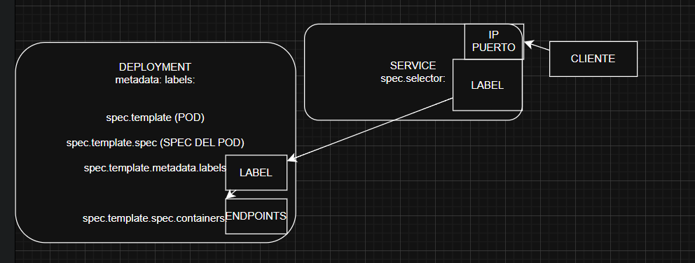

# Actividad20-CC3S2
Antes ejecutamos los pasos del laboratorio 11

    Siguiendo las indicaciones **(2 preparacion del entorno)** de la ejecucion del laboratorio: 
**source scripts/env.sh** ejecuta el .sh conservando las variables y configuraciones, en contraposicion con **bash .sh**. Este .sh usa la sustitucion de comandos para asignar a la variable TAG la ejecucion de **./scripts/tag.sh** en esta linea **TAG="$(./scripts/tag.sh)"** 
En tanto que tag.sh , seleccionamos el interprete, y activamos el rastreo de errores, terminar si hay un error, variables mal escritas y errores en un pipeline.Luego verificamos si estamos dentro de un repositorio git y si es asi se obtiene el hash del ultimo commit , de lo contrario solo la fecha actual  
```bash
#!/usr/bin/env bash  
set -o errexit
set -o nounset
set -o pipefail
if git rev-parse --is-inside-work-tree > /dev/null 2>&1; then
git rev-parse --short HEAD
else 
 date +%Y%m%d%H%M%S
fi 
```
Hecho esto  se realizan las asignaciones por defecto **export VARIABLE="${VARIABLE:-valor}"** y exportaciones  de las variables SERVICE , IMAGE_NAME, IMAGE_REPO, IMAGE  e imprimimos esa informacion.
```bash
#!/usr/bin/env bash
export TAG="$(./scripts/tag.)"
export SERVICE="${SEVICE:-order-service}"
export IMAGE_NAME="${SERVICE}"
export IMAGE_REPO="${IMAGE_REPO:-${IMAGE_NAME}}"
export IMAGE="${IMAGE_REGISTRY:+${IMAGE_REGISTRy}/}${IMAGE_REPO}:${TAG}"
echo "SERVICE=$SERVICE TAG=$TAG IMAGE=$IMAGE"

(.venv_labo11) esau@DESKTOP-A3RPEKP:~/desarrolloDeSoftware/labs/Laboratorio11$
 source scripts/env.sh
SERVICE=order-service TAG=9bc3a72 IMAGE=order-service:9bc3a72
```
**3 desarrollo local de pruebas, make dev** 
Desarrollo local, la receta make dev tiene los prerrequisitos env, minikube-up, build entre otros , env exporta las variables de entorno en el mismo proceso (shell) en el que nos encontramos. En tanto que minikube-up hace **minikube start**. Lueho la receta build, hace lo esperado **eval $$($(MINIKUBE) docker-env)** para usar el docker de kubernetes, luego la construccion se hara en los contenedores del cluster **$(DOCKER) build -t $(K8S_IMAGE) -f docker/Dockerfile...**

```bash
# iniciando kubermetes minikube
minikube-up:
    $(MINIKUBE) status >/dev/null 2>&1 || $++(MINIKUBE) start --drive=docker --kubernetes-version=$(K8S_VERSION) --cpus=$(...) --memory=$(...)
# y seguidamente build
eval $$($(MINIKUBE) docker-env)  
$(DOCKER) build -t $(K8S_IMAGE) -f docker/Dockerfile . 
```
Se construye la imagen dentro del cluster de acuerdo al dockerfile, veamos 
```bash
FROM imagen
ENV PYTHONDONTWRITECODE=1 # no mantener .pyc bytecode compilado 
PYTHONBUFFERED=1 # no guardar en memoria
PORT=8000
# ejecutamos comandos de shell durante la construccion de la imagen
RUN set -eux; rm -f /etc/apt/apt.conf.d/docker-clean || true;
apt-get update; apt-get install -y ....
rm -rf /var/lib/apt/lists/* 
...
RUN useradd -m app && chown -R app:app /app
HEALTHCHECK ... CMD curl -fS 
CMD ["sh","-c","python -m http.server ${PORT}"]
```
Se borra el archivo **/etc/apt/apt.conf.d/docker-clean**  (que las imagenes slim tiene) que borra la cache , luego apt-get update, se usa advanced package tools para actualizar los paquetes y luego instalamos curl con **--no-install-recommends curl ca--certificates** 
Ademas creamos un usuario no root
USER  useradd -m user , ese **-m** crea el directorio home, lo cual no confundir con **python -m venv** donde si se ejecuta el modulo como script
Entonces **USER useradd -m app && chown -R USUARIO:GRUPO /app**
de modo que todo dentro de /app pertenece a usuario app y grupo app.

En tanto la instruccion **HEALTHCHECK** con algunas banderas como --intervals=.. --timeout=.. --retries=.. y un comando del heatcheck **CMD curl -fsS** las banderas hacen que falle(-f) modo silenciioso(-s) y muestra de errores(-S)

Y finalmente la instruccion que arranca el contenedor **CMD ["sh","-c","ejecutamos un servidor http simple "]** , "python -m http.server ${PORT}"
Esto se hace en la linea docker build -t -f docker/Dockerfile de la receta build


Mientras que la receta k8s-prepare crea la carpeta para los artefactos **mkdir -p $(ARTIFACTS)**

luego determinamos si el SERVICE es order-service, **if [[ "$(SERVICE) == "order-service" ]]** hecho esto usamos el comando sed(stream editor ) un tools de unix para sustituir el regex por reemplazo **s|regex|reeemplazo** , de modo que buscamos la expresion regular **image\s*[^[:space:]]+** osea buscamos la expresion imagen luego un vacio o mas(\s*) seguidamente caracteres pero sin espacios [^[:space:]] una o mas veces + . Y lo reemplazamos por 

**imagen:(K8S_IMAGE)|** 
Siendo el archivo donde se buscara (K8S_SERVICE)/deployment-and-service.yaml y el archivo donde se guardara (redireccionará) $(ARTIFACTS)/order-service.yaml

```bash
k8s-prepare:
    @ mkdir -p $(ARTIFACTS) 
    if [[ "$(SERIVICE) == "order-service" ]];then
        sed -E 's |image:\s*[^[:space:]]+ | ' $(K8S_DIR)/deployment-and-service.yaml > $(ARTIFACTS)/order-service.yaml ...s 
```
Veamos entonces el contenido del manifiesto order-service.yaml.
tenemos los campos **apiVersion: app/v1** , **kind: Deployment** el Deployment es un tipo reconocido por kubernetes y no es opcional, no lo define el usuario.
```bash
spec:
    replicas:
    selector:
    template:
        metadata:
            labels:
        spec:
            containers:
                - name: 
                  imagen: order-service:CHANGEME 
                  ...
```
Ademas **metadata:** con la info del manifiesto, **name: identifica el recurso tipo Deployment**
Ahora **metadata.labels.app: para seleccionar conjunto de recursos** 

Cabe resaltar metadata.name es el **Resource name** identifica un solo recurso y se usa en **kubectl get deployment order-service** , mientras que **metadata.labels.app**  es el Labels para clasificar, y poder usar **kubectl get deployment -l app=order-service** En tanto **spec.selector.matchLabels.app:que pods controla el Deployment** mientras que **spec.template.metadata.labels.app:son los labels de los pods** de modo que el se selector los encuentre,son los labels de instancias(PODS) no del recurso.
Un Pod es una instancia (runtime) de la plantilla definida por un Deployment(en este caso) o el pod es la instancia concreta creada por un un ReplicateSet el cual es gestionado por un Deployment.

En tant que **spec.template.spec.containers:** 
Es una lista de definicion de  contenedores ,del siguiente modo , **-** indica un elemento de dicha lista, **- name: order-service**

luego el campo **image:order-service:TAG** que en la practica, esta linea sera encontrado por el sed y cambiado a order-service:TAG con TAG= el hash del ultimo commit  o la fecha de modo que la imagen quedaria **order-service:hash o fecha**. En este punto surge una duda (personalmente) la imagen esta en el dockerfile dentro de una ruta definida , es justamente la imagen construida en **(DOCKER) build -t $(renombrar la imagen construida) -f rutadeldockerfile  .** , esto despues de eval **$(minikube docker-env)** 

Esto para que la construccion se haga dentro del cluster, un detalle importante el cluster no esta definido por el maniefiesto , el cluster es un conjunto de maquinas controlados por un control plane que gestiona contenedores, el cluster incluye **control-plane:kube-apiserver, etcd,shceduler,controller-maneger** y **workers-nodes:kubelet,container runtime, kube-proxy** mientras que nuestro Deployment crea el estado deseado y los pod son instancias de este Deployment(en este caso).
Regresando a la construccion de la imagen dentro del cluster,la imagen construida queda en el image store del docker daemon que ejecuto el build, como se usó minikube docker-env quedará en el docker del cluster. 

Pero lo importante es que se "guarda" en "(K8S-IMAGE)" , luego en la receta k8s-prepare se busca la linea **image:order-service:CHANGEME** via **sed -E 's|image:\s*[^[:space:]]+|image:$(K8S-IMAGE)'**

En el manifiesto del deployment.yaml redireccionando (>) a ARTIFACTS/order-service.yaml. 
Entonces image: IMAGE_REPO   := $(patsubst /%,%,$(IMAGE_REPO_0)):TAG ?= $(shell (git rev-parse --short HEAD 2>/dev/null) || date +%Y%m%d%H%M%S), **order-service:hash**.
esta imagen esta en el docker imagen ,entonces al ejecutarse (apply) se levantara el contenedor con la imagen (con ese nombre) construida dentro del cluster.
```bash
k8s-apply:
    if [ "$(SERVICE)" == "order-service" ]; then
    minikube apply -f $(ARTIFIFACTS)/order-service.yaml -n $(K8S_NS)
    else
    ..
    fi 
```
Esta receta realiza lo equivalente a docker-compose up quien ejecuta contenedores, pero no escala automaticamente, no reprograma; mientras que kubernetes ejecuta controladores, mantiene el estado , repara pods, escala , distribuye en nodos.
Por cierto el **-n** declara el namespace dentro del cluster, de modo que asi separamos entornos (dev/qa/prod) .
Se "levantan los contenedores" con los manifiestos antes preparados en "$(ARTIFACTS)/manifiestos.yaml" y un else para un caso distinto.

Finalmente la receta **smoke** 
```bash
    @if [ "$(SERVICE)" == "order-service" ]; then ejecutar el scripts minikube_smoke.sh pasando variables de entorno order-service ($1)  8001($2) namespace ($K8S_NS)
    else ejecutar el minikube_smoke para user-service
```
Siempre es interesante revisar un .sh. Se indica cual sera el interprete **#!/usr/bin/env bash** y algunas variables bash **SERVICE="{1:-user-service}"** , **PORT="{2:-8000}"** , **NS="{3:-default}"**, las tres variables se asignan por defecto **:-** luego imprimimos la informacion via el comando de shell echo

Asimismo buscamos los pods dentro de un namespace(-n) con un determinado labels (-l) con una salida formateada (-o jsonpath) indicando que no devuelva tabla ,solo salida indicada , en este caso .items[0].metadata.name ; **.** indica la raiz del objeto json, **items** la lista de pods, **[0]** pedimos el primero pod, luego la metadata.name de este pod.
**kubectl -n NS det pods -l app="SERVICE" -o jsonpath='{.items[0].metadata.name}'**. 

Luego se obtiene el PID del ultimo proceso en segundo plano **PD_PID=$!** 

Permitimos quee existan errores sin abortar la ejecucion del script

Realizamos una solicitud via cliente curl , con las banderas -f(error si el codigo status code es != 0 o > 4XX) , -s(modo soliencioso) y -S (show mostrar el tipo de error).
**curl -fsS http://localhost:${PORT}/endpoint**

Obtenemos el exit status del ultimo comando $?

Nuevamente reactivamos el modo seguro, abortar si hay un error **errexit** mediante **set -o errexit** 

Matamos(enviandole la señal SIGTERM) al proceso con el PID obtenido **kill $PID** redireccionando la salida a /dev/null  y el stderr al mismo destino que stdout (1) **2>$1** y usamos cmd1 || cmd2(si cmd1 falla) 

Además usamos la sincronizacion de procesos **wait PID** espera que el proceso termine recuperando su exit status evitando procesos zombies. **wait $PID 2/dev/null** . 

Luego el operador condicional para determinar si el exit status es 0(todo bien) **if [ $RC -eq 0 ]; then ...**
El comando echo es ya conocido, algo interesante aunque parezca diminuto es **exit 1** finaliza el shell o script devolviendo un codigo de salida 1 al proceso padre. No mata procesos hijos directamente eso lo hace el kernel.
En este caso makefile recibe este codigo de salida y ya no ejecuta los siguientes pasos.


el paso 3.2 ORDER-SERVICE via receta makefile con una variable make **SERVICE** pasada desde linea de comandos **SERVICE=order-service** , todos los prerrequisitos son los mismos y la ejecucion es el mismo , solo varian los puertos para los livenessProbe y los puertos expuestos **ports:** del kind Service. Mientras que para user-service se usa **8001** para user-service se usa **8000**.
```bash
#!/usr/bin/env bash
set -euo pipefail

SERVICE="${1:-user-service}"
PORT="${2:-8000}"
NS="${3:-default}"

echo "[i] smoke: $SERVICE/$NS -> http://127.0.0.1:${PORT}"

# Busca un pod del deployment
POD="$(kubectl -n "$NS" get pods -l app="$SERVICE" -o jsonpath='{.items[0].metadata.name}')"

# Port-forward en background
kubectl -n "$NS" port-forward "pod/${POD}" "${PORT}:${PORT}" >/tmp/pf_${SERVICE}.log 2>&1 &
PF_PID=$!
sleep 1

# Curl health (primero /health, si falla usa /)
set +e
curl -fsS "http://127.0.0.1:${PORT}/health" || curl -fsS "http://127.0.0.1:${PORT}/"
RC=$?
set -e

kill $PF_PID >/dev/null 2>&1 || true
wait $PF_PID 2>/dev/null || true

if [ $RC -eq 0 ]; then
  echo "[OK] SMOKE $SERVICE -> 200"
else
  echo "[!] SMOKE $SERVICE FALLÓ"
  exit 1
fi

```


Detallemos el manifiesto tipo Service.

metadata.name define el namespace de modo que podamos usar (**kubectl get service order-service**) y como se vio antes metadata.labels para  organizar seleccion(**kubectl get svc -l app=order-service**) o politicas

En tanto que spec indica como se comportara este **service** , spec.selector define que pods pertenecen a este Service

Spec.ports es el **service port mapping** 
****nombre simbolico del puerto para referecias protocolos servicios con muchos puertos.

spec.ports.

UN diagrama para entender de forma visual como se da en envio de trafico, las flechas no son tecnicamente el canal , pero conceptualemene describe como se establece la comunicacion.

