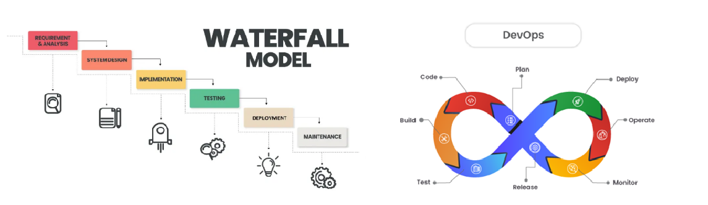
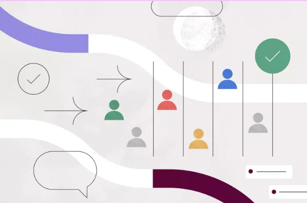
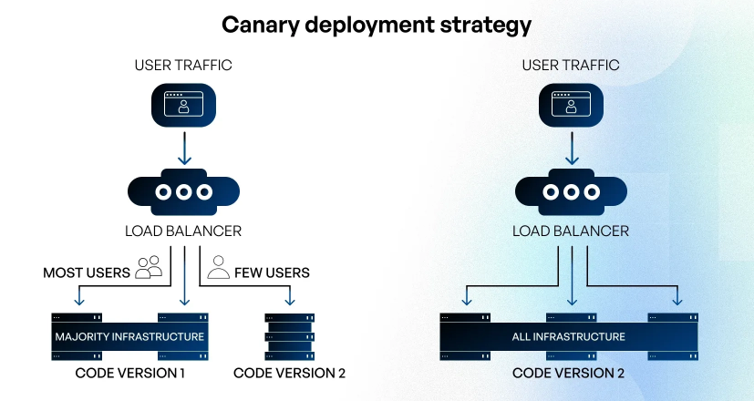
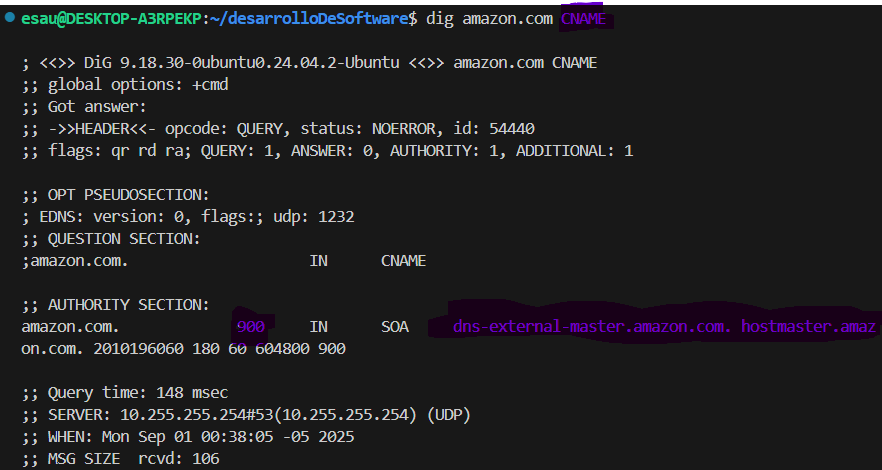
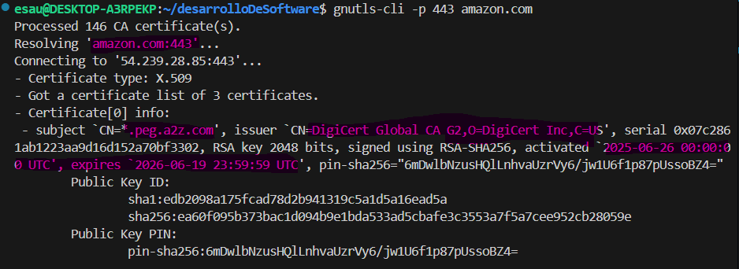
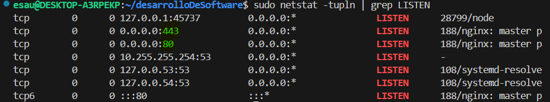
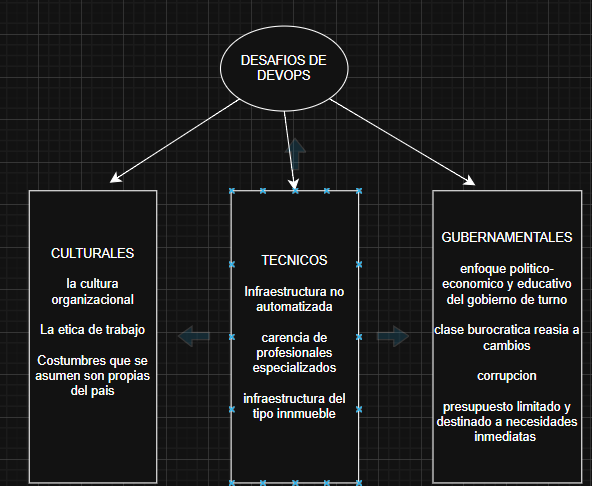
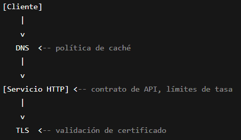

# Actividad 1-CC3S2                                     Flores Villar Esau
**Nombre:**Flores Villar Esau
**Fecha:**31/08/2025
**Tiempo:**Dias
## 4.1 Comparacion Cascado vs Devops
Como se menciona en la Lectura 1 ,en el desarrollo tradicional se espera que la etapa anterior termine , esto provoca que los errores se acumulen y sea dificil detectar en que parte se genero tal o cual error.Ahora bien, esto es un lastre si pretendemos usar computacion en la nube, pues  una de las caracteristicas de esta ultima,es que permite gestionar el ciclo de vida de las aplicaciones; entonces se debera optar por devops, quee tiene como una de sus bondades la  retroalimentacion continua lo que permitira  por ejemplo la creacion de dashboard para la medicion de metricas de interes.

En un entorno de programacion de hardware medica-por ejemplo un marcapasos- se exige una trazabilidad documentaria, osea que cada etapa debe quedar delimitada claramente,caracteristica que encaja maravillosamente con el enfoque cascada,con lo cual queda abarcado el primer criterio "la documentacion exhaustiva" que ayudara a demostrar el cumplimiento de las normas ante cualquier entidad reguladora.Respecto al seugundo criterio es precisamente la validad de la seguridad, cada etapa debe "testear" por separado , generando que ese estadio abarca y satifice todas los requerimientos.
Con todo esto el trade-offs es indiscutiblemente el hecho de sacrificar "agilidad" y ganar en cambio, conformidad y seguridad, lo cual es imprescindible en un escenario donde un fallo equilvadria a poner en riesgo la vida del paciente.

* imagen 1. Constraste en entre en enfoque cascada y Devops. Fuente en [FUENTES.md](FUENTES.md)

## 4.2 Ciclo tradicional de dos pasos y silos

* imagen 2. Ciclo tradicional (limitaciones y anti-patrones). Fuente en [FUENTES.md](FUENTES.md).*

## 4.3 Principios y beneficios de Devops(CI/CD, automatizacion, colaboracion,Agile como precursor)

* imagen 3. Ciclo tradicional (limitaciones y anti-patrones). Fuente en [FUENTES.md](FUENTES.md).*

## 4.4 Evolucion a Devsecops(SAST/ DAST)

* imagen 4. Ciclo tradicional (limitaciones y anti-patrones). Fuente en [FUENTES.md](FUENTES.md).*

## 4.5 CI/CD y estrategias de despliegue(sandbox, canary azul/verde)

* imagen 5. Ciclo tradicional Estrategias de despligue. Fuente en [FUENTES.md](FUENTES.md).*

## 4.6 Fundamentos practicos sin comandos 

### 1.HTTP - contrato observable

* imagen 6.1. HTTP . Fuente en [FUENTES.md](FUENTES.md).*

### 2.DNS - nombres y TTL

* imagen 6.2. DNS . Fuente en [FUENTES.md](FUENTES.md).*

### 3.TLS - seguridad en transito

* imagen 6.3. TLS . Fuente en [FUENTES.md](FUENTES.md).*

### 3.Puertos- estado de runtime

* imagen 6.3. TLS . Fuente en [FUENTES.md](FUENTES.md).*

### 5 12-Factor -port binding , configuración, logs

### 6 Checklist de diagnostico (incidencia simulado)

## 4.7 Desafios de Devops y mitigaciones

* imagen 7. Desafios Devops . Fuente en [FUENTES.md](FUENTES.md).*

## 4.8 Arquitectura minima para DevsecOps (HTTP/ DNS/ TLS + 12-factor)

* imagen 8. DevsecOps . Fuente en [FUENTES.md](FUENTES.md).*

