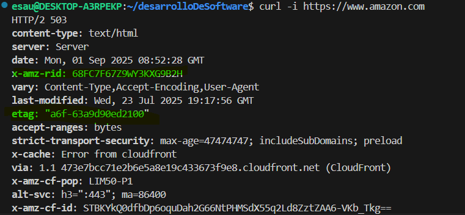

# Actividad 1-CC3S2                                     
**Nombre:** Flores Villar Esau
**Fecha:** 31/08/2025
**Tiempo:** Dias
**Entorno usado :** Wsl, ejecutamos de forma nativa un entorno linux en windows

## 4.1 Comparacion Cascado vs Devops
- 
* imagen 1. Constraste en entre en enfoque cascada y Devops. Fuente en [FUENTES.md](FUENTES.md).*

- Como se menciona en la Lectura 1 ,en el desarrollo tradicional se espera que la etapa anterior termine , esto provoca que los errores se acumulen y sea dificil detectar en que parte se genero tal o cual error.Ahora bien, esto es un lastre si pretendemos usar computacion en la nube, pues  una de las caracteristicas de esta ultima,es que permite gestionar el ciclo de vida de las aplicaciones; entonces se debera optar por devops, quee tiene como una de sus bondades la  retroalimentacion continua lo que permitira  por ejemplo la creacion de dashboard para la medicion de metricas de interes.

- En un entorno de programacion de hardware medica-por ejemplo un marcapasos- se exige una trazabilidad documentaria, osea que cada etapa debe quedar delimitada claramente,caracteristica que encaja maravillosamente con el enfoque cascada,con lo cual queda abarcado el primer criterio "la documentacion exhaustiva" que ayudara a demostrar el cumplimiento de las normas ante cualquier entidad reguladora.Respecto al seugundo criterio es precisamente la validad de la seguridad, cada etapa debe "testear" por separado , generando que ese estadío abarque y satifaga todas los requerimientos.
Con todo esto el trade-offs es indiscutiblemente el hecho de sacrificar "agilidad" y ganar en cambio, conformidad y seguridad, lo cual es imprescindible en un escenario donde un fallo equilvadria a poner en riesgo la vida del paciente.

## 4.2 Ciclo tradicional de dos pasos y silos
- 
* imagen 2. Ciclo tradicional (limitaciones y anti-patrones). Fuente en [FUENTES.md](FUENTES.md). *

- A saber,CI añade cambios pequeños probados, si esto no se considera como parte del ciclo de desarrollo resultara en una "falta de visibilizacion temprana de errores" lo que naturalmente propicia una gran entrega en produccion.
La "compatibilidad entre entornos" si no se realiza la integracion continua la aplicacion puede correr bien en desarrollo, pero; por temas de configuracion de librerias-por ejemplo- falle en produccion.

- "Throw over the wall": es la principal caracteristica del modo tradicional, los equipos estan serparados , terminan su trabajo(bien, en el sentido de validar sus metas) pero luego simplemente lo lanzan(handoff) al siguiente equipo,en este sentido Devops es -como se menciona en las lecturas- es tambien un cambio de la cultura organizativa.

"Seguridad como auditoria tardia": como se viene mencionando, este antipatron origina que luego de un gran lanzamiento  no pueda identificar facilmente(MTTR) donde realmente estan los errores.

## 4.3 Principios y beneficios de Devops(CI/CD, automatizacion, colaboracion,Agile como precursor)

- **CI:** Integramos pequeños cambios continuos y correctos  al repo principal,estas pruebas se automatizan y pueden ser -por ejemplo- unitarias.
**CD:** Entregamos cambios a produccion de modo que cada version sea reproducible,finiquitando con el clasico "en mi maquina corre".La automatizacion ademas nos ayudara a acortar los ciclos de entrega y a responder rapidamente ante errores.
- **Practica Agil:**
Las practicas agiles tienen entre sus maximas la colaboracion con el cliente, de modo que mecanismos como  stand-up meetings permitiran una mejora continua del software en este aspecto.

- **Indicador que mide la mejora de la colaboracion Devops**
Numero de despliegues exitosos por dia, utilizando curl, redirigiendo la salida a un archivo luego de hacer un request al endpoint en nuestro localhost , estas tendrian posibles valores : 200,500,404 se contaria las veces que se obtiene 200.

## 4.4 Evolucion a Devsecops(SAST/ DAST)
- **SAST** esta tecnica analiza codigo fuente sin ejecutarla, de modo que podamos detectar vulnerabilidades en la logica de programacion como sql inyection. En tanto que **DAST** se aplica en ejecucion,mas precisamente en un entorno de preproduccion(staging) , donde simulamos el entorno real de produccion.

* imagen 4. SAST y DAST. Fuente en [FUENTES.md](FUENTES.md).*

- **Gate:Dependencias externas sin vulnerabilidades CVE** Todas las librerias externas no deben presentar vulnerabilidades registrados en CVE
un ejemplo concreto es que librerias como numpy pasen esta condicion de seguridad.Los Acerca de los umbrales: 
Umbral estricto (0 vulnerabilidades)
umbral permisivo( <=2 vulnerabilidades ) 
Dependiendo de estos se permitira que promocione o no  hacia la siguiente del ciclo del software.Sin embargo, en caso de no poder resolver este gate(por falta de una actualizacion), ha de aplicarse la siguiente politica de "captura de excepcion" la cual considera para la *caducidad* un maximo de 30 dias,*responsable* el lider tecnico del proyecto , *plan de correcion* esta incluiría colocar la actualizacion de la dependencia en los pendientes(backlogs) mientras tanto se podría usar un reemplazo.
- **Evitando "teatro de seguridad"** 
Como conseguimos que realmente se haga un trabajo de seguridad, pues dotaremos de eficacia a nuestras tecnicas de modo que 
1. se dismunuyan hallazgos repetidos 
2. Reducir el tiempo promedio para la correccion(MTTR).
El primero se medirá con el registro en un historial en cada escaneo SAST/DAST calculando luego el porcentaje de problemas que se repiten respecto de la ejecucion anterior, asi si la tendencia es decreciente implicará que el equipo aprendio y aplicó la correccion.
Mientras que el segundo se calcula al obtener la diferencia entre la resolucion y la deteccion, el objetivo es que el MTTR se reduzca-por ejemplo- trimestralmente. 

## 4.5 CI/CD y estrategias de despliegue(sandbox, canary azul/verde)

- 
* imagen 5. Ciclo tradicional Estrategias de despligue. Fuente en [FUENTES.md](FUENTES.md).*

- Como es sabido canary release divide el trafico entre dos grupos de usuarios,version antigua y la de la actualizacion.Entonces al escoger el microservicio "autenticación" que son cruciales en cuanto a la experiencia del usuario y un tanto mas relevante en cuanto a seguridad.

- **tabla solicitada**
| Riesgo                          | Mitigacion
|---------------------------------|--------------------------------------|
|Ruptura de una funcion en endpoint de login →  Tests automatizados 
                                                que  comparan E/S esperadas con la version anterior
|Costo operativo del doble despliegue        →  Limitar el 
                                                tiempo definido maximo un dia del trafico canary
|impacto en usuarios sensibles ej clientes empresariales →  Seleccionar 
                                                            un grupo de bajo impacto 

- **KPI primario para promocion/rollback** 
Métrica: tasa de errores  HTTP *5xx* en el microservicio en cuestión 
Umbral: *<= 0.5%* de las solicitudes canary
Ventana de observacion: *30 minutos* de trafico real antes de promover el 100%

- El escenario descrito muestra que un indicador numérico( error 5x) es aceptable pero el indicador relacionado directamente con el usuario (adopcion del app de pago) cae.
Ambos tipos de metricas tienen que coexistir en el *gate* ya que una representa el cumplimiento de normativas tecnicas y la otra refleja la satisfaccion del usuario final.

## 4.6 Fundamentos practicos sin comandos 
### 1.HTTP - contrato observable
- **Recurso observado:**`https://www.amazon.com`
    **Metodo:** `GET`
    **Codigo de estado:**`503`
    **Cabecera control cache:**`etag`→ Este es el identificador unico de la version del recurso, se validara la condicional "el recurso que pido sigue siendo el mismo"(if-None-Match)
    **Cabecera traza/diagnostico:**`x-amz-rid`→ Este es el ID de seguimiento interno de Amazon(por ejemplo)
-  `eTag` se usa para preguntar si el recurso es el mismo, si lo es se tendra un `304 Not Modified ` entonces ya no se envia nuevamente, lo que seran menos bits viajando por la red mejorando de este modo el rendimiento. En cuanto a `x-amz-rid` se usa para trazar requests dentro de la infraestructura de AWS , de modo que se obtiene una buena observabilidad rastreando -por ejemplo- los logs. 

### 2.DNS - nombres y TTL
- **Dominio observado:** `amazon.com `
    **Registro:**`CNAME :dns-external-master.amazon.com. hostmaster.amazon.com`
    **TTL**:`900`
- A saber , el TTL es el tiempo que este registro estara en cache ,si nuestro resolver pregunta por el dominio amazon.com y recibe un TTL= 900 , entonces durante este tiempo no tendra que volver a preguntar a los servidores autoritativos, sencillamente serguira devolviendo la ip ya guardada.
Entonces si TTL era alto, ante un cambio de ip,para distintos usuarios habran distintos puntos de terminacion de sus tiempos en cache, unos veran una nueva ip(ttl ya expiro) y otros la anterior(ttl aun no expira), ocasionandose una ventana de inconsistencia.
Mientras que en el caso de una vuelta a la ip anterior(rollback) un porcentaje podrian estar con la ip que falló y el resto ya habrá regresado a la ip original.

* DNS-TTL . Fuente en [FUENTES.md](FUENTES.md).*

### 3.TLS - seguridad en transito
- **Dominio analizado:**  `amazon.com`
    **CN/SAN:**`CN=*.peg.a2z.com`
    **Vigencia:**activated `2025-06-26 00:00:00 UTC`, expires `2026-06-19 23:59:59 UTC`
    **Emisor:**issuer `CN=DigiCert Global CA G2,O=DigiCert Inc,C=US`
- Al validar la cadena de certificados comprobamos que el certificado esta firmado por el anterior en la cadena hasta llegar al certificado raiz, emitida por una autoridad certificadora de fiar(CA), luego, no validar esto generaria algunos problemas como :
    - *errores de confianza*: nuestro navegador mostrara errores o sencillamente bloqueara la conexion al no asegurar la legitimidad del servidor
    - *Riesgo de Ataque hombre en el medio*: un atacante intercepta la comunicacion y al no existir un certificado legitimo , no se distingue que se esta bajo ataque.
    - *Impacto en la experiencia del usuario*:debido a lo anterior, las advertencias o que la pagina no cargue, el uso de la pagina(UX) resulta pesima.

* TLS . Fuente en [FUENTES.md](FUENTES.md).*

### 4.Puertos- estado de runtime 
- **Puerto 80 (HTTP):** sugiere servicio web accesible en ese puerto, en este caso nginx escuchando.
  **Puerto 443 (HTTPS):** sugiere servicio seguro,nginx escuchando. 

- Esta evidencia ayuda a detectar:
  Despliegues incompletos: si un puerto esperado no aparece, el servicio no está corriendo o  no se desplegó correctamente.
  Conflictos: si otro proceso ocupa el mismo puerto, el despliegue puede fallar.

* PUERTOS . Fuente en [FUENTES.md](FUENTES.md).*

### 5 12-Factor:port binding(7) , configuración(3), logs(11)
- **Port binding parametrizable**:
Para evitar tocar el código, se define el puerto mediante variable de entorno, por ejemplo PORT=8080  que puede ser definido incluso con configuracion de un contenedor, lo que normalmente se hace en codigo python.Luego dentro del codigo la app solo le bastara leer os.environ['PORT'] (Python) al iniciar. Esto permite desplegar la misma imagen en distintos entornos sin cambiar el código.

- **Logs en flujo estándar**:
Los logs se envían a stdout/stderr, y el gestor de contenedores o pipeline los captura. Ejemplo: console.log("mensaje") en Node.js o print("mensaje") en Python. Estas salidas alimentan herramientas como ELK Stack de modo tal que  evitamos grabar en archivos(disco) en cada ejecucion de nuestra app y tener que revisarlos los discos fisicos en cada maquina. 

- **Anti-patrón**:
Guardar credenciales en el código fuente. Impacto: disminuye reproducibilidad y seguridad, fuerza cambios manuales por ambiente.

* 12-Factor . Fuente en [FUENTES.md](FUENTES.md).*

### 6 Checklist de diagnostico (incidencia simulado)
Con lo siguiente, una vez reportando intermitencia, se pondra en marcha el checklist siguiente, de modo que los fallos : http roto, resolucion dns inconsistente, certificado tls caducos o puertos mal configurados.
O:objetivo, EE:evidencia esperada,I:interpretacion,AS:accion siguiente
1. **Verificar contrato HTTP**
    O:confirmar que el endpoint responde correctamente.
    EE: curl -i https://<sitio> devuelve código 200 y cabeceras correctas.
    I: 200 OK → HTTP operativo; otro código (404, 503, 500) → fallo  
    AS: si falla, revisar logs de la aplicación y despliegue; detener aquí si es crítico.
2. **Validar resolución DNS**
    O: asegurar que el dominio resuelve a la IP correcta.
    EE: dig <dominio> muestra A o CNAME con TTL coherente.
    I: IP consistente → DNS correcto; IPs inconsistentes → problema de propagación o resolución.
    AS: si es inconsistente, revisar TTL, servidores autoritativos y cambios recientes de IP.
3. **Revisar certificado TLS**
    O: comprobar vigencia, CN/SAN y emisora del certificado.
    EE: gnutls-cli -p 443 <dominio>    muestra CN/SAN, fechas y emisora.
    I: expirado o CN/SAN incorrecto → riesgo MITM y errores de confianza.
    AS: renovar certificado o ajustar CN/SAN; detener promoción de cambios críticos.
4. **Confirmar puerto HTTP/HTTPS**
    O: verificar que los puertos están en escucha y accesibles.
    EE: sudo netstat -tupln | grep LISTEN muestra puertos 80 y 443 abiertos.
    I: puerto ausente → servicio no expuesto; puerto abierto → correcto.
    AS: abrir puerto o corregir firewall; reiniciar servicio si necesario.
5. **Validar trazas de red y cabeceras**
    O: asegurar observabilidad y trazabilidad de peticiones.
    EE: curl -i -H "X-Request-ID:ID_de_interes" https://<sitio> devuelve header de traza (X-Request-ID) o similar.
    I: header presente → trazabilidad OK; ausente → pérdida de observabilidad.
    AS: habilitar herramientas de logs
6. **Confirmar consistencia de despliegue**
    O: verificar que el despliegue es estable y consistente.
    EE: logs y métricas de uptime (puertos + HTTP) sin errores.
    I: todo OK → despliegue estable; si persiste intermitencia → investigar dependencias externas o microservicios.
    AS: escalar a DevOps/SRE para un mejor análisis.

## 4.7 Desafios de Devops y mitigaciones
- 

-   **Error crítico en producción tras despliegue**
    Hacer Rollback inmediato al estado anterior; mantener snapshots de despliegue y base de datos.
  
    **Impacto excesivo a usuarios por fallo parcial**
    Despliegue gradual (canary o azul/verde) con porcentaje de tráfico limitado; monitorizar errores y métricas(5xx o latencia p95) antes de ampliar.
  
    **Defectos o vulnerabilidades no detectadas**
    Revisión cruzada de cambios entre equipos; límites de “blast radius” pequeños para contener impacto de cambios fallidos .
-   **despliegue gradual vs. despliegue big-bang**
    Objetivo: validar que un despliegue gradual (canary/azul-verde) reduce el riesgo de fallos en producción comparado con un despliegue completo “big-bang”.
    **Métrica primaria**: porcentaje de errores 5xx en producción durante las primeras 2 horas posteriores al despliegue.
    **Umbral de referencia**: < 1% de errores 5xx → aceptable.
    **Grupo control**:
    Grupo A: usuarios expuestos al despliegue gradual (10–20% inicialmente).
    Grupo B: usuarios expuestos a un despliegue big-bang (100% de la base de usuarios).
    **Criterio de éxito**:Si el porcentaje de errores 5xx en el grupo A es significativamente menor que en el grupo B, se considera que el despliegue gradual reduce riesgo. 
    **Plan de reversión (rollback)**:
    Para el grupo A (canary): detener tráfico a la nueva versión y redirigir al entorno previo.
    Para el grupo B (big-bang): activar rollback completo del entorno a la versión anterior.
    **Monitoreo continuo**: errores 5xx, latencia p95, alertas de monitoreo de CPU/memoria. 

* BLAST RADIUS. Fuente en [FUENTES.md](FUENTES.md).*

## 4.8 Arquitectura minima para DevsecOps (HTTP/ DNS/ TLS + 12-factor)

El cliente lanzara una solicitud DNS se aplica un TTL razonable y valida la resolucion de la peticion, aqui se trabaja para obtener la ip
↓
se pasa a la etapa de servicio HTTP / API ,aqui estan definidos los  contratos observables (método, códigos de estado, cabeceras clave), se aplican pki para proteger el servicio,HTTPS obligatorio.
↓
en la capa o nivel TLS: se validan certificados (CN/SAN, cadena completa, fechas) para evitar vulnerabilidades como  MIT →Caché / Políticas de control: configurar cabeceras como Cache-Control y ETag -por ejemplo-para optimizar rendimiento.

- **Contribución a despliegues seguros y reproducibles**
Cada capa ofrece verificación y consistencia: DNS correcto asegura que todos los usuarios apuntan al mismo servicio; HTTP y TLS garantizan que las solicitudes y datos viajan de manera segura y verificable; políticas de caché evitan problemas de versiones inconsistentes.

Los despliegues son reproducibles porque cada capa tiene reglas claras y automatizables, reduciendo errores manuales.

-**Relación con principios 12-Factor**
Configuración por entorno (config): las variables de entorno controlan puertos, endpoints, claves. 
evidencia operativa: diffs mínimos entre entornos (dev, staging, prod) esto es mayor consistencia entre los estados en las distintas etapas.

Logs a stdout/stderr (logs): toda la salida de logs se envía al flujo estándar, sin escribir en archivos locales.
evidencia: se puede revisar trazabilidad de logs de procesos en ejecución, analizar patrones sin depender de almacenamiento manual.

* DevsecOps. Fuente en [FUENTES.md](FUENTES.md).*

