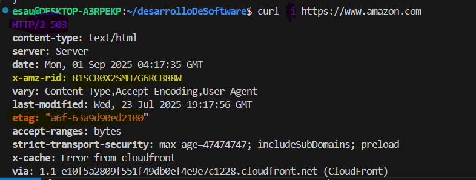

# Actividad 1-CC3S2                                     
**Nombre:** Flores Villar Esau
**Fecha:** 31/08/2025
**Tiempo:** Dias
**Entorno usado :** Wsl, ejecutamos de forma nativa un entorno linux en windows

## 4.1 Comparacion Cascado vs Devops
- 
* imagen 1. Constraste en entre en enfoque cascada y Devops. Fuente en [FUENTES.md](FUENTES.md).*

- Como se menciona en la Lectura 1 ,en el desarrollo tradicional se espera que la etapa anterior termine , esto provoca que los errores se acumulen y sea dificil detectar en que parte se genero tal o cual error.Ahora bien, esto es un lastre si pretendemos usar computacion en la nube, pues  una de las caracteristicas de esta ultima,es que permite gestionar el ciclo de vida de las aplicaciones; entonces se debera optar por devops, quee tiene como una de sus bondades la  retroalimentacion continua lo que permitira  por ejemplo la creacion de dashboard para la medicion de metricas de interes.

- En un entorno de programacion de hardware medica-por ejemplo un marcapasos- se exige una trazabilidad documentaria, osea que cada etapa debe quedar delimitada claramente,caracteristica que encaja maravillosamente con el enfoque cascada,con lo cual queda abarcado el primer criterio "la documentacion exhaustiva" que ayudara a demostrar el cumplimiento de las normas ante cualquier entidad reguladora.Respecto al seugundo criterio es precisamente la validad de la seguridad, cada etapa debe "testear" por separado , generando que ese estadío abarque y satifaga todas los requerimientos.
Con todo esto el trade-offs es indiscutiblemente el hecho de sacrificar "agilidad" y ganar en cambio, conformidad y seguridad, lo cual es imprescindible en un escenario donde un fallo equilvadria a poner en riesgo la vida del paciente.

## 4.2 Ciclo tradicional de dos pasos y silos
- 
* imagen 2. Ciclo tradicional (limitaciones y anti-patrones). Fuente en [FUENTES.md](FUENTES.md). *

- A saber,CI añade cambios pequeños probados, si esto no se considera como parte del ciclo de desarrollo resultara en una "falta de visibilizacion temprana de errores" lo que naturalmente propicia una gran entrega en produccion.
La "compatibilidad entre entornos" si no se realiza la integracion continua la aplicacion puede correr bien en desarrollo, pero; por temas de configuracion de librerias-por ejemplo- falle en produccion.

- "Throw over the wall": es la principal caracteristica del modo tradicional, los equipos estan serparados , terminan su trabajo(bien, en el sentido de validar sus metas) pero luego simplemente lo lanzan(handoff) al siguiente equipo,en este sentido Devops es -como se menciona en las lecturas- es tambien un cambio de la cultura organizativa.

"Seguridad como auditoria tardia": como se viene mencionando, este antipatron origina que luego de un gran lanzamiento  no pueda identificar facilmente(MTTR) donde realmente estan los errores.

## 4.3 Principios y beneficios de Devops(CI/CD, automatizacion, colaboracion,Agile como precursor)

- **CI:** Integramos pequeños cambios continuos y correctos  al repo principal,estas pruebas se automatizan y pueden ser -por ejemplo- unitarias.
**CD:** Entregamos cambios a produccion de modo que cada version sea reproducible,finiquitando con el clasico "en mi maquina corre".La automatizacion ademas nos ayudara a acortar los ciclos de entrega y a responder rapidamente ante errores.
- **Practica Agil:**
Las practicas agiles tienen entre sus maximas la colaboracion con el cliente, de modo que mecanismos como  stand-up meetings permitiran una mejora continua del software en este aspecto.

- **Indicador que mide la mejora de la colaboracion Devops**
Numero de despliegues exitosos por dia, utilizando curl, redirigiendo la salida a un archivo luego de hacer un request al endpoint en nuestro localhost , estas tendrian posibles valores : 200,500,404 se contaria las veces que se obtiene 200.

## 4.4 Evolucion a Devsecops(SAST/ DAST)
- **SAST** esta tecnica analiza codigo fuente sin ejecutarla, de modo que podamos detectar vulnerabilidades en la logica de programacion como sql inyection. En tanto que **DAST** se aplica en ejecucion,mas precisamente en un entorno de preproduccion(staging) , donde simulamos el entorno real de produccion.

* imagen 4. SAST y DAST. Fuente en [FUENTES.md](FUENTES.md).*

- **Gate:Dependencias externas sin vulnerabilidades CVE** Todas las librerias externas no deben presentar vulnerabilidades registrados en CVE
un ejemplo concreto es que librerias como numpy pasen esta condicion de seguridad.Los Acerca de los umbrales: 
Umbral estricto (0 vulnerabilidades)
umbral permisivo( <=2 vulnerabilidades ) 
Dependiendo de estos se permitira que promocione o no  hacia la siguiente del ciclo del software.Sin embargo, en caso de no poder resolver este gate(por falta de una actualizacion), ha de aplicarse la siguiente politica de "captura de excepcion" la cual considera para la *caducidad* un maximo de 30 dias,*responsable* el lider tecnico del proyecto , *plan de correcion* esta incluiría colocar la actualizacion de la dependencia en los pendientes(backlogs) mientras tanto se podría usar un reemplazo.
- **Evitando "teatro de seguridad"** 
Como conseguimos que realmente se haga un trabajo de seguridad, pues dotaremos de eficacia a nuestras tecnicas de modo que 
1. se dismunuyan hallazgos repetidos 
2. Reducir el tiempo promedio para la correccion(MTTR).
El primero se medirá con el registro en un historial en cada escaneo SAST/DAST calculando luego el porcentaje de problemas que se repiten respecto de la ejecucion anterior, asi si la tendencia es decreciente implicará que el equipo aprendio y aplicó la correccion.
Mientras que el segundo se calcula al obtener la diferencia entre la resolucion y la deteccion, el objetivo es que el MTTR se reduzca-por ejemplo- trimestralmente. 

## 4.5 CI/CD y estrategias de despliegue(sandbox, canary azul/verde)

- 
* imagen 5. Ciclo tradicional Estrategias de despligue. Fuente en [FUENTES.md](FUENTES.md).*

- Como es sabido canary release divide el trafico entre dos grupos de usuarios,version antigua y la de la actualizacion.Entonces al escoger el microservicio "autenticación" que son cruciales en cuanto a la experiencia del usuario y un tanto mas relevante en cuanto a seguridad.

- **tabla solicitada**
| Riesgo                          | Mitigacion
|---------------------------------|--------------------------------------|
|Ruptura de una funcion en endpoint de login →  Tests automatizados 
                                                que  comparan E/S esperadas con la version anterior
|Costo operativo del doble despliegue        →  Limitar el 
                                                tiempo definido maximo un dia del trafico canary
|impacto en usuarios sensibles ej clientes empresariales →  Seleccionar 
                                                            un grupo de bajo impacto 

- **KPI primario para promocion/rollback** 
Métrica: tasa de errores  HTTP *5xx* en el microservicio en cuestión 
Umbral: *<= 0.5%* de las solicitudes canary
Ventana de observacion: *30 minutos* de trafico real antes de promover el 100%

- El escenario descrito muestra que un indicador numérico( error 5x) es aceptable pero el indicador relacionado directamente con el usuario (adopcion del app de pago) cae.
Ambos tipos de metricas tienen que coexistir en el *gate* ya que una representa el cumplimiento de normativas tecnicas y la otra refleja la satisfaccion del usuario final.
## 4.6 Fundamentos practicos sin comandos 

### 1.HTTP - contrato observable

* imagen 6.1. HTTP . Fuente en [FUENTES.md](FUENTES.md).*

### 2.DNS - nombres y TTL

* imagen 6.2. DNS . Fuente en [FUENTES.md](FUENTES.md).*

### 3.TLS - seguridad en transito

* imagen 6.3. TLS . Fuente en [FUENTES.md](FUENTES.md).*

### 3.Puertos- estado de runtime

* imagen 6.3. TLS . Fuente en [FUENTES.md](FUENTES.md).*

### 5 12-Factor -port binding , configuración, logs

### 6 Checklist de diagnostico (incidencia simulado)

## 4.7 Desafios de Devops y mitigaciones

* imagen 7. Desafios Devops . Fuente en [FUENTES.md](FUENTES.md).*

## 4.8 Arquitectura minima para DevsecOps (HTTP/ DNS/ TLS + 12-factor)

* imagen 8. DevsecOps . Fuente en [FUENTES.md](FUENTES.md).*

