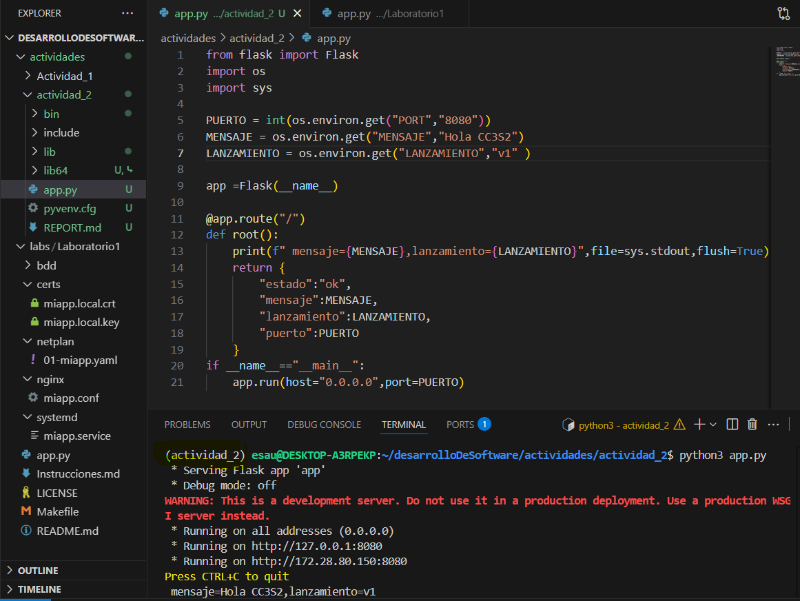
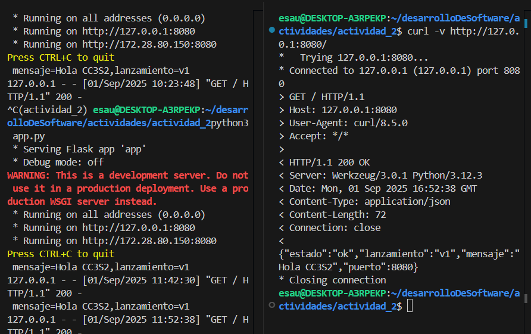
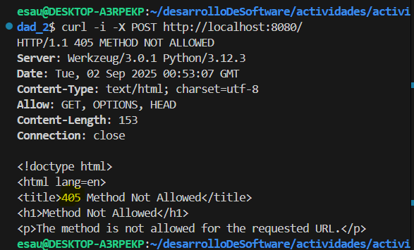
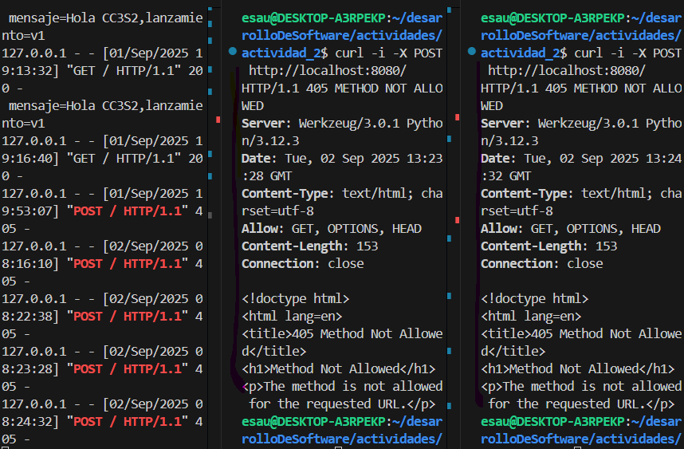
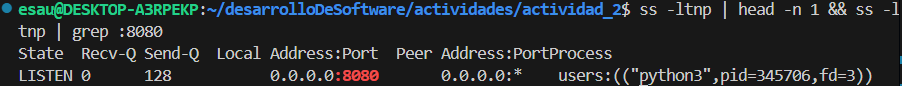
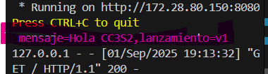
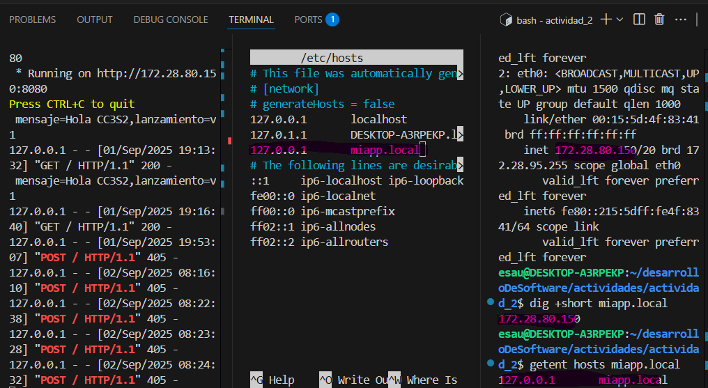

### Actividad2_CC3S2 
**FLORES VILLAR ESAU**
## 1 HTTP : Fundamentos y herramientas
 1. **Levantando la app** 
 - La app en cuestion se describe del siguiente modo. En las primeras lineas importamos las librerias de interes, entre ellos flask y os
en las siguientes se definen las variables de entorno como PUERTO y LANZAMIENTO
luego creamos una instancia de flask ``app=Flask(MODULO de recursos)``para procesar los request http.Seguidamente se usa un decorador 
``@app.route("/")`` para agregar comportamiento a ```def root()``` de modo que cada vez que  alguien haga un request hacia *http://localhost:PUERTO* o *("/")* se ejecutara root()
Cabe resaltar que se creó el entorno virtual ,`actividad-2` que es donde se corre la version de flask descargada.
- 

-  salida stdout ` mensaje=Hola CC3S2,lanzamiento=v1`

`python -m venv actividad_2`
`source actividad_2/bin/activate`
`sudo o apt install python3-flask`
`python3 app.py`

2. **Inpección con curl**
- ``curl -v http://localhost:8080`` 
 *cabeceras*                    *cuerpos de estado* 
    Host:                           localhost:8080        
    User-Agent:                     curl/8.5.0      
    Accept:                         */*
                     
    *cuerpo json*  
    ``HTTP/1.1 200 OK
    Server: Werkzeug/3.0.1 Python/3.12.3
    Date: Mon, 01 Sep 2025 16:52:38 GMT
    Content-Type: application/json
    Content-Length: 72
    Connection: close``
 

- ``curl -i -X http://127.0.0.1:8080/``
Si no existiera ruta "/" en el servidor responde con un 404 Not Found 
Si existe la ruta pero no acepta metodo POST responde con un 405 Method Not Allowed
En el codigo  ```@app.route("/")`` se tiene la ruta
que acepta un GET metodo que permite obtener un recurso del servicio
pero no se pasa una lista de metodos al parametro methods del siguiente modo 
``@app.route("/",methods = ["GET","POST"])``
Entonces se espera que la respuesta sera 405 Method Not Alowwed
``HTTP/1.1 405 METHOD NOT ALLOWED``
  

- **pregunta guia**
En el script app.py se definen las variables de entorno y son estas variables las que son las referenciadas  cuando es ejecutada root() al hacerse la consulta GET  a la ruta raiz ("/") del  servidor flask  que escucha en el puerto 8080 de localhost.
                puerto 8080 de localhost
                    |
solcitud GET    → ruta ("/") del servidor flask → root()
                                                    |
                                                stdout con mensaje y  cuerpo json    

y estas variables son las mismas para un arranque especifico de la aplicacion , por lo que al modificarlas sin reiniciar el servidor no afecta al proceso ya en ejecuccion, esto es que seguiremos viendo los valores anteriores. 


3. **Puertos abiertos con ss**
- ``ss -ltnp | grep :8080``
algunas opciones que no se conocían:
-n, --numeric       don't resolve service names
-p, --processes     show process using socket
la salida de son las columnas 
ESTADO   RECIBIDOS-Q ENVIADOS-Q direccion_local:puerto direccion_maquina_virtual:puerto id
en este caso el tipo de socket es tcp
los procesos que lo usan son del tipo users
el proceso que abrio este socket  es "python3"
el id del proceso es pid=345706 
y el file descriptor que el proceso usa para el socket es fd=3

mas precisamente lo que se hizo fue  
primera fila de( ss -ltnp) y fila que coincide con :8080 de (ss -ltnp)
``ss -ltnp | head -n 1 && ss -ltnp | grep :8080``


* Como usar el comando SS de linux1 . Fuente en [FUENTES.md](FUENTES.md).*

4. **Logs como flujo**
el logs (en este caso ) se detalla en ``f"mensaje={MENSAJE}, lanzamiento={LANZAMIENTO}" `` redirigidos a → file = sys.stdout aunque python ya lo hace por defecto es una forma de ver que esta ocurriendo , luego tambien indicamos que todo el mensaje vaya al flujo de salida y no quede nada en el buffer de memoria ``flush = True`` 
Una buena practica 12-Factor app es no grabar los logs en memoria local sino centralizarlos en un stack externo. 
En ese sentido ``file`` es un objeto Stream que posee un metodo ``write`` tiene los logs y podra -por ejemplo- escribirlos en el log collector de runtime en el caso de Docker/Kubernetes.

En este caso en particular stdout envia al terminal


## 2 DNS: nombres, registros y caché
1. Añadiendo el reistro host ``sudo nano /etc/hosts``
                                ```127.0.0.1    miapp.local```
2. ``dig +short miapp.local`` devuelve mi ip 172.28.80.150 
    ``getent hosts miapp.local`` devulve 127.0.0.1  miapp.local
    que es el registro hosts con que se resuelve


3. **TTL/cache**
TTL es el tiempo se puede guardar el registro en cache antes de que dns consulte nuevamente al servidor autorizado
con eso en mente al  hacerse  las consultas consecutivas los tiempos indicados van decreciendo
``dig miapp.local +ttlunits``
``miapp.local.            4d2h49m41s IN   A       172.28.80.150``
``miapp.local.            4d2h37m53s IN   A       172.28.80.150``
...


4. **pregunta guia**
el  archivo /etc/hosts contiene registros que  entradas estaticas  tipo ip - nombre de hosts  y es local, valido para mi pc mientras que la zona DNS autoritativa es dinamica , esta distribuida con TTL y valida para todo el mundo