### Actividad2_CC3S2 
**FLORES VILLAR ESAU**
## 1 HTTP : Fundamentos y herramientas
 1. **Levantando la app** 
 - La app en cuestion se describe del siguiente modo. En las primeras lineas importamos las librerias de interes, entre ellos flask y os
en las siguientes se definen las variables de entorno como PUERTO y LANZAMIENTO
luego creamos una instancia de flask ``app=Flask(MODULO de recursos)``para procesar los request http.Seguidamente se usa un decorador 
``@app.route("/")`` para agregar comportamiento a ```def root()``` de modo que cada vez que  alguien haga un request hacia *http://localhost:PUERTO* o *("/")* se ejecutara root()
Cabe resaltar que se creó el entorno virtual ,`actividad-2` que es donde se corre la version de flask descargada.
- 

-  salida stdout ` mensaje=Hola CC3S2,lanzamiento=v1`

`python -m venv actividad_2`
`source actividad_2/bin/activate`
`sudo o apt install python3-flask`
`python3 app.py`

2. **Inpección con curl**
- ``curl -v http://localhost:8080`` 
 *cabeceras*                    *cuerpos de estado* 
    Host:                           localhost:8080        
    User-Agent:                     curl/8.5.0      
    Accept:                         */*
                     
    *cuerpo json*  
    ``HTTP/1.1 200 OK
    Server: Werkzeug/3.0.1 Python/3.12.3
    Date: Mon, 01 Sep 2025 16:52:38 GMT
    Content-Type: application/json
    Content-Length: 72
    Connection: close``
 

- ``curl -i -X http://127.0.0.1:8080/``
Si no existiera ruta "/" en el servidor responde con un 404 Not Found 
Si existe la ruta pero no acepta metodo POST responde con un 405 Method Not Allowed
En el codigo  ```@app.route("/")`` se tiene la ruta
que acepta un GET metodo que permite obtener un recurso del servicio
pero no se pasa una lista de metodos al parametro methods del siguiente modo 
``@app.route("/",methods = ["GET","POST"])``
Entonces se espera que la respuesta sera 405 Method Not Alowwed
``HTTP/1.1 405 METHOD NOT ALLOWED``
  

- **pregunta guia**
En el script app.py se definen las variables de entorno y son estas variables las que son las referenciadas  cuando es ejecutada root() al hacerse la consulta GET  a la ruta raiz ("/") del  servidor flask  que escucha en el puerto 8080 de localhost.
                puerto 8080 de localhost
                    |
solcitud GET    → ruta ("/") del servidor flask → root()
                                                    |
                                                stdout con mensaje y  cuerpo json    

y estas variables son las mismas para un arranque especifico de la aplicacion , por lo que al modificarlas sin reiniciar el servidor no afecta al proceso ya en ejecuccion, esto es que seguiremos viendo los valores anteriores. 


3. **Puertos abiertos con ss**
- ``ss -ltnp | grep :8080``
algunas opciones que no se conocían:
-n, --numeric       don't resolve service names
-p, --processes     show process using socket
la salida de son las columnas 
ESTADO   RECIBIDOS-Q ENVIADOS-Q direccion_local:puerto direccion_maquina_virtual:puerto id
en este caso el tipo de socket es tcp
los procesos que lo usan son del tipo users
el proceso que abrio este socket  es "python3"
el id del proceso es pid=345706 
y el file descriptor que el proceso usa para el socket es fd=3

mas precisamente lo que se hizo fue  
primera fila de( ss -ltnp) y fila que coincide con :8080 de (ss -ltnp)
``ss -ltnp | head -n 1 && ss -ltnp | grep :8080``


* Como usar el comando SS de linux1 . Fuente en [FUENTES.md](FUENTES.md).*

4. **Logs como flujo**
el logs (en este caso ) se detalla en ``f"mensaje={MENSAJE}, lanzamiento={LANZAMIENTO}" `` redirigidos a → file = sys.stdout aunque python ya lo hace por defecto es una forma de ver que esta ocurriendo , luego tambien indicamos que todo el mensaje vaya al flujo de salida y no quede nada en el buffer de memoria ``flush = True`` 
Una buena practica 12-Factor app es no grabar los logs en memoria local sino centralizarlos en un stack externo. 
En ese sentido ``file`` es un objeto Stream que posee un metodo ``write`` tiene los logs y podra -por ejemplo- escribirlos en el log collector de runtime en el caso de Docker/Kubernetes.

En este caso en particular stdout envia al terminal


## 2 DNS: nombres, registros y caché
1. Añadiendo el reistro host ``sudo nano /etc/hosts``
                                ```127.0.0.1    miapp.local```
2. ``dig +short miapp.local`` devuelve mi ip 172.28.80.150 
    ``getent hosts miapp.local`` devulve 127.0.0.1  miapp.local
    que es el registro hosts con que se resuelve


3. **TTL/cache**
TTL es el tiempo se puede guardar el registro en cache antes de que dns consulte nuevamente al servidor autorizado
con eso en mente al  hacerse  las consultas consecutivas los tiempos indicados van decreciendo
``dig miapp.local +ttlunits``
``miapp.local.            4d2h49m41s IN   A       172.28.80.150``
``miapp.local.            4d2h37m53s IN   A       172.28.80.150``
...
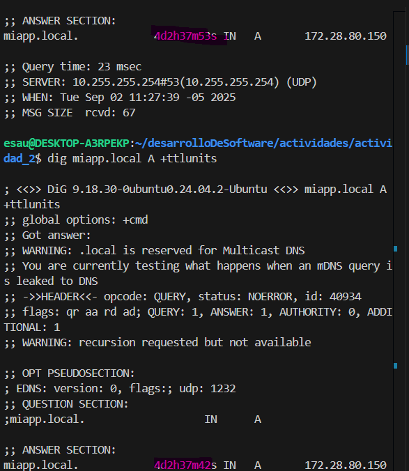

4. **pregunta guia**
el  archivo /etc/hosts contiene registros que  entradas estaticas  tipo ip - nombre de hosts  y es local, valido para mi pc mientras que la zona DNS autoritativa es dinamica , esta distribuida con TTL y valida para todo el mundo

## 3 TLS: seguridad en transito NGINX
En este punto se tiene lo siguiente; un app.py que usa ``app = Flask`` como servidor este esta alojado en nuestra maquina fisica y escucha en  ``port=8080``, cuando se hace una peticion a ``http//localhost:8080`` se redirecciona hacia ``@app.route("/")`` que ejecuta ``root()`` , el servidor se pone en marcha escuchando a todas las interfaces en dicho puerto mediante ``app.run(host="0.0.0.0",port=PUERTO)`` (1)
Pero no podemos exponer nuestro servidor a internet directamente necesitamos un servidor NGINGX que actuara como proxy inverso , de modo que sera nginx quien escuche en el puerto 80-por ejemplo- y pase las peticiones a ``127.0.0.1:8080``. Esto se configura en la el archivo miapp.conf el cual tendra el la estructura siguiente
``
server {    listen  puerto_donde_escucha;
            server_name nombre_dominio_asociado;
    location / {
            proxy_pass direccion_donde_reenviar;
    }
} ``

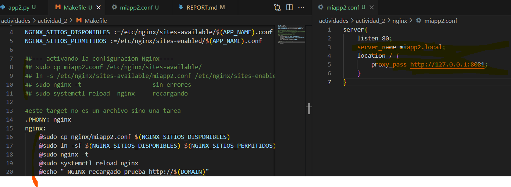

entonces la configuracion para obtener un proxy inverso que se expondra a intenet que estara vinculado  a nuestro dominio esta en miapp2.conf 
luego necesitamos ubicar estas *reglas* miapp2.conf en 
*/etc/nginx/sites-available* y relanzar el servicio nginx
``sudo cp miapp2.conf /etc/nginx/sites-available/<br>
sudo ln -s /etc/nginx/available/ /etc/nginx/sites-enabled/<br>
sudo systemctl reload nginx``<br>
pero siguiendo un enfoque 12-factor app
luego todo esto se ubica en makefile, aqui deffinimos variables ?=  := 
``
    APP_NAME ?= miapp2
    DOMINIO ?= miapp2.local
    DISPONIBLES :=/etc/nginx/available/$(APP_NAME).conf
    PERMITIDOS :=/etc/nginx/site-enabled/$(APP_NAME).conf
``
como el dominio , el puerto , la ruta donde para sitios disponibles y permitidos
y seguidamente declaramos un target que ejecuta el blqoue que nos interesa

``.PHONY nginx
ngnix:
`   @sudo cp miapp2.conf $(DISPONIBLES) `
`   @sudo ln -s $(DISPONIBLES) $(PERMITIDOS)` creando enlace simbolico entre DISPONIBLES ↔ PERMITIDOS
`   @sudo systemctl reload nginx `
``
okay , entonces al hacer make nginx se añade esa cofiguracion al servidor nginx , creando el enlace 
entre DISPONIBLES y PERMITIDOS, para que cada vez que miapp2.conf se modifique 
esos cambios los conozco NGINX

luego al hacer make nginx se automatizan la ejecucion de esos comandos

como nginx siempre esta activo en segundo plano como proceso demonio, no nos preocupamos de ello
ahora al hacer python3 miapp2.py nuestro servidor flask arranca (1), cuando hagamos las peticiones a
http://NUESTRO_DOMINIO  → port 80 → nginx →  127.0.0.1:8081<br>
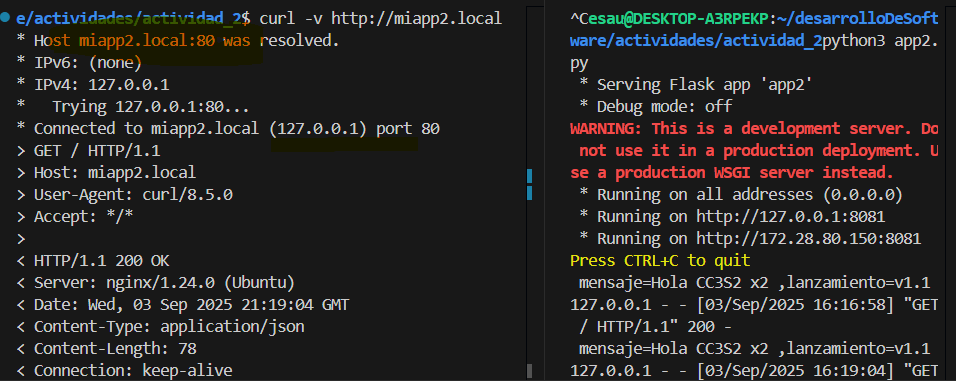
## 1
ahora se hara una terminacion TLS en nginx, esto es que nuestro proxy inverso estara escuchando en el puerto 443 , TLS requiere un certificado
y una llave estos se declaran en .conf y sera en makefile donde se ejecutan los comandos para crearlos
en miapp2.conf `` 
                listen 443 ssl;<br>
                ssl_certificate /etc/ssl/miapp2/miapp2.local.crt;<br>
                ssl_certificate_key /etc/ssl/miapp2/miapp2.local.key; ``
y en Makefile : ``
              OPENSSL :=&(shell command -vv openssl ...)
              DIRECTORIOS :=......
              KEY , CRT

              .PHONY:tls-cert
              tls-cert:
                comandos del target
    ``
y una vez creados los certificados se repetira el proceso que se hizo cuando  nginx quedo vinculado a nuestro dominio y se encargara de recibir el request en 443 para luego hacer el proxy_pass hacia Flask  corriendo en 127.0.0.1:8081 (2)
``
.PHONY: nginx
nginx:

``@if [ -z "$(NGINX)" ]; then echo "nginx no encontrado (omitiendo)"; exit 1; fi
	@sudo mkdir -p $(NGINX_CERT_DIR)
	@if [ -f "$(CRT_FILE)" ] && [ -f "$(KEY_FILE)" ]; then \
	  sudo cp $(CRT_FILE) $(NGINX_CERT_DIR)/$(DOMAIN).crt; \
	  sudo cp $(KEY_FILE) $(NGINX_CERT_DIR)/$(DOMAIN).key; \
	else echo "Faltan certificados. Ejecuta 'make tls-cert' primero."; exit 1; fi
    ubicar la configuracion en sitios permitido y reiniciar el servidor nginx

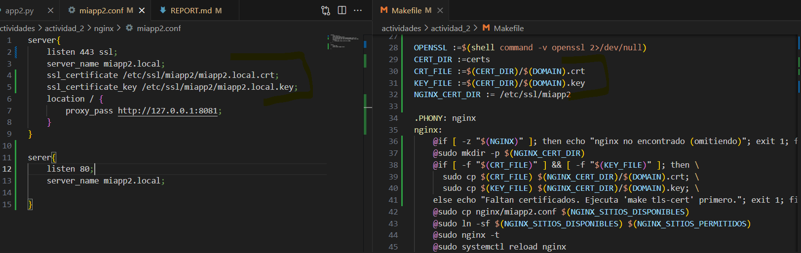
los certificados son guardados en certs  y tambien en /et/ssl/miapp2 que es donde nginx los espera para usarlos.

1[certs y /etc/ssl/miapp2](imagenes/3_1_2.png)

y ahora con make niginx copiamos los certificados a /etc/nginx/  donde nginx espera usarlos
luego para ver que realmente se TLS seguro, arrancamos el servidor, entonces tenemos (1)  y (2)
ahora realizamos una peticion via ``curl -vk https://miapp2.local`` y sucede lo siguiente :

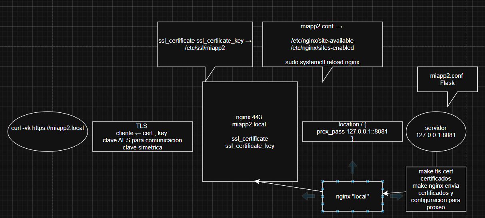

lo cual que verificado mediante ``curl -vk https://miapp2.local``
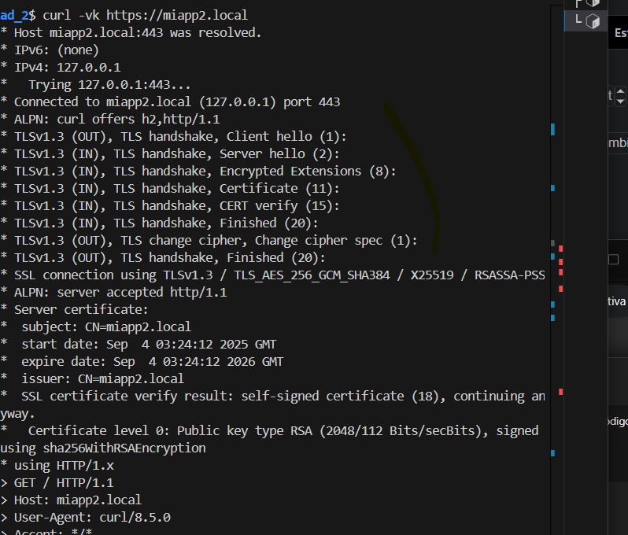
# 2 configura nginx
ahora se añadira variables de configuracion en .conf para que Flask sepa la informacion exacta del cliente y si usa http o https, entonces de este modo podra hacer los logs respectivos

``  proxy_se_theader X-Forwarded-Host $host<br>
    proxy_set_header X-Forwarded-For $remote_addr<br>
    proxy_set_header X-Forwarded-Proto https<br>
``
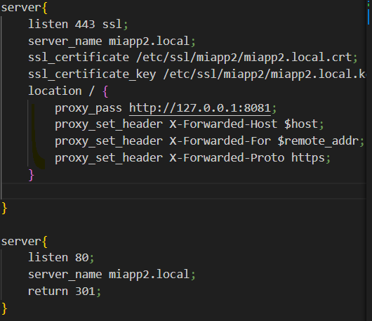

# 3 valida el handshake 
1[validar via openssl,curl](imagenes/3_3_1.png)
en ```curl -k https://miapp2.local `` con la opcion -k indicamos que obviamos el hecho de que cert y key sean autofirmados

# 4 Puertos y logs
``ss -ltnp | head -n 1 && ss -ltnp | grep -E ':(443:8081)'``
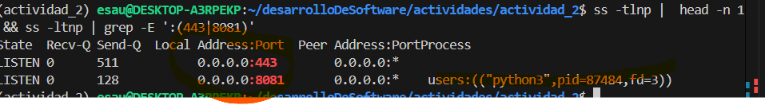

``journalctl``
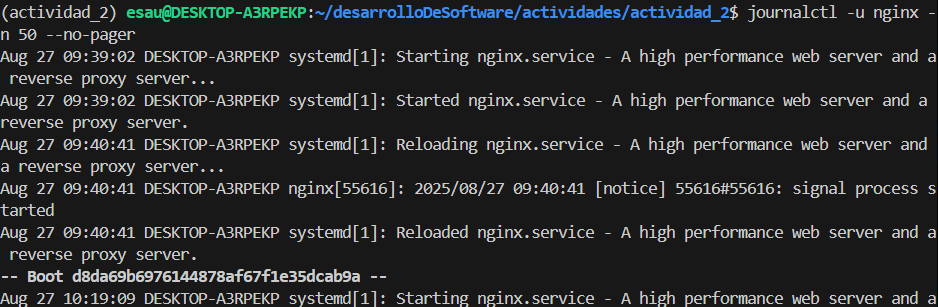

## 4 12-Factor App: port binding , conf y logs 
# 1 port binding 
para poder pasar el puerto sin tocar CODIGO se necesita hacer make run PORT = N_PUERTO
entonces se define el target ``.PHONY run run :``
que ejecutara python3 app2.py pero para alinearnos al factor port binding y config usaremos las variables de configuracion         `   VENV ?=venv<br>
    VENV_BIN :=$(VENV)/bin<br>
    PY :=$(VENV_BIN)/python3<br>
`
que no es otra cosa que obtener la ruta del binario para que ejecute la app, usando la version del entorno virtual.
en el cuerpo de run 
``@ PUERTO = $(PORT) MENSAJE =$(MESSAGE) LANZAMIENTO=$(RELEASE) $(PY) app2.py ``

estos nombre de variables deben coinciden con las variables locales en app2.py 
`   os.environ.get("PUERTO"," ")<br>
    os.environ.get("MENSAJE"," ")<br>
    os.environ.get("LANZAMIENTO," ")<br>
`
y teniendo en cuenta (1) y (2) , al hacer make run PORT = 8087 los valores por defecto en os.environ.get() ceden al valor ingresado via make
la duda es como hace makefile para "leer" directamente desde terminal? pues en la linea `@ mensaje = $(MESSAGE)...` crea variables temporales y se las pasa a app2.py 
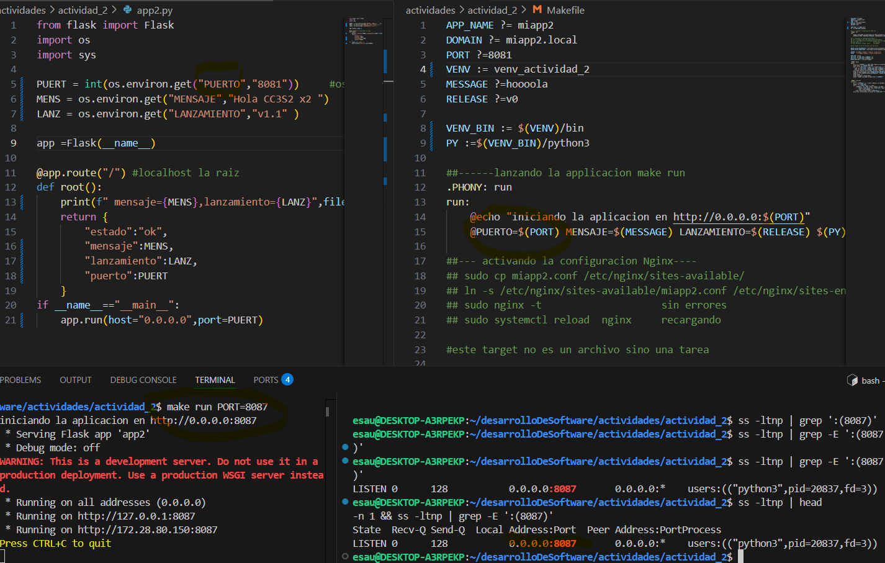
# 2 config por entorno
desde terminal haciendo ``make run MESSAGE = "primera modificacion"`` y se los pasa a app2.py al ejecutar el target .PHONY run run: @.. $(PY) app2.py , y esos valores para MENSAJE LANZAMIENTO son enviados al alcance de flask que ejecuta root() donde se muestra las variables.
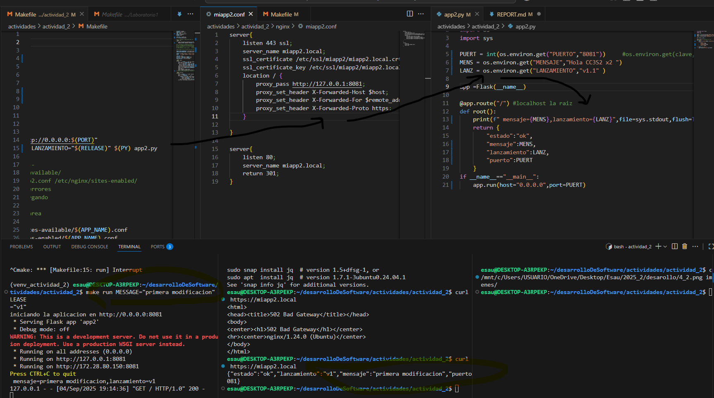
# 4 logs a stdout
de momento el 'log' es un un mensaje simple mostrada por print que  se almacena en file =stdout un stream ojbeto con file descriptor 1
luego no se quiere que los logs esten atados a memoria interna de la app, sino que puedan ser colectados desde afuera, entonces el stdout se redirige a un archivo externo usando el operador de SHELL, mediante make run > saliga.log  y tambien el stream stderr hacia salida mediante 2>&1.
De modo que el comando ``make run MESSAGE = "aaa" > salida.log 2>&1`` realiza dicho cometido 
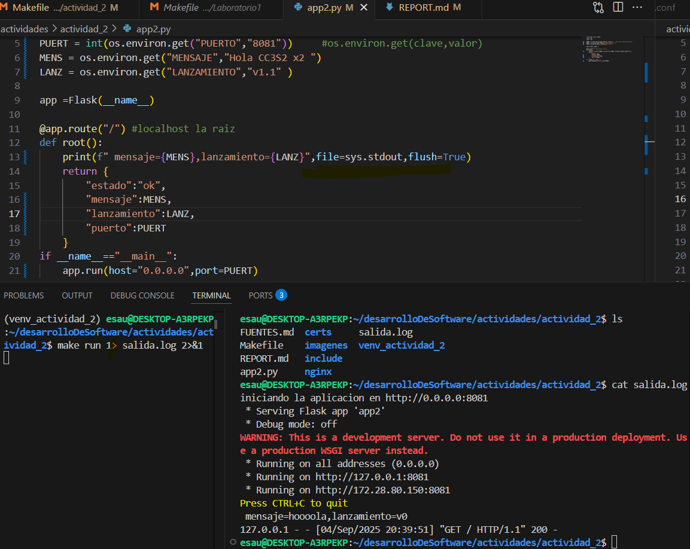

# 5 Operacion reproducibe 
en Makefile : los target .PHONY run run : para ejecutar <br>
 .PHONY nginx nginx: sube las configuraciones par el proxy inverso y presentacion de certificados a cliente <br>
.PHONY tls-cert tls-cert crea los cetificados y los almacena en ssl donde tls espera buscarlos. 
Se hizo todo de antemano de forma reproducible.

*mejoras incrementales* tambien fueron tomados en cuenta en los pasos anteriores

# preguntas guias 
1. indempotencia :ejecutar un metodo produce el mismo resultado para paras ejecuciones, por ejemplo una consulta GET. Entonces en el caso de retries (reintentos) si el metodo es idempotente las consultas no generan duplicados de datos.Los heath checks determinan si el servicio esta funcionando correctamente , en el caso de usar metodos no idempotentes se podria determinar redirigir el trafico.
2. hosts se usa de manera local, pero los ip dominios se actualizan manualmente, el ttl indica cuanto tiempo se guarda la ip antes de volver a consultar al servidor dns, esto hace que las resoluciones sean mas rapidas
3.el SNI permite que un servidor tenga varios nombres de dominio, y el certificado asociado que usara TLS segun el pedido del cliente.
4. los logs no son archivos locales sino que se pasan a streams, estos son luego recogidos por herramientas recolectores
5. ss -ltnp → verifica que el puerto esté abierto y Nginx esté escuchando.
curl -v → prueba desde el cliente que la aplicación responde correctamente.
journalctl -u nginx → revisa los logs internos de Nginx para detectar errores de configuración, TLS, permisos o fallos de proxy.