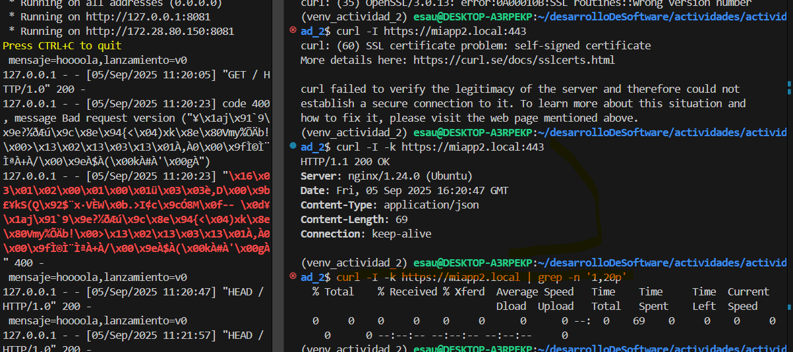
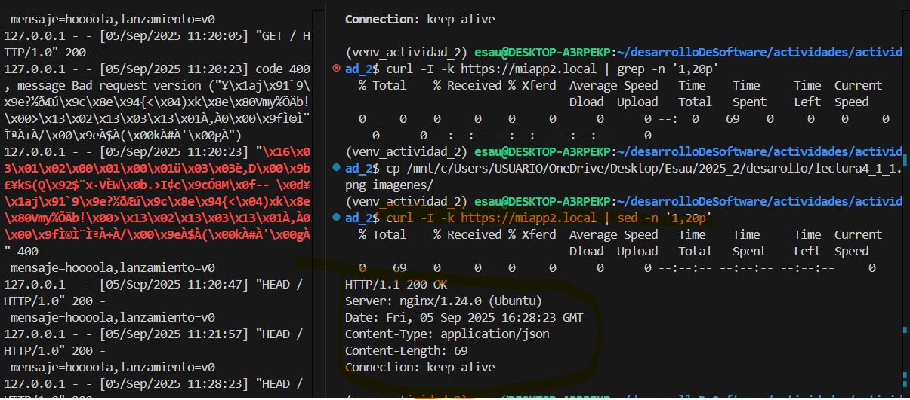
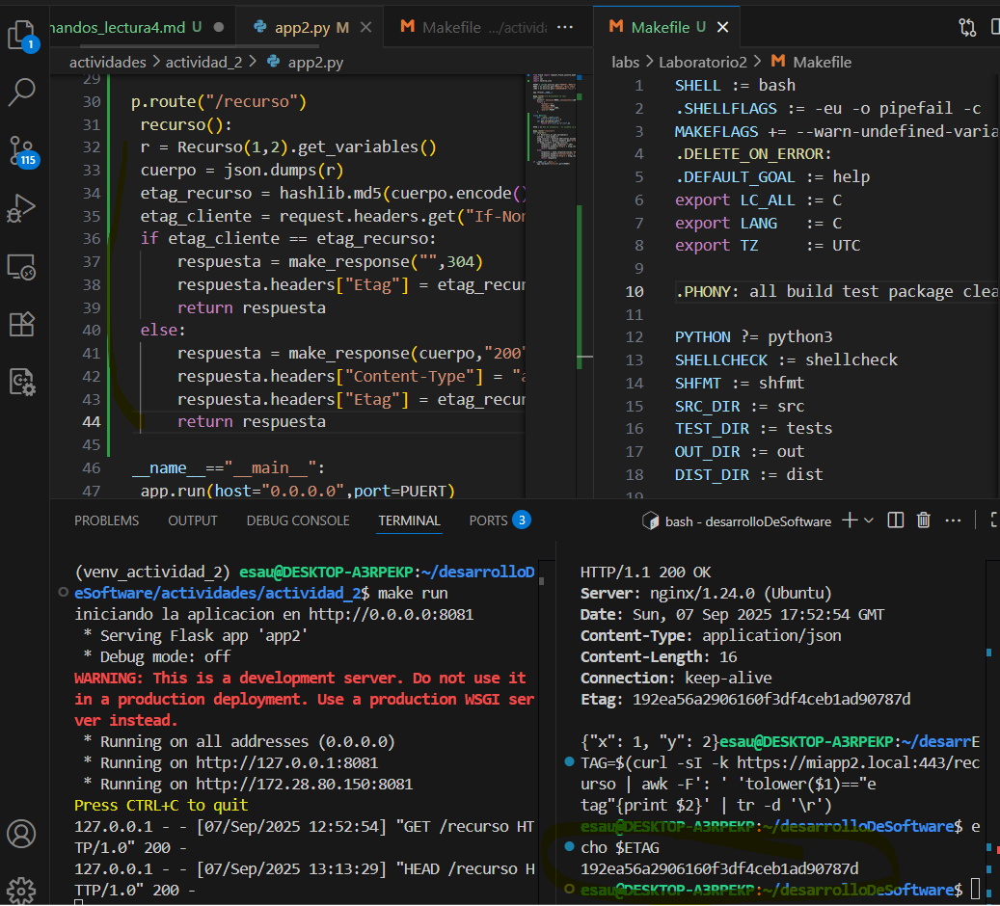
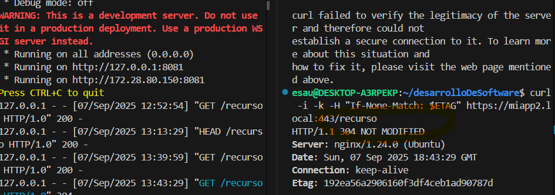
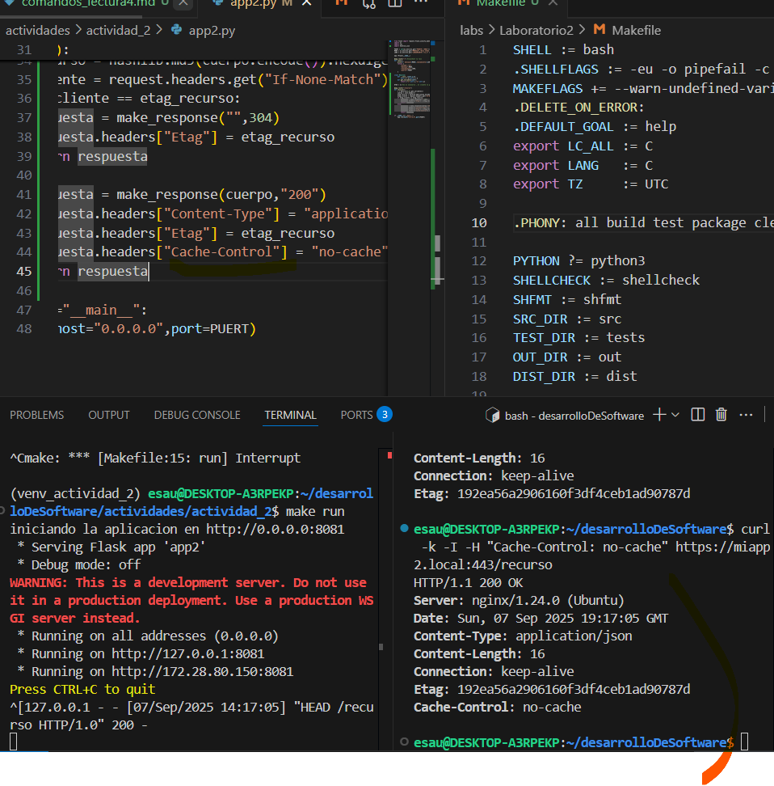
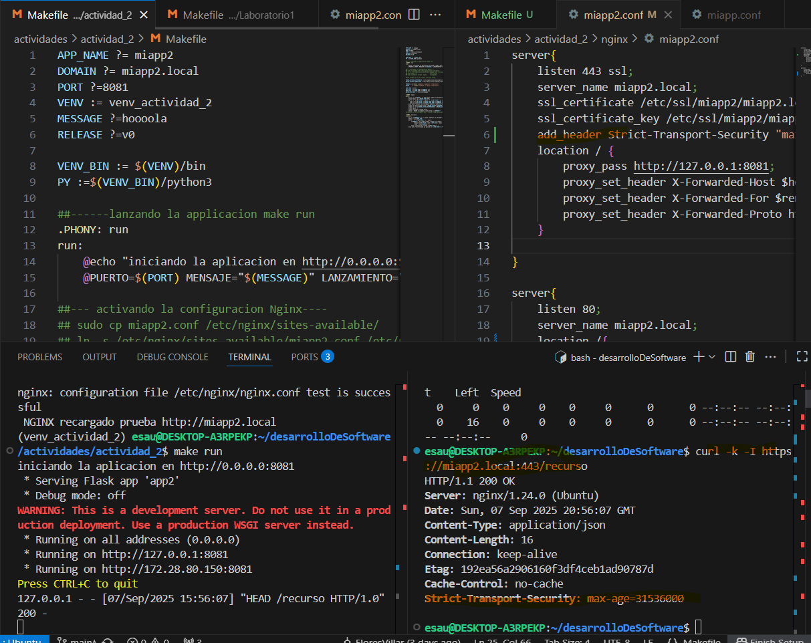
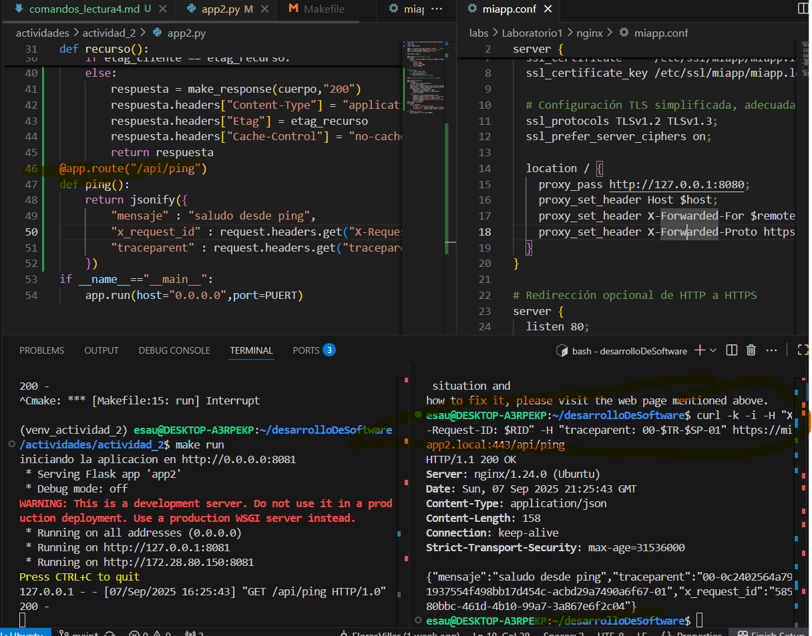
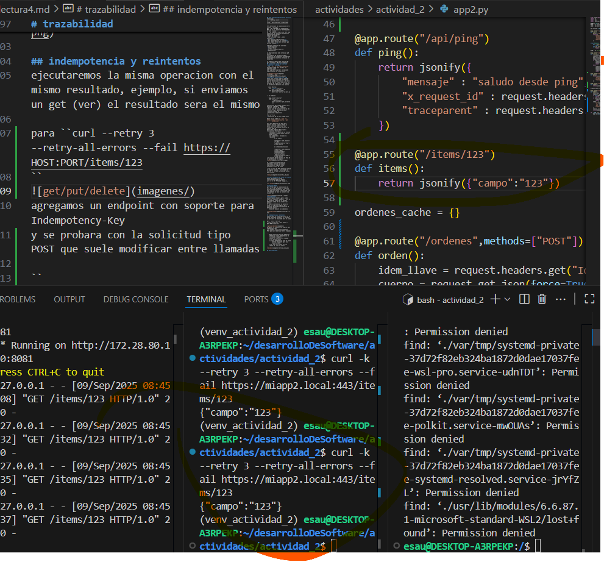
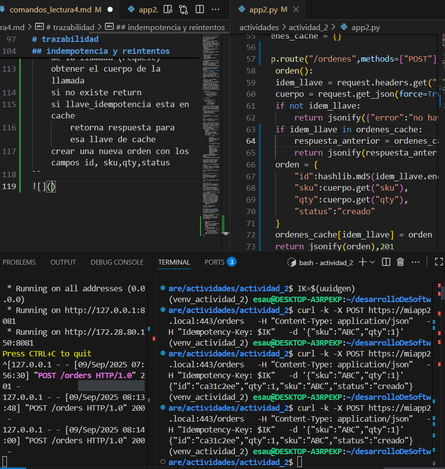
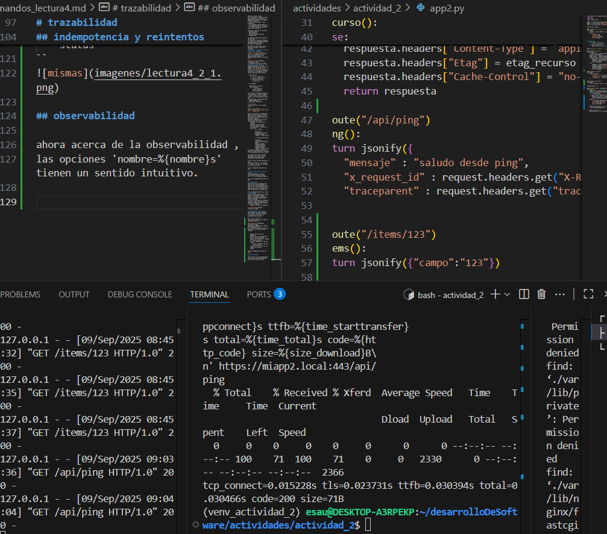

## http contrato operativo del servicio
transicion: 
|-----CALMS y CI/CD---------------|
|---------------------------------|
|http → observabilidad y seguridad|
|---------------------------------|

http estructura la comunicacion entre cliente y servidor.
GET , PUT y DELETE son idempotentes.
POST no lo es, mientras PATCH depende lo sera a veces
ej : un endpoint /orders con POST debe asegurarse de reintentos automaticos que dupliquen pedidos
codigos de estado :
- 2xx exito 201 creado , 2022 aceptado 
- 3xx gestiona redirecciones 
- 4xx responsabiliza al cliente 
- 5xx señala fallas del servidor que activan alarmas 

cabeceras refuerzan el contrato:
- Cache-Controle
- Etag If-Match
- Strict-Transport-Security 
- X-Request-ID

la observabilidad mide latencias p50 p95 p99 
los endpoint de salud distinguen *liveness* de *readiness* evitando que balanceadores enruten a instacias no preparadas

un endpoint /health que retorna 200 para liveness y 503 para readiness
## inspeccion rapida del contrato (cabeceras y coodigos)
- con ``curl -I -k https://host:443`` enviamos en GET para recibir las cabeceras clave
sed -p permite imprimir lo deaseado especificando las lineas 1,20 

# validacion condicional con Etag 
ahora para ejecutar toda la segunda instruccion se requiere un endpoint que nos devuelva un recurso , en este caso se crea la clase recurso con dos atributos de clase(int) y en endpoint lo que hara se devolver esos valores

``class Recurso:
    def __init__(self,a,b):
        self.x = a;self.y = b
    def get_variables(self):
        return {"x":self.x,"y":self.y}``
 
 y el endpoint

 ``@app.route("/recurso")
    def recurso():
        r = Recurso(1,2)
        return jsonify(r.get_variables())
``
una peticion GET simple mediante curl devuelve: < HTTP/1.1 200 OK
< Server: nginx/1.24.0 (Ubuntu)
< Date: Sun, 07 Sep 2025 15:24:45 GMT
< Content-Type: application/json
< Content-Length: 14
< Connection: keep-alive
< 
{"x":1,"y":2}
* Connection #0 to host miapp2.local

Ahora lo que piden es ``curl -sI https://miapp2.local/recurso | awk -F': ' 'tolower($1)' ``

para ello definimos el eTag para nuestro recurso, como ni flask ni nginx tiene esa cabecera en sus respuestas, se necesita definirlo en nuestro app2.py 
dentro del endpoint @app.route(/recurso) def recurso():
    hasheamos el retorno de la funcion 
    obtenemos el hash (etag) anterior desde cliente
    los comparamos y enviamos la repsuesta
            si no cambio

            respuesta = make_response("",304)
            respuesta.headers["Etag"] = hash_recurso

            o si hubo modificacion

            respuesta = make_respuesta(cuerpo,"200")
            respuesta.headers["Content-type"] = "application/json"
            respuesta.headers["Etag"] = etag_recurso
y a consulta hecha devuelve el Etag de lo que devuelve el endpoint

el  cliente curl pide solo las cabeceras| analiza la columna imprimiendo el segundo campo | evitando el salto de linea

y con el valor de ETAG obtenido se hace
el segundo comando , solicitando el recurso si el hash no coincide con el que se tiene

# Forzar validacion de cache en cliente
ahora obviaremos la cache y consultaremos desde la fuente
curl -k -I -H "PETICION" htpps://..

# comprobar HSTS 
para forzar que la comunicacion sea solo por https agregamos la cabecera Strict-Transport-Security hsts  en el .conf que usara nginx, reiniciando este y finalmente se hace la consulta via cliente curl

# trazabilidad 
aunque request.headers.get() puede usarse en cualquier endpoint , esto es en cualquier cuerpo de os metodos definidos luego de app.route("/ip/ping")
lo ideal es determinar un punto de salud sin logica de negocio para verificar disponibilidad entonces se define en ping():
    devolver jsonify con cabeceras 

## indempotencia y reintentos
ejecutaremos la misma operacion con el mismo resultado, ejemplo, si enviamos un get (ver) el resultado sera el mismo

para ``curl --retry 3 --retry-all-errors --fail https://HOST:PORT/items/123
``

agregamos un endpoint con soporte para Indempotency-Key 
y se probara con la solicitud tipo POST que suele modificar entre llamadas

``  
    @app.route(ruta para el endpoint) 
    obtener el llava_idempotencia de la llamada (request)
    obtener el cuerpo de la llamada
    si no existe return 
    si llave_idempotencia esta en cache
        retorna respuesta para esa llave de cache
    crear una nueva orden con los campos id, sku,qty,status         
``

## observabilidad

ahora acerca de la observabilidad ,
las opciones 'nombre=%{nombre}s' tienen un sentido intuitivo. 
se va a medir latencias en cada fase de peticion https
*%{time_namelookup}* dns lookup tiempo desde que se inicio la peticion hasta la resolucion del nombre A/AAAA

*%{time_connect}* tcp connect tiempo desde el incio hasta que se completa la conexion tcp

*%{time_appconnect}* TSl handshake tiempo que tomo hacer el handshake tls (ssl/tls) 

*{time_pretranser}* tiempo para que libcurl de por hecho la negociacion preliminar(auth,proxy,tls) y listo para Enviar/ recibir 

*{tiime_starttransfer}* TTFB tiempo HASTA que llega el primer byte de respuesta del servidor
TTFB = DNS + TCP + TLS + tiempo_servidor_procesa

*{time_total}* total 

### Liveness vs Readness (sin kubernetes)
*patron recomendado*
- /healthz 200 proceso vivo no revisa dependencias
- /readyz 200 solo cuando dependencias esten ok (db,cola) 503 mientras inicia

``curl -k -fsS https://miapp2.local:443/saludz >/dev/null && echo "VIVO" || echo "NO VIVO"

