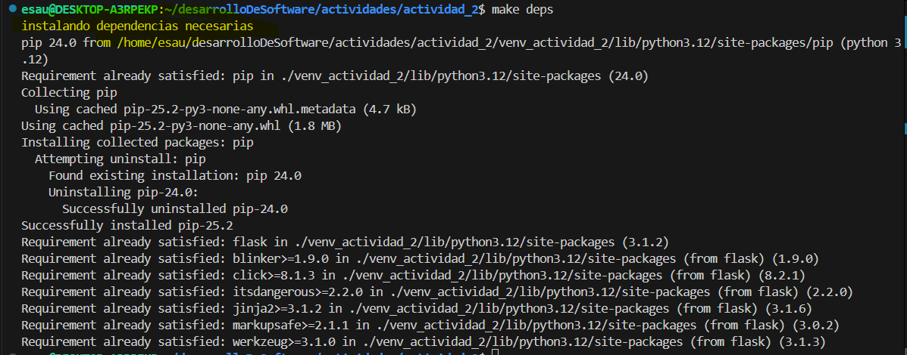
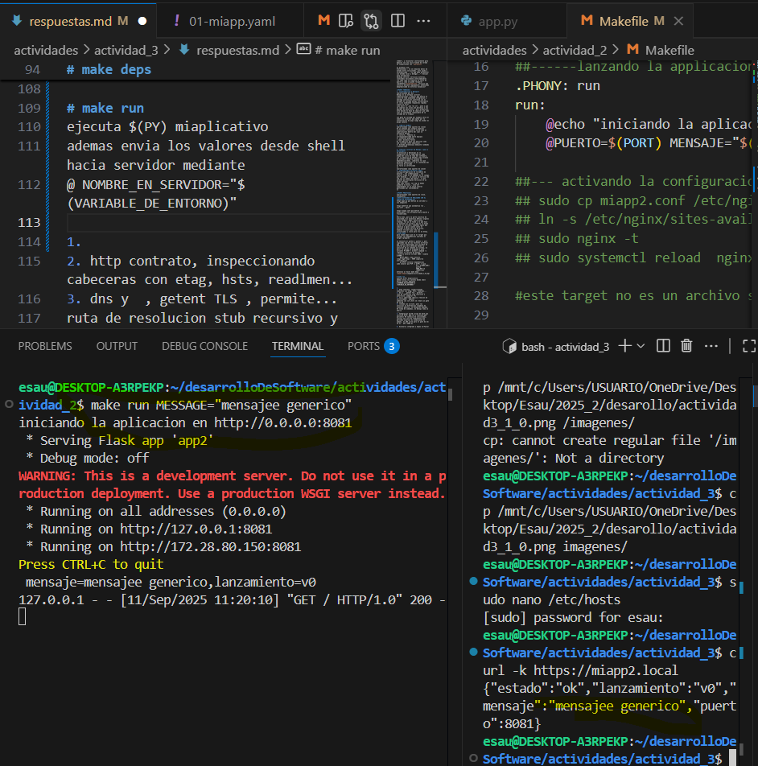
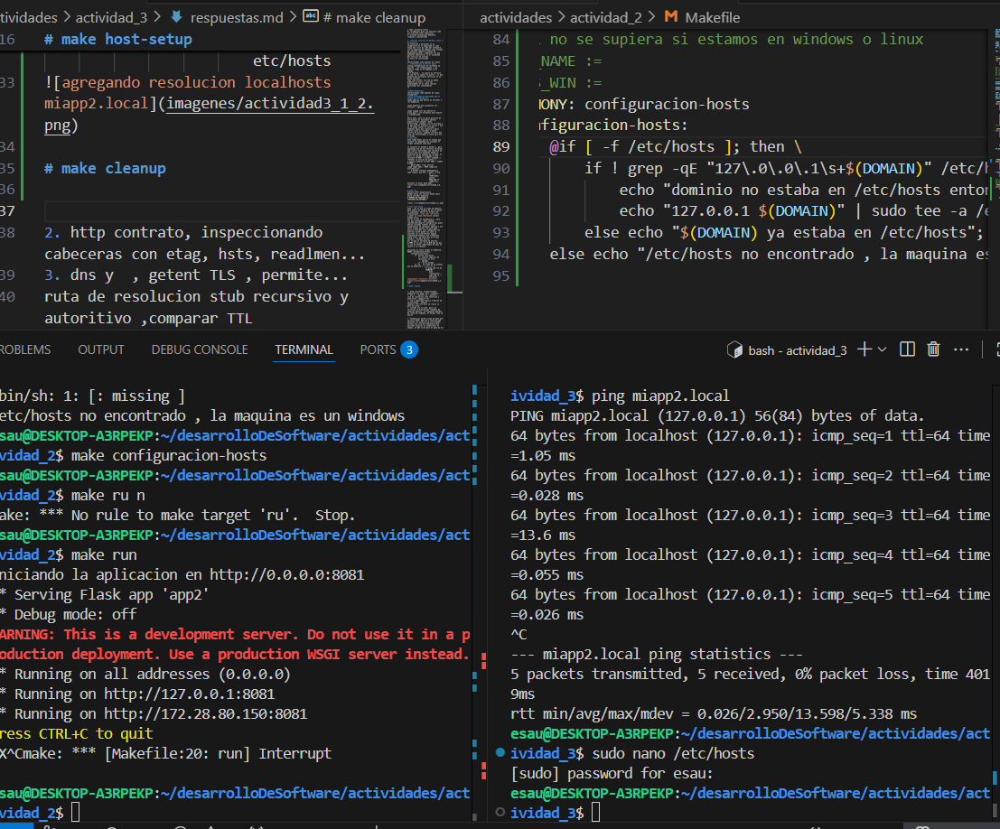

### Actividad 3 CC3S2
**Evolucon de devpops a sec, levar una app de cdigo a produccion**
**Teoria de clase**
queremos articular cultura de colaoracion , automatizacion  y reproducibilidad : con linux , bash y sobre todo con make.

Esto servira como primer paso de automatizacion reproducible : make

Ademas control tecnico: http dns tls y puertos y procesos

Esto va a estar guiado por la metodologia 12-app

labo 1 evidencia trazabilidad en cada paso

you build it you run it: elquipo que desarrolla es responsable de mejorar el servicio.

devops no solo son herramientas tambien implican metricas y gates, si no se cumplen umbrales especificos se bloquea la promocion.

los gates de calidad son puntos de control en el pipelne de CI/CD , esto permite cumplir con calidad y rendimiento antes de seguir a la siguiente etapa

2. CALMS C:culture A:automatization L:Lean M:measurement S:sharing es un marco que sintetiza devops→devsecops
Adoptar la seguridad embebida desde el inicio, del mismo modo la automatizacion , las metricas.
La cultura.
Automatizacion es codificar: procesos de construccion pruebas, y la observabilidad
en devsecops es automatizar controles de seguridad

analisis dinamico y estatico de codigo, escaneo de dependencias.

ver metricas de seguridad detccion de vulnerabilidades y solucion de ello
lean :simplificar flujos 
post mortem : analisis posterior a incidentes para identicar causas , se hace de forma colaborativa, promoviendo la mejora continua

CALMS se aterriza usando archivos y practicas, se trabaja sobre MAKEFILE este automatiza tareas y gates

nginx: expone el  servicio y politicas TLS

system : goberna el arranque , entorno

netplan: fija red  direccionamiento y documentos y evidencias que ayudan a como utilizarlo

**practica**
la configuracion de entorno mediante variables de entorno, evitamos embebidos , conseguimos pariedad

que hace un port binding: explicita que el app publique el servicio en un puerto propio y el nginx que es un proxy inverso pueda 'comunicarse a internet' y con nuestro servidor, con quien tendra el vinculo mediante  
``location / {
    proxy_pass http://127.0.0.1:8081
}`` 

los logs son flujos , es emitir STdout stdderr, y recolectar centralmente para  depurar con una unica fuente de verdad
Se inspeccionan con `journalctl`

el profesor usa:
Statelesness : no se almacena datos de estado entre solicitudes, esto ayuda a escalabilidad  , "la app debe permanecer sin estado local y delegar..." *revisar esta afirmacion*
backing service: servicios externos, conectados facilmente intercambiables
¿en labo como se simuaria un fallo de puerto y como se puede recuperar rapidamente`disposability` servicio que inciia y detiene rapidamente, obteniendo adaptabilidad en entornos dinamicos?

**PARTE TEORICA**
1. **introduccion a Devops**
*parafraseado por mi*
Devops es un enfoque cultural , organizacional y laboral que mejora el ciclo de vida añadiendo integracion y entrega continua.En contraste con el enfoque en cascada devops retroalimenta el ciclo añadiendo respuestas rapidas frente un error
*you built it ,you run it* , pese a que se superan los silos que dividian a los equipos de desarrollo , QA y produccion, esta maxima no deja de implicar que cada cual es totalmente responsable de la calidad de su trabajo

*un gate de calidad por ejemplo seria el numero de usuarios que optan por la actualizacion de pago luego de probar el grupo canary*

2. **Marco CALMS**
*parafraseado como apuntes de clase*
En un enfoque que integra aspectos culturales y tecnicos y seria como el superconjunto dentro del cual se encuentra devops
C: cultura , fomenta la corresponsabilidad entre equipos
A: sintetiza pipelines
L Lean: minimiza fallos 
M: la medicion guia con metricas como SLO (servide level objective)
S: difunde aprendizaje mediante runbooks y postmortems

3. **Vision cultural de Devops y paso a Devsecops**
la evolucion a devsecops es la integracion de la seguridad en cada etapa del ciclo de vida del softwaare, con la adopcion de medidas como escaneo de software (SAST?)y escaneo de dependencias(SCA), cabeceras tls que permitan identificar si el contenido del servicio ha variado 
Si falla un certificado 
**
*parafraseado como apuntes de clase*
4. **Metodologia 12-factor app**
config:configuracion de variables de entorno , las credenciaales , los feature flags no se embeden en el codigo.
port binding :  se asocia un servicio de red con un numero de puerto , lo que permite que multiples servicios en un mismo servidor
logs como flujos: los log no deben grabarse en disco , sino ser almacenadoos en un stack central gestionado por contenedores 
**

**PARTE PRACTICA**
*parafraseado como apuntes de clase,incompleto*
**ESTA ACTIVIDAD SE REALIZARA CON EL CODIGO DE ACTIVIDAD_2**
tengo app2.py que define mi servidor y los endpoints

tengo makefile que automatiza run , tls-cert , nginx 

tengo miapp2.conf que define el proxy_pass y los atributos para health y trazabilidad.
1. 
Ahora bien, para la parte practica de actividad_3 es necesario definir algunos otros targets: deps, hosts-setup, cleanup, run ya se tiene y lo que hace es ejecutar el script o que es lo mismo lanzar el servidor, tambieen nginx que comunica a nginx cuales seran el servidor a quien servira de proxy, tambien tls-cert que crea los certificados y llave para tls en https.
# make deps
Para *make deps* que es el target que instala las dependencias usaremos el target *prepare* como guia

se necesita el python o python 3, pero siguiendo una de los factores 12-factor app (cual?) declaramos una variable de entorno que sera obtenido desde la ejecucion de un comando en sistema, es decir la salida se asignada a esta variable PY_BOOT = $(shell command -v  "obtener la version de python ")
y nuestro entorno virtual VENV = nombre
$(VENV) :
    @$(PY_BOOT) crear entorno
luego taget deps : VENV cumplirse prerrequisito
    @ $(PIP) instalar dependencias
cabe señalar que PIP := $(PY) -m pip
                        PY = $(VENV_BIN)/python
                        VENV_BIN =$(VENV)/bin
entonces al hacer make deps:

# make run 
ejecuta $(PY) miaplicativo 
ademas envia los valores desde shell hacia servidor mediante 
@ NOMBRE_EN_SERVIDOR="$(VARIABLE_DE_ENTORNO)" 

# make host-setup 
okay , con lo que se tiene de momento, para emular el trabajo de dns se hacia lo siguiente: abirir el archivo de resoluciones ``sudo nano /etc/hosts `` y poner la linea resolucion iplocal miapp2.local.
eso es lo que se automatizara , pero , con que sentido , para obtener reproducibilidad,la configuracion podra haerse evitando cometer errores tipograficos en cualquier maquina y sin abrir ningun editor, de este modo 
nuestro servidor sera compatible con entornos CI/CD donde los jobs se ejecutan sin intervencion humana
asumimos(de momento) que trabajamos sobre linux, de hecho eso es lo que hacemos , estamos en wsl .
por lo que la variable de entorno U_NAME no se usa, ni IS_WIN que de por si son un tanto complicados de leer en cuanto a su sintaxis.

definimos un nuevo target en makefile, .PHONY configuracion-hosts:
    configuracion-hosts:
        if  existe /etc/hosts
            if  nuestro registro de resolucion no esta
                agregar
            if - no ya estaba
        if -no , se trata de un windows
que en makefile [ <condicion>]:
                    if grep -qE "ip $$(DOMAIN)"
                        echo "resolucion" | sudo tee -a /etc/hosts

# make cleanup 

Ahora tambien necesitamos dejar limpio el sistema una vez que nos desconectemos, pero conservando los logs  y certificados.
PERO antes seria conveniente implementar :arranque automatico de servicios, esto es systemd, en el labo 1 se detalla ello y vamos a servirnos de el.

2. http contrato, inspeccionando cabeceras con etag, hsts, readlmen...
3. dns y  , getent TLS , permite...
ruta de resolucion stub recursivo y autoritivo ,comparar TTL 
5. TLS y seguridad implica creacion de certificados,  openssl
cabecera con curl,hsts se creara un gate de CI/CD , 
6. lstando con ss/lsof, pero los servicios se diferencias loopback de conexion publica, se ensayaran medidas.En linea de comandos, en devops toma se abarca
....
7. Integracion CI/CD script de bash que verifica HTTP, DNS,TLS y latncias,p95 percentil 95 latencia de solicitudes, calcula una cola de rendimiento que perciben usuarios en condiciones no ideaes, el p95 sirve para el gate de CI/CD ej : p95 <5000 ms

8. Escenario integrado y mapeo 12-Factor

