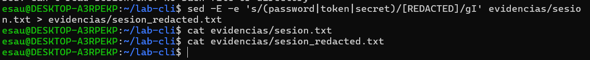
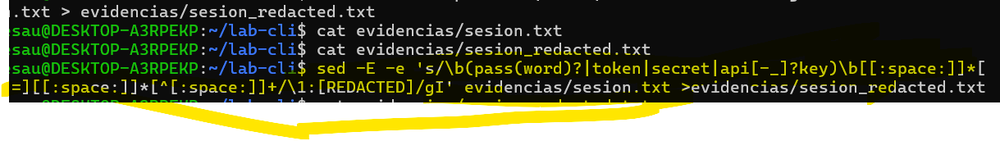
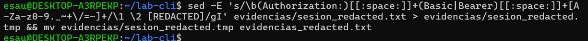
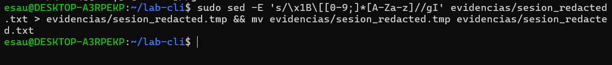

### Comandos linux para devsecops
situar CLI como herramienta para automatizar tareas:
- marco teorico
- manejo solido de cli
- 

**sanitizador**
1. 
introducirnos a la Cli esto es , a la sintaxis  de comandos puede ser abrumador
``sed -E -e 'PATRON' -e 'PATRON' archivo_objetivo > archivo_resultado``
luego dentro del patron se usara el comando de sustituccion
's/../gI' que es el comando en cuestion
``s/REGEX/REEMPLAZO/flags``

``sed -E \
  -e 's/(password|token|secret)/[REDACTED]/gI' \
  -e 's/\b(pass(word)?|token|secret|api[-_]?key)\b[[:space:]]*[:=][[:space:]]*[^[:space:]]+/\1: [REDACTED]/gI' \
  
  evidencias/sesion.txt > evidencias/sesion_redactada.txt

  clave - valor, -E activa expesiones regalres, gI aplica a todos las ocurrencias en modo case-inensitive(mayusculas y minuscuclas)
  primera regla:``s/(password|token|secret)/[REDACTED]/gI`` 
  
  la profundidad del ccodigo fuente va mas alla de escribir un simple script, la parte de configuraciones , contenedores ,se trabajan de esta forma, usamos sed para ocultar datos sensibles
  extended regular expresion , permite utilizar los ( ) y  |  sin escapes, eje: si ``-e s/../flags``
  esto define una sustitucion, (||) define un grupo de captura
  `
  que es lo que se hace en esta linea sed -E
  -e 's/(password|token|secret)/[REDACTED]/gI , primera sustituion
  


  tengo pass token secret y cual es el reemplazo ,es REDACTED 
  tngo gI g todas las apariciones en linea, I sendible a mayucculas y minusculas, pass ,token y secret pasan  a REDACTED

  la segunda parte 

`` -e 's/\b(pass(word)?|token|secret|api[-_]?key)\b[[:space:]]*[:=][[:space:]]*[^[:space:]]+/\1: [REDACTED]/gI``

``'s/patron/reemplazo/gI'``

``s/\b inicio TODA LA PALABRA \b final``

``s/\b(PATRON DE CAPTURA)\b/gI``

``s/\b (pass(word)?|     |api[-_]?key  ) \b``              
        pass (SI ESTA DENTRO LA SECUENCIA) ?  pass o password     
        api [UN SOLO CARACTER]?key        apikey, api-key,api_key
Entonces sed habra capturado:
password , por ejemplo
ahora se busca los caracteres = : ...

``[[:space:]]`` cualquier espacio en blanco (espacio, tabulador,salto de linea)
``*`` 0 o mas repeticiones
```[:=]`` clase de caracteres solo uno de estos : ó =
```[[:space:]]`` ahora despues del sepador
``[^[:space:]]+`` cualquier caracter que no sea espacio , una o mas veces 
es aqui donde se captura el valor de password 
password =``[^[:space:]]+``
entonces lo que se esta buscando es el caracter que indica que se trata de una creddencial , se buscan los espacios por ejemplo luego = ó : y otro espacio
finalmente todos los caracteres   que no sean espacios, osea el valor de esa credencial PASSWORD
entoces sed habra reconocido ```password = CONTRASEÑA`` 
ahora pasando al reemplazo \1 guarda lo que esta en la () osea el nombre del campo password (por ejemplo)  y lo reemplazmos (TODO )  por  \1 : [REDACTED]
lo que estaba dentro del () se guarda en \1 
y redireccionamos la salida a evidencias/sesion_redactada.txt

luego el texto ya tranformado en texto redactado
un sanitizador es un proceso limpia o neutraliza datos peligrosos o sensibles antes de compartirlos o procesarlos
que hace en el codigo fuente, usamos sed y grep acutando como sanitizadores, redactaremos secretos etc.


se muestra que compila correctamenteme, aunque de momento solo eso 
2. oculta las credenciales en cabeceras HTTP (Autothorization Basic/Bearer)
sed -E 's/\b(Authorization:)[[:space:]]+(Basic|Bearer)[[:space:]]+[]+/\1 \2 [REDACTED]/gI'

como antes -E 's/PATRON A BUSCAR/REEMPLAZO/gI'
                /\b(PRIMER GRUPO)caracteres(SEGUNDO GRUPO)caracteres caracteres/
                                  [[:space::]]+    [[:space:]][A-Za-z0-9._~+\/=-] 

REEMPLAZO     \1 \2 [REDACTED]
              Authorization  Basic [REDACTED]

              

3. quitando codigos de color ANSI
``s/PATRON//g`` 
  '\x1B\[[0-9;]*[A-Za-z]'
  \x1B  caracter ESCAPE 
  \[   escapa del [ , esta buscando 'literalmente' un corchete
  [0-9;]*   digitos  o punto y coma , 0 o mas veces
  [A-za-z] una letra
  Estamos buscando      ESC [ 31m    color rojo m codigo ANSI
  
  