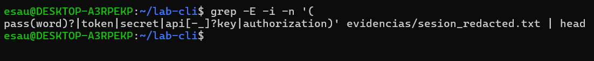

# Comandos linux para devsecops
preparacion para evidencias y evauluacion
Se crea la carpeta lab-cli pero no se usa script  debido a que wsl2 no responde adecuamente  , wsl lo logra correr la shell dentro de TTy, script simplemente no funciona. 
se intenta ``bash | tee evidencias/sesion.txt``
pero tampoco resulta , por lo que se usara 
``comando | tee -a evidencias/sesion.txt``
**sanitizador**
1. 
introducirnos a la Cli esto es , a la sintaxis  de comandos puede ser abrumador
``sed -E -e 'PATRON' -e 'PATRON' archivo_objetivo > archivo_resultado``
luego dentro del patron se usara el comando de sustituccion
's/../gI' que es el comando en cuestion
``s/REGEX/REEMPLAZO/flags``

``sed -E \
  -e 's/(password|token|secret)/[REDACTED]/gI' \
  -e 's/\b(pass(word)?|token|secret|api[-_]?key)\b[[:space:]]*[:=][[:space:]]*[^[:space:]]+/\1: [REDACTED]/gI' \
  
  evidencias/sesion.txt > evidencias/sesion_redactada.txt

  clave - valor, -E activa expesiones regalres, gI aplica a todos las ocurrencias en modo case-inensitive(mayusculas y minuscuclas)
  primera regla:``s/(password|token|secret)/[REDACTED]/gI`` 
  
  la profundidad del ccodigo fuente va mas alla de escribir un simple script, la parte de configuraciones , contenedores ,se trabajan de esta forma, usamos sed para ocultar datos sensibles
  extended regular expresion , permite utilizar los ( ) y  |  sin escapes, eje: si ``-e s/../flags``
  esto define una sustitucion, (||) define un grupo de captura
  `
  que es lo que se hace en esta linea sed -E
  -e 's/(password|token|secret)/[REDACTED]/gI , primera sustituion
  


  tengo pass token secret y cual es el reemplazo ,es REDACTED 
  tngo gI g todas las apariciones en linea, I sendible a mayucculas y minusculas, pass ,token y secret pasan  a REDACTED

  la segunda parte 

`` -e 's/\b(pass(word)?|token|secret|api[-_]?key)\b[[:space:]]*[:=][[:space:]]*[^[:space:]]+/\1: [REDACTED]/gI``

``'s/patron/reemplazo/gI'``

``s/\b inicio TODA LA PALABRA \b final``

``s/\b(PATRON DE CAPTURA)\b/gI``

``s/\b (pass(word)?|     |api[-_]?key  ) \b``              
        pass (SI ESTA DENTRO LA SECUENCIA) ?  pass o password     
        api [UN SOLO CARACTER]?key        apikey, api-key,api_key
Entonces sed habra capturado:
password , por ejemplo
ahora se busca los caracteres = : ...

``[[:space:]]`` cualquier espacio en blanco (espacio, tabulador,salto de linea)
``*`` 0 o mas repeticiones
```[:=]`` clase de caracteres solo uno de estos : ó =
```[[:space:]]`` ahora despues del sepador
``[^[:space:]]+`` cualquier caracter que no sea espacio , una o mas veces 
es aqui donde se captura el valor de password 
password =``[^[:space:]]+``
entonces lo que se esta buscando es el caracter que indica que se trata de una creddencial , se buscan los espacios por ejemplo luego = ó : y otro espacio
finalmente todos los caracteres   que no sean espacios, osea el valor de esa credencial PASSWORD
entoces sed habra reconocido ```password = CONTRASEÑA`` 
ahora pasando al reemplazo \1 guarda lo que esta en la () osea el nombre del campo password (por ejemplo)  y lo reemplazmos (TODO )  por  \1 : [REDACTED]
lo que estaba dentro del () se guarda en \1 
y redireccionamos la salida a evidencias/sesion_redactada.txt

luego el texto ya tranformado en texto redactado
un sanitizador es un proceso limpia o neutraliza datos peligrosos o sensibles antes de compartirlos o procesarlos
que hace en el codigo fuente, usamos sed y grep acutando como sanitizadores, redactaremos secretos etc.


se muestra que compila correctamenteme, aunque de momento solo eso 
2. oculta las credenciales en cabeceras HTTP (Autothorization Basic/Bearer)
sed -E 's/\b(Authorization:)[[:space:]]+(Basic|Bearer)[[:space:]]+[]+/\1 \2 [REDACTED]/gI'

como antes -E 's/PATRON A BUSCAR/REEMPLAZO/gI'
                /\b(PRIMER GRUPO)caracteres(SEGUNDO GRUPO)caracteres caracteres/
                                  [[:space::]]+    [[:space:]][A-Za-z0-9._~+\/=-] 

REEMPLAZO     \1 \2 [REDACTED]
              Authorization  Basic [REDACTED]

              

3. quitando codigos de color ANSI
``s/PATRON//g`` 
  '\x1B\[[0-9;]*[A-Za-z]'
  \x1B  caracter ESCAPE 
  \[   escapa del [ , esta buscando 'literalmente' un corchete
  [0-9;]*   digitos  o punto y coma , 0 o mas veces
  [A-za-z] una letra
  Estamos buscando      ESC [ 31m    color rojo m codigo ANSI
  
  

4. Verificando que no queden secretos
Un poco de la teoria de GREP  global regular expresion print , busca patrones en archivos de texto e imprime las lineas completas que coinciden con el patron 

grep [opciones] PATRON [archivo]
si no se da el archivo, se leera la entrada estandar stdin
algunas opciones -i ignora mayusculas o minusculas
-v mostrar lineas que no coinciden con el patron 
-n mostrando numero de linea
-r buscar recursivamente los directorios
-E usar expresiones regulares extendidas

``grep -E -n -i '(pass(word)?|token|secret|api[-_]?key|autorization)' evidencias/sesion_redactada.txt | head``
el grupo de captura pass(word) | token | secret| api[-_]? key .....
de nuevo (TEXTO) captura texto , mientras que [-_]? solo uno de esos caracteres
se ha visto que * tambien se usa para capturar 0 o mas coincidencias del patron "interno" anterior a * ó ? , se prefire  * para capturar espacios o saltos


*JOURNALCTL*
Algo de teoria de los comandos que se usarn en la entrega minima 
``journalctl -p err.alert -since "today"``
journalctl consulta el journal la base de datos binaria de logs que gestiona systemd ,muestra servicis de kernel , procesos y usuarios.Tiene filtros potentes por unidad fecha etc mas que solo leer /var/log/syslog
filtros:
- "-p" nivel de severidad (err, warning , info) err.alert
- "-u" por servicio unidad systemd              ssh.service
- "--since   --until" especificar fechas        
- "-f" por seguimiento en tiempo real

*TAIL*
se ua para para mostrar las ultimas lineas de un archivo  o inspeccionar un arhivo muy grande       
- ``tail /var/log/syslog`
algunos flags:
- -n fijar linea de inicio
*FIND*
busca archivos
- -mtime -5  seleccionar archivos segun su ultima fecha de modificacion , indica dias
- -printf permite formatear la salida de find
- '%TY-%Tm-%Td %TT %p\n'
*SORT*
Ordena las lineas de acuerdo criterios alfanumerico    
entonces el comando sera : journalctl -p err.alert --since "today"                                                                                                  sudo tail -n 100 /var/log/syslog | grep -i error
    find /tmp -mtime -5 -type f -printf '%TY-%Tm-Td%'

## Seccion 1: Manejo solido de CLI
### Riesgo & mitigacion en DevSecOps*
Riesgo: Errores en navegacion o manipulacion masiva, las consecuencias son perdida de datos o exposicion (borrado accidental en pipelines CI/CD)
como mitigar ? usar opciones seguras -- para fin de argumentos, -print0/-0 
Conviene detenernos en este punto para analizar estos puntos.

1. -- como fin de argumentos: "a partir de aqui ya no hay mas opciones lo que venga son nombres de archivos aunque empiecen con -"
``rm -rf /tmp/-archivo`` error intentara interpretar -
```rm -rf -- /tmp/-archivo``` sabra que el nombre del archivo es -archivo
Entonces prevenimos borrar de mas por confundir nombres con flags


2. -print0 -0 para manejar espacios
cuando se separan archivos por espacios, tendremos un problema si los nombres de los archivos tienen espacios.
``touch "archivo con espacios.txt"``
``find . -name "*.txt" | xargs rm `` 
se crea un archivo suyo nombre tiene espacios, se busca dicho archivo , el stdout de find se pasa como argumentos a rm via xargs
Pero precisamente tendremos un error
pero si usamos print0 para indicar que el delimitador es espacio
y con xargs -0 se lee la lista(de archivos ) y entiende que el delimitador es espacio
``find . -name "*." -print0 | xargs -0 rm ``


3. DRY - RUN 
En devsecops no se borra directo sin probar, primero se hace un simulacro con echo
``find . -name "*.txt" -print0 | xargs -0 echo rm ``


4. evitar operaciones recursivas con /
Y es que / es la raiz del sistema de archivos, todo esta colgado de alli
/bin /etc /home /usr /var
si un comando recursivo recorre todo el sistema de archivos
``rm -rf / `` DESTRUIRA TODO , -r recursivo -f forzar sin preguntar
``rm / -type f -name "*.log" -delete`` se puso / en lugar de ., no se esta buscando en directorio actual sino en la raiz y se borran todos los logs
MORALEJA : no poner / a menos que se este 1000% seguro.

### Marco teorico 
la CLI (Command line interface) es la interfaz de texto para interactuar con el sistema operativo
En DevSecOps es esencial para scripting , automatizacion de pipelines CI/CD (jenkins o git) y tareas de seguridad como escaneo de vulnerabilidades.
1. navegacion
2. Globbing : usar patrones (wildcards) para seleccionar multiples archivos, util para procesar logs 
3. Tuberias (pipes): Enlazar comandos para procesar datos en cadena
4. Redirecciones :  Enviar salida de comandos para logging y auditoria
5. xargs : stdout de un comando en argumentos para otro.

Explicacion paso a paso :
1. Navegacion Basica
  - pwd  directorio actual
  - ls lista archivos y directorios -a para ocultos
  - cd cambiar de directorio cd /tmp 

2. Globbing 
  - uso de * para listar archivos terminados en .txt 
  
3. Tuberias (Pipes)
  okay , el comando | se ha venido usando tanto en actividades como en la pc, es muy practico
  acerca de ``wc`` va a contar el numero de lineas en un archivo de texto, en este caso contaria las lineas correspondientes al nombre de un archivo cada linea
como se menciona a inicio se usara ``tee -a evidencias/sesion.txt`` en lugar de script


4. Redirecciones
esta tambien es un operador poderoso en el entorno CLI


5. XARGS
Procesa salida como argumeto ó que es lo mismo, la salida de un comando se pasa como argumento a un segundo(tercer?) comando
find en_el_directorio_actual profundidad_directorio_actual | xargs considerar_espacios_en_nombres rm considerar_-_en_nombres_archivos 


### Ejercicios de reforzamiento
1. / desde raiz    ~/ home del usuario actual 


2. usando globbing /*.{txt,doc}
 
un poco de sintaxis de find
find [ ruta_inicial ] [ opciones ] [ expresiones ][ acciones ]
``find /tmp -maxdepth 1 -type f \(-name '*.txt' -o -name '*.doc'\)``
En este caso se usa el operador && para ejecutar dos pipelines , el primero es para que tee escriba en sesion.txt


3. utilizacion de pritnf
 

4. stderr 2 con el opeador de redireccion de salida en modo append
``ls NO_EXISTE 2>> errores.log``
``find . -maxdepth 1 -name 'archivo*.txt' | xargs echo rm ``


*Comprobacion*


cabe señalar que el acceso a las imagenes realizadas con la herramienta de recorte en windows se acceden via cp WINDOWS WSL del siguiente modo:
`` cp /mnt/c/Users/USUARIO/OneDrive/Desktop/Esau/2025_2/desarollo/actividad_4/redireccion.png ~/desarrolloDeSoftware/actividades/actividad_4/imagenes``


## Seccion 2: Administracion Basica
### Riesgo & Mitigacion en DevSecOps
Riesgo : Over-permission en usuarios/permisos 
esto como lo indica el nombre puede exponer datos sensibles en contenedores o repos.
Mitigacion : aplicando umask 027 
evitar operaciones recursivas con / (la raiz del sistema de archivos ) 
la guia indica que se debe usar ```--preserve-root`` que es un flag de seguridad en el comando rm y otros comandos que borran recursivamente como chown, chmod (chown/chgrp/rm)
1. Usuarios/Grupos/Permisos
2. Procesos/señales
3. Systemd
4. journalctl


### Marco Teorico 

### Explicaciones Paso a Paso
