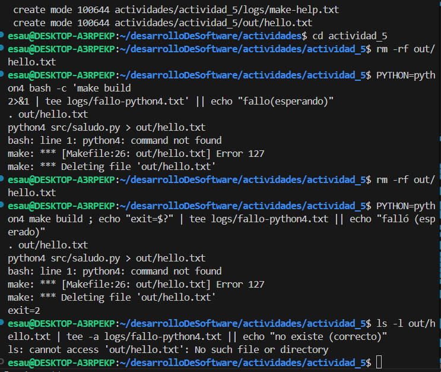

# Construyendo un pipeline Devops con Make y Bash
En *CONSTRUIR* en Se contruira un Makefile y probara unos scripts python
Make decidira si rehacer un target a partir de sus dependencias *esta frase no se profundiza del todo aun* , esto con el uso de variables automaticas
$@ nombre del target out/hello.txt 
$< primera dependencia
las configuraciones del script bash para el rastreo de errores ya nos son conocidas
set - eu set -o pipefail 
y el internal field separator IFS tambien
pero TRAP si es una herramienta interesantisima, nos permite una finalizacion ordenada, intercepta señales como SIGINT SIGTERM EXIT y permite ejecutar un comando del siguiente modo :
``trap comando_a_ejecutar`` SEÑAL1 SEÑAL2 ...
ej:
``trap exit 1 INT`` INT =2  cuando presionamos CTRL + C se ejecutara el comando exit 1
En *LEER*
en tanto que los operadores de asignacion := ?= suenan familiares, la primera se asigna al momento de la declaracion y la segunda es una asignacion condicional 
En *EXTENDER*
Acerca de los LINTERS: Un linter es una herramienta que analiza el codigo y avisa posibles problemas , malas practicas  o inconsistencias de estilo
No ejecuta el codigo solo lee y revisa, este detecta : 
- Errores de sintaxis
- Variables sin usar
- Estilo inconsistente (espacios , identacion)
- Errores de seguridad(usar eval en bash o SQL sin sanitizar)
un ejemplo de eval: 
```bash 
cadena_comando = 'rm -rf '
eval $cadena_comando
```
esto es particularmente peligroso si  esa cadena tiene codigo malicioso,pues se interpretara como coomando de shell bash 

La guia de la actividad indica que el pipeline resultante compila , prueba y empaqueta scripts de pyhon demostrando practicas robustas de shell.

Es preciso exterdernos un poco en "practicas robustas de shell" como 
1. here-docs :
En bash son una forma muy util de redirigir un bloque de texto directamente a un comando o archivo , sin tener que usar muchos ``ècho`` ni archivos temporales
```comando << DELIMITADOR``
los delimitadores pueden ser EOF , END , TEXT 
se prueba en el terminal
``cat << EOF > archivo.txt ``
permite ingresar texto hasta el EOF
y todo esto se redirecciona a un .txt

2. subshells:
un subshell es un proceso hijo que se crea cuando el shell necesita ejecutar un entorno separado, usa las variables del shell padre pero detro de su alcance
```bash
VAR = "hola"
(VAR="adios"; echo "dentro de subshell:" $VAR) 
echo "fuera de subshell: $VAR"  
```
como se ve () define el subshell
ademas una subshell se crea cuando se usa 
el comando de sustitucion ``$()``
cuando lanzamos un pipeline ``|``

la guia continua señalando,ademas, que el makefile esta endurecido : usa reglas claras, evita reglas implicitas y produce artefactos con empaquetado 100% reproducible(metadatos normalizados , orden estable)  

3. En este punto conviene precisar que son 'artefactos' 
Un artefacto es cualquier archivo o conjunto de archivos que resulta del proceso de construccion (build) o empaquetado de un software.
algunos ejemplos 
en C  .exe .out 
en java  .jar
en python .tar.gz (paquetes distribuidos)

'En pocas palabra es el achivo que se genera al ejecuta el codigo fuente'

Esto facilita CI/CD auditoria y bulids deterministas , como se espera en entornos profesionales

## Preparacion
- El entorno es WSl , bueno la guia señala que se deberia trabjar en ~/ en la raiz de mi usuario.
Sin embargo se trabaja directamente en actividad_5
- Dependencias: makee, bash, python3  son conocidos, pero los siguientes son nuevos, ``shellcheck shfmt ruff`` 
1. shellcheck : es un linter que analiza codigo y muestra errores comunes
```bash
for f in $FILES; do echo $f;done     
#al 'ejecutar' con     shellcheck script.sh
#indica que usemos comillas para evitar globbing 
for f in "$FILEs" ; do echo "$f";done
```
2. shfmt : es un formatter para scripts bash,ajusta la sangrias, espacios y llaves automaticamente 
```bash 
if [ $x -eq 1];then echo "uno";else echo "otro";fi
```
probando con shfmt -w script.sh
hara lo siguiente
```bash 
if [ $x -eq 1];then
    echo "uno"
else 
    echo "otro"
if
```
3. Ruff , es un linter y formatter para python , detecta posibles bugs , malas practicas
```python
import os,sys
def add(a,b): return a+b
```
ruff script.py
indica que hay multiples importaciones en una sola linea y que deberia haber un espacio luego de la coma
```python 
import os
import sys
def add(a, b):
    return a + b
```
un concepto más, un benchmark es una prueba de rendimiento util para medir tiempos de ejecucion , consum de memoria en general la eficiencia de un programa

La estructura inicial 
Laboratorio2/
├── Makefile
├── src/
│   ├── __init__.py
│   └── hello.py
├── scripts/
│   └── run_tests.sh
├── tests/
│   └── test_hello.py
├── out/
└── dist/

Se creara ``src/__init__.py`` para compatibilidad en entornos antiguos de python 

## Parte 1 : Construir - Makefile y Bash desde cero
Se crea un Makefile y un bash
src/hello.py

Algunos detalles acerca de la sintaxis de Makefile.

1. .VARIABLE importa las funcones de configuracion de bash,a saber, set -euo pipefail
entonces si queremos usar esas configuraciones se utiliza .SHELLFLAGS la asignacion al momento de declarar y las opciones de configuracion 
``.SHELLFLAGS := -eu -o pipefail -c``
y un detalle mas ``-c`` le dice a bash 'ejecuta el siguiente argumento como un comando/script
ejemplo :
```bash
bash -c "echo Hola; ls"
```
2. Lo siguiente es abarcar la sintaxis de ``MAKEFLAGS += --warn-undefined-variables --no-builtin-rules``
En este punto podria pensarse que cada linea de codigo aporta nueva sintaxis desconocida ,y es que realmente es asi , como sea. Veamos su interpretacion.
con ```MAKEFLAGS+=`` sumamos banderas a make en el sentido que indicamos como debe ejecutarse un comando ,asi, si se quiere que todos los comandos se ejecuten en modo estricto 
``MAKEFLAGS += --warn-undefined-variables ``.
Y desactivando las reglas implicitas (precisamente lo que se menciono) ``--no-builtin-rules`` 

3. Y una vez mas
.DELETE_ON_ERROR:
una bandera global para borrar el archivo target si su receta falla
ej :

```bash
.DELETE_ON_ERROR:

broken.txt:
    echo "mensjae" > broken.txt
    false
    echo "no ejecutado"

make broken.txt
echo "saludo" > broken.txt
false
make : *** [Makefile:4:broken.txt] error 1
rm broken.txt
```
make borra el archivo 

4. .DEFAULT_GOAL := help 
tal como indica su nombre sera el target que corre cuando no se indica a make cual ejecutar.
entonces para recalcar ``.VARIABLE`` son variables / directivas

5. Ahora bien la sintaxis export VARIABLE  := mezcla conceptos de variables de make con variables de entorno del sistema
```bash 
CC := gcc
```
es una variable dde make, visibles solo dentro de Makefile
Mientras que la palabra clave *clave* hace que la variable definida en Makefile se convierta en *variables de entorno * cuando make ejecuta los targets

una primera tentativa para entender que son las variables de entorno 
```bash
export VARIABLE_ENTORNO := saludos
VARIABLE_MAKE := hola

.PHONY:
demo_variable_entorno:
    echo $$VARIABLE_ENTORNO
.PHONY:
demo_variable_make:
    echo $$VARIABLE_MAKE
```
al ejecutar con make y pasarle los valores de las variables, ambos tienen el mismo comportamiento , esto es que make les da prioridad
entonces investigando un poco mas se concluye que la utilidad de las variables de entorno(mucho verbo aparte) es que *las variables de entorno pueden ser referenciadas desde un script python (por ejemplo) actuan como puentes entre make y los programas o scripts que este ejecuta*
Eso, de momento

CABE PRECISAR , se esta editando con la mayor celeridad, honestamente , los errores de ortografia no son tan relevantes, sin embargo ,se tratara de corregir ello

Las lineas de codigo que continuan en Makefile ya nos son familiares, ergo , obviamos su profundizacion 
sin embargo ; hay algo relativamente nuevo , a saber : ``$<  >   $@``
``build : $(OUT_DIR) /hello.txt``
es un target con un prerrequisito
se entiende que hello.txt debe existir
y luego hay otro target que era el prerrequisito o dependencia de build, un poco confuso 
luego se quiere que archivo.py → archivo.txt.
entonces declarar ese target
``$(OUT_DIR)/hello.txt : $(SRC_DIR)/hello.py``
y luego la recete el cuerpo del target, que debe decodificarse con sumo cuidado por no decir con destreza
``$@ target actual ,out/hello.txt``
```$(@D) directorio del target actual, out``
se asegura que exista la carpeta out
``$(PYTHON) hello.py > out/hello.txt ``
```$(PYTHON) $< > $@``
verdaderamente un trabalenguas programatico!

Okay se desentraño lo anterior, el target clean es maas legible pero el siguiente target.., bueno, interpretemos su significado:
```'^ [caracteres digitos guiones]+'``
inicio [] uno o mas veces
```[a-zA-Z0-9_-]``
osea por ejemplo se buscaria test-case
luego ```:``
luego . cualquier caracter
```*`` una o mas veces
? minimo posible
buscaria build: foo.o
y finalmente busca el ``##`` 
y captura toda la linea ..

luego se lo pasa a awk que separa el nombre del target y el comentario usando 
':|##' como delimitadores, habrian 3 partes , el target, lo demas (dependencias) y el comentario, entonces nos quedamos con $1 y $3 , target y comentarios
```'{printf " %-12s %s\n",$1,$3}'``
okay ahora sabemos que hace makefile 


Y una vez editado todo el makefile, podemos señalar que este establece un entorno de construccion *estricto y determinista* define un flujo minimo para generar un artefacto desde un script.
Se fija el interprete de recetas a Bash ``SHELL := bash``
activamos el modos estricto con ``.SHELLFLAGS := -euo pipefail -c ``
Refuerza la deteccion de problemas con ``MAKEFLAGD +=--warn-undefined-variables --no-builtin-rules``
Reforza la deteccion de problemas y desactiva reglas implicitas. Exporta LC_ALL, LANGm TZ a C/UTC para obtener salidas reproducibles(mensajes, ordenamientos y fechas estables). Declara como .PHONY un conjunto de objetivos logicos (all, clean, help) para que no entren en conflicto con archivos reales del mismo nombre

Define las variables de conveniencia: ``PYTHON ?= python3`` (sobreescribible desde el entorno /CI) rutas (SRC_DIR,OUT_DIR). all actua como integrador y cuando el Makefile completo tenga definidas ejecutra ``tools, lint, build,test , package`` en cadena.
En este fragmento , el objetivo ``build`` produce out/hello.txt a partir de src/hello.py 
crea el directorio de destino con ``mkdir -p $(@D)`` y ejecuta  $(PYTHON) $< > $@ ,primr prerrequisito y target respectivamente.
La directiva .DELETE_ON_ERROR asegura que si una receta falla, no quede artefacto parcialmente generado. Finalmente help autodocumenta los objetivos escaneando el propio Makefile con ``grep  awk `` se fija el objetiivo por defecto con ``.DEFAULT_GOAL := help`` de modo que si invocamos make sin argumentos nos muestra la ayuda

### EJERCICIOS  
1. en el terminal :
```bash 
mkdir -p logs evidencia
make help | tee logs/make-help.txt
grep -E '^\.(DEFAULT_GOAL|PHONY):' -n Makefile | tee -a logs/make-help.txt
```
creamos las carpetas en cuestion, ignorando el comando si ya se han creado
se ejecuta el targets help , que como se describe en el DESENTRAÑAMIENTO de la sintaxis de este makefile , busca los nombres de los target y los comentarios (##)
con grep, luego esas lineas las pasamos a awk, quien se queda con esos nombres-comentarios fila a fila a modo de columnas, entoneces ya unicamente usamos tee para copiar esa salida en make-help.txt.
nuevamente se usa grep para encontrar el patron .DEFAULT o PHONY , esto se ejecuta si usamos make sin argumentos, recordar que (|) es un grupo de ejecucion con varias opciones en este caso 2, el archivo donde buscar es Makefile , y otra vez se usa tee para guardar esa salida en make-help.


2. 
```bash
rm -rf out dist
make build | tee logs/build-run1.txt
cat out/hello.txt | tee evidencias/out-hello-run1.txt
```
Se borra las carpetas out y dist
luego ejecutamos build , recordamos que este target tiene un prerrequisito OUT_DIR/hello.txt, se llama a ese prerrequisito  que tiene a su vez el prerrequisito saludo.py y el cuerpo del target crea out ``@D`` y guarda python salido.py ``$<`` en out/hello.txt ``$@``
y esa salida es copiado en build-run1.txt via tee.
luego la salida de cat out/hello.txt (prerrequisto en make y a su vez target) se copia en evidencia/out-hello-run1.txt 
entonces hasta alli se sigue una ejecucion esperada, sin que haga falta contrastar el concepto de indempotencia ni nada.

Ahora bien al ejecutar 
```bash
make build | tee logs/build-run2.txt 
make: Nothing to be done for 'build'.
```
y que es eso? sencillo aunque no tanto, veamos 
build : out/hello.txt
su prerrequisito es out/hello.txt
entonces se analiza el target out/hello.xtt : saludo.py
- si src/saludo.py  es mas nuevo osea HA CAMBIADO se ejecuta "rehace " our/hello "target"
- si out/hello.txt es mas nuevo esto es que src/saludo.py no ha cambiado no se hace nada
entonces build mismo no hace nada.
Se deja todo como estaba, esto es indempotencia en acccion. INDEMPOTENCIA que esta en la comparacion automatica de timestamps entre targets y prerrequisitos
luego se ejecuta 

`` stat -c '%y %n' out/hello.txt | tee -a logs/build-run2.txt``

otra vez algo nuevo, que tiene que analizarse, lo cual se hara, stat = status, muestra atributos,  %y hora %n nombre del objetivo out/hello.txt  lugo con tee en modo de append (no sobreescribiendo) guardamos la salida en logs/build-run2.txt


3. forzando un fallo controlado para observar el modo estricto(-eu- o pipefail)  y .DELETE_ON_ERROR, este borrara cualquier artefacto (archivo generado al ejecutar el codigo fuente) en este caso los targets de Makefile
```bash 
rm -rf out/hello.txt
PYTHON = python4 make build ;echo "exit=$" | tee logs/fallo-python4.txt || echo "fallo(esperado)"
ls -ls out/hello | tee -a logs/fallo-python4.txt || echo "no existe python4"
```
limpiamos el archivo  y pasamos el valor para la variable de make PYTHON que tendra preponderancia respecto al valor por defecto asignado mediante ?= 
luego como sabemos build tiene out/hello.txt como prerequisito, va al target out/hello.txt , ejecuta el cuerpo pero PYTHON = python4 no existe , entonces tendremos un error, se imprime mediante exit=$ ,codigo de salida del ultimo comando (make build), se pasa esa salida a fallo-python4.txt 
borrando cualquier artefacto corrupto generado


+
4. 
```bash
make -n build | tee logs/dry-run-build.txt
make -d build | tee logs/make-d.txt 
grep -n "MENSAJE out/hello.txt objetivo" logs/make-d.txt
```


en make el flag -n activa el modo "dry-run" mostramos los comandos pero sin ejeecutarlos.
y acerca del flag -d (debug) , se imprime informacion detallada sobre como make decide rehacer targets, timestamps,dependencias ,reglas implicitas etc
grep -n es conocido 


5. 
```bash 
touch src/hello.py
make build | tee logs/rebuild-after-touch-src.txt

touch out/hello.txt
make build | tee logs/no-rebuild-after-touch-out.txt
```
porque como se vio en indempotencia, si saludo.py es modificado al tener timestamp mas reciente  y ser prerrequisito de out/hello.txt  y este ser prerequisito de build, se rehace el target.
Caso contrario si solo se modifica el target, el timestamp de saludo.py no cmabio luego no se rehace el target
Solo se reconstruye lo que necesita ser actualizado

6. Se comento al principio el uso de shellcheck y shfmt
```bash
command -v shellcheck >/dev/null && shellcheck scripts/run_tests.sh | tee logs/lint-shellcheck.txt || echo "shellcheck no instalado" | tee logs/lint-shellcheck.txt
command -v shfmt >/dev/null && shfmt -d scripts/run_tests.sh | tee logs/format-shfmt.txt || echo "shfmt no instalado" | tee logs/format-shfmt.txt
```
No instalados


7. El siguiente bloque de codigo es muy interesante.
```bash
mkdir -p dist
tar --sort=name --mtime='@0' --owner=0 --group=0 --numeric-owner -cf dist/app.tar src/hello.py
gzip -n -9 -c dist/app.tar > dist/app.tar.gz
sha256sum dist/app.tar.gz | tee logs/sha256-1.txt

rm -f dist/app.tar.gz
tar --sort=name --mtime='@0' --owner=0 --group=0 --numeric-owner -cf dist/app.tar src/hello.py
gzip -n -9 -c dist/app.tar > dist/app.tar.gz
sha256sum dist/app.tar.gz | tee logs/sha256-2.txt

diff -u logs/sha256-1.txt logs/sha256-2.txt | tee logs/sha256-diff.txt || true
```
se crea un .tar y comprime, y se genera un hash de ese comprimido, tocar cada flag y las opciones resulta abrumador
```bash
diff -u logs/sha256-1.txt logs/sha256-2.txt | tee logs/sha256-diff.txt || true
tar: src/hello.py: Cannot stat: No such file or directory
tar: Exiting with failure status due to previous errors
b1dd88cdd8bf09af2539d0b345e647129d8fd55c92b6d824b6ecc53efd531028  dist/app.tar.gz
tar: src/hello.py: Cannot stat: No such file or directory
tar: Exiting with failure status due to previous errors
b1dd88cdd8bf09af2539d0b345e647129d8fd55c92b6d824b6ecc53efd531028  dist/app.tar.gz
```
- --sort=name ordena los archivos dentro del tar alfabéticamente, eliminando variabilidad por orden de listado.

- --mtime='@0' fija la fecha de modificación de todos los archivos, evitando que el timestamp cambie el hash.

- --owner=0 --group=0 --numeric-owner normaliza propietario y grupo, evitando diferencias entre sistemas o usuarios.

- gzip -n suprime timestamps en el encabezado de compresión, y -9 solo afecta la compresión, no el contenido reproducible.

8. 
```bash
cp Makefile Makefile_bad
# (Edita Makefile_bad: en la línea de la receta de out/hello.txt, reemplaza el TAB inicial por espacios)
make -f Makefile_bad build |& tee evidencia/missing-separator.txt || echo "error reproducido (correcto)"
```
Cuando Make ejecuta un Makefile, las recetas deben comenzar estrictamente con un TAB para diferenciar comandos de dependencias y targets. Si se usan espacios, Make no puede distinguir la receta y produce el error “missing separator”.

El flujo de la actividad reproduce esto: se copia el Makefile original, se reemplaza el TAB de la receta de out/hello.txt por espacios, y al ejecutar make -f Makefile_bad build se obtiene el error, confirmado en missing-separator.txt.

Este comportamiento garantiza que Make interprete correctamente la estructura de dependencias y comandos. Para diagnosticarlo rápido, se puede usar make -n o revisar la línea señalada en el mensaje de error, buscando líneas de receta que no comiencen con TAB.